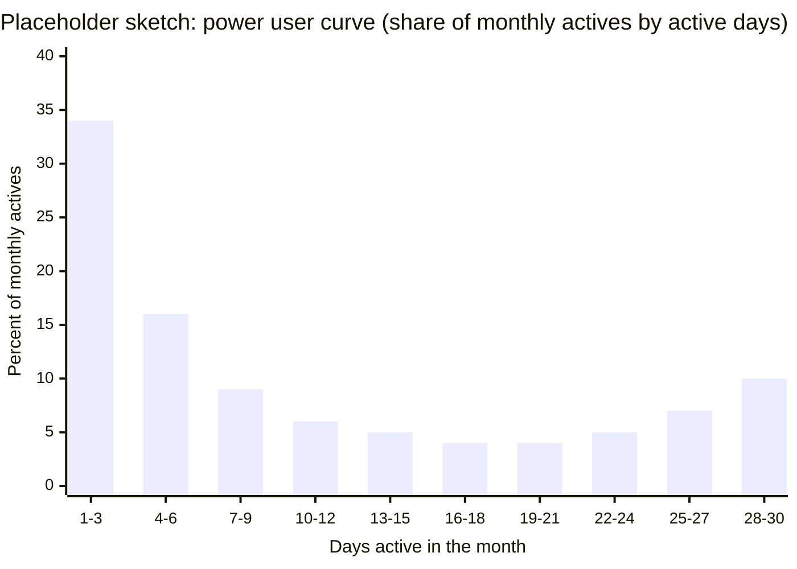
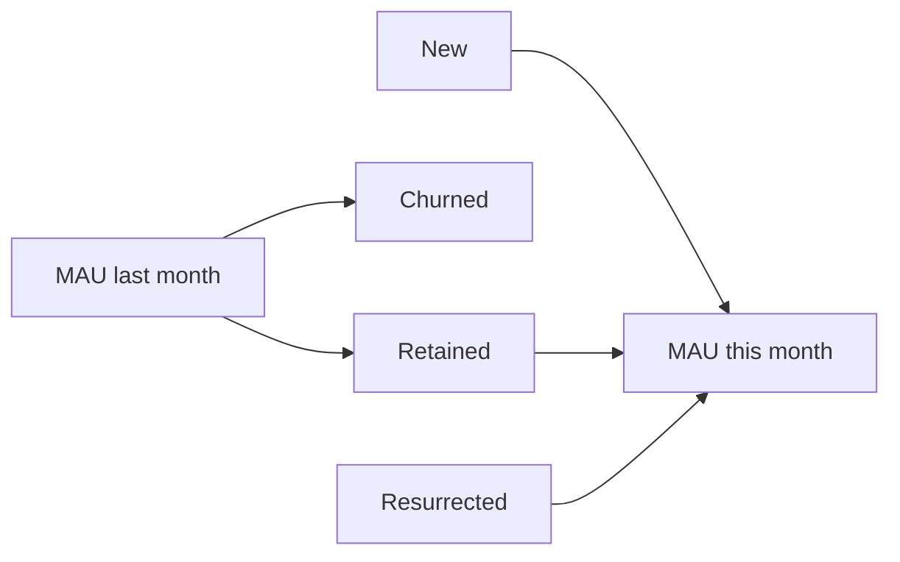
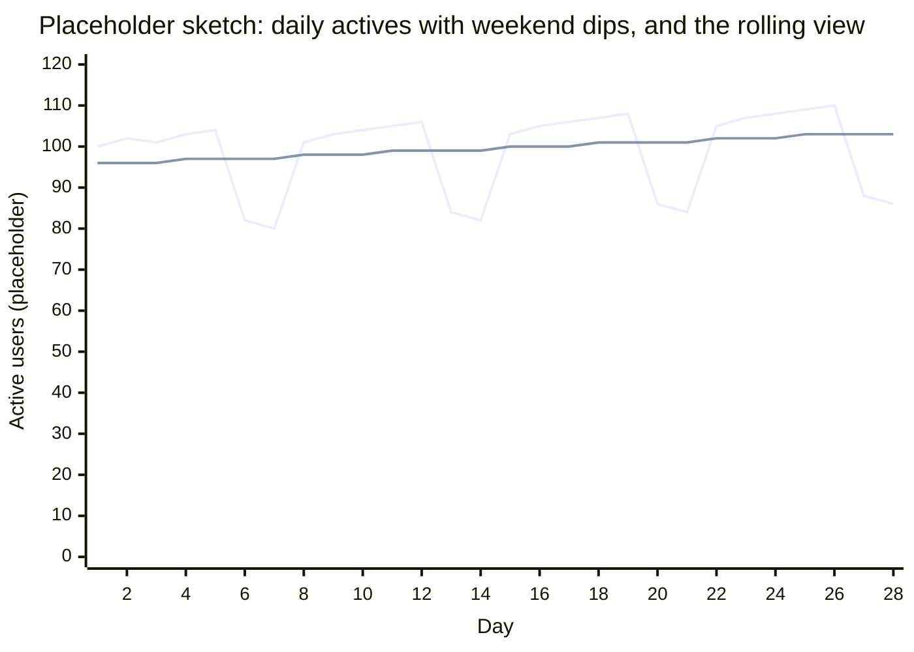
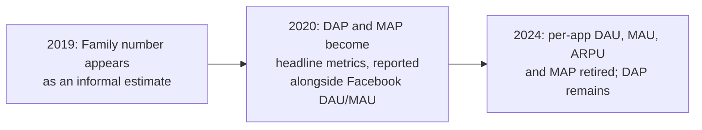

# Active users

"Active" is one of the most important, yet most debated and opinionated definitions of all time. It is almost the only thing that matters in defining the success of a company: active users, active accounts, active machines, active pipelines, active routes, active resources. Yet how it is defined and measured means something so different for different organizations.

Where to jump: [what an active user is](#what-an-active-user-is) covers the definition choices and how they fail; [the windows and the ratios](#the-windows-and-the-ratios) covers DAU, WAU, MAU and stickiness; [worth measuring, or vanity](#worth-measuring-or-vanity) is the vanity-metric question with its real provenance; [decomposing the aggregate](#decomposing-the-aggregate) turns the number into levers; [the public record](#definitions-on-the-public-record) carries the stories this page is built on.

## What an active user is

Four choices make the number: the entity you count, the action that counts as "active," the window the action must fall in, and the population you count over. Each choice has failed in public, which is why every example in this table comes from a filing or a working document rather than a glossary.

| Choice | The question | A public example |
|---|---|---|
| Entity | A user, an account, a seat, a workspace, or a person? | Meta redefined the entity from accounts to people, and says plainly that the person-level number is estimated by models, not counted [^meta-2024]. |
| Action | What must the entity do to count? | Facebook: logged in and visited [^facebook-2012]. Snap: opened the app at least once [^snap-2017]. Wikimedia: made five or more edits [^wikimedia-2015]. |
| Window | A day, a week, a month? | Snap's S-1 defines only a daily metric and defends the choice in one sentence about engagement and ad inventory [^snap-2017]. |
| Population | Active among whom? | The SEC asked Slack to clarify that its "10,000,000+ Worldwide Daily Active Users" included paying and non-paying users [^sec-2019]. |

The formal reference definition in this library is Facebook's S-1, the filing a company publishes to go public: a registered user who logged in and visited within the window, with the edge cases documented in the same filing, duplicate accounts and devices that contact servers without user action [^facebook-2012]. The single-definition discipline story, one company-level definition held to inside and out, lives on the [conversion page](conversion-rate.md) [^schultz-2014].

**The action is the choice that decides how flattering the number is.** Snap's definition pairs the weakest possible action, opening the app, with the strictest window, a day [^snap-2017]. The opposite position comes from an investor framework built at a consumer product: counting users is meaningless until you have chosen the core action of the product, and "active" should mean completing that action, not showing up [^tavel-2017] [^tavel-2023]. A founder's essay on B2B daily actives shows how broad the logged-in style gets in practice: his "active" includes signing in, using the platform, or calling the API programmatically [^cummings-2017]. Neither pole is wrong; the page's position is that the choice must be written down and defended, the way the filings defend theirs.

**A practitioner glimpse of the definition's edge cases.** Wikimedia's analytics team maintains a public working document on its own active-editor definition: a registered, logged-in, non-bot person making five or more edits in a month. The team itemizes where the definition misleads [^wikimedia-2015]:

- The bot exclusion is a heuristic that is hard to enforce automatically.
- History is retroactively unstable, because activity on later-deleted pages vanishes from the data.
- An editor whose five edits are all reverted still counts as active.

It reads like a checklist for anyone writing their own definition.

**Definitions decay unless someone owns them.** One data practitioner's essay describes the mechanism precisely: metric formulas end up scattered across tools and dashboards, and "in the best case, these calculations drift apart over time; in the worst case, they never match in the first place" [^stancil-2021]. The public-company version of drift, definitions that quietly broke and had to be corrected in print, is in [the stories below](#definitions-on-the-public-record).

- [TODO(heqing): interview — the default choices you would recommend: what entity and what action for a B2C product vs. a B2B product, where seats, accounts, and workspaces compete for the definition?]
- [TODO(heqing): interview — logged-in vs. a value action: when is "opened the app" an honest definition of active, and when is it flattering noise?]
- [TODO(heqing): interview — the seat-vs-account rule in B2B: when does the account count lie while the seat count tells the truth, and vice versa? No good public treatment survived verification, so this slot is yours.]
- [TODO(heqing): interview — a definition-drift story: have you seen an "active user" definition drift inside one company, and what was the cheapest mechanism that stopped it (a metrics layer, a document, one owner)?]

## The windows and the ratios

DAU, WAU, and MAU are the same definition evaluated at three windows: active today, active in the trailing week, active in the trailing month. The window says how often you expect people to use the product, which makes it a product decision, not a reporting one. The practitioner guidance is to choose the top metric from the frequency you expect the product to be used at, not from convention [^sequoia-2018], the same argument the [retention page](retention.md) makes for retention windows. A company can also re-choose the window: Twitter narrowed both the window and the surface at once when it moved from MAU to mDAU, a narrower daily count explained in [the story below](#definitions-on-the-public-record), with its reasoning in print [^twitter-2019].

**Stickiness.** DAU/MAU is a common engagement ratio [[JIN-CHEN-2018]](../../REFERENCES.md). Read it as an overlap: a ratio of 0.6 means 60 percent of the people who show up over a month are also showing up on a given day [^sequoia-2018]. Two caveats come with it from the same source: the ratio depends strongly on what the product is and how it is expected to be used, and a healthy mix of casual and highly engaged users can depress it without meaning failure [^sequoia-2018].

**The ratio hides a histogram.** The sharper critique comes from two consumer investors writing on its home turf: DAU/MAU is a single number, so it blurs the variance among users. Their alternative is the power user curve, a bar chart of users bucketed by how many of the last 30 days they were active (the L30 view) [[JIN-CHEN-2018]](../../REFERENCES.md). A smile shape means a hardcore daily segment exists even when the blended ratio looks mediocre, and the curve can be drawn on a value action instead of app opens. The figure below sketches the shape with placeholder numbers.

**On benchmarks, plainly.** No DAU/MAU benchmark appears here: none traced back to a primary source. A stickiness heuristic circulating in secondary sources could not be pinned to a primary post, so this page does not repeat it. What is documented is that benchmarks differ sharply by product category, for retention: a practitioner survey puts good six-month retention at 25 percent for consumer social and 75 percent for enterprise SaaS, a threefold difference for the same word [[RACHITSKY-WINTERS-2020]](../../REFERENCES.md). Assume the same category dependence for stickiness.

- [TODO(heqing): interview — how should a team pick its primary window? What products have you seen goal on DAU when their honest cadence was weekly?]

## Worth measuring, or vanity

The vanity-metric critique is Eric Ries's, commonly credited to the 2011 book, but the posts came first: the primary artifacts are two 2009 blog posts. The first defines vanity metrics against actionable metrics and names registered users, alongside raw hits and message totals, as a named example: numbers that only ever go up and support no decision [[RIES-2009A]](../../REFERENCES.md). The second supplies the organizational damage: when a vanity number rises, everyone credits their own work; when it falls, everyone blames someone else, so the team never learns what actually causes what [[RIES-2009B]](../../REFERENCES.md). The registered-users-vs-active-users contrast is the founding story of the distinction, and the same contrast anchors the growth lecture already cited on the [conversion page](conversion-rate.md) [^schultz-2014].

The modern restatement calls it data theater: reporting that makes a team feel data-driven without touching a real decision, including metrics that show adoption or engagement without a link to the business objective [^widjaja-2024]. That essay's own examples are operations metrics rather than active-user counts, so this page cites it for the general failure, not for DAU specifically.

An active-user aggregate earns north-star status when the definition is honest (a value action, a window matched to cadence) and when the team works on its [decomposition](#decomposing-the-aggregate) rather than the topline. The strongest statement of the alternative comes from a public company arguing against its own bigger number. When Twitter replaced MAU with the narrower mDAU, it wrote: "our goal was not to disclose just the largest daily active user number we could" [^twitter-2019]. A definition chosen to align everyone on delivering value is the opposite of a vanity metric, whatever the number's size.

- [TODO(heqing): interview — a class-level vanity-metric trap you have seen: the number that looked like health and was not.]

## Decomposing the aggregate

The aggregate is a sum of flows, not a lever. The citable ancestor of every decomposition in this library is growth accounting, from an investor's write-up of how he evaluates companies: this month's MAU is exactly new users plus retained users plus resurrected users, and last month's MAU is exactly this month's retained plus churned [^hsu-2015]. Nothing is modeled; the identity forces every change in the topline to be attributed to a flow.

The same source compresses the flows into one number, the quick ratio: new plus resurrected, divided by churned. Above 1 the product grows; the essay's rough ranges are around 1 to 1.5 for consumer products and 1.5 to 2 for businesses with strong retention, and the whole analysis shifts to weekly or daily windows depending on the product [^hsu-2015].

Growth accounting is the coarse version, three flows and an identity. The full treatment, seven states, transition rates between them, and the sensitivity check (which rate moves the total most) that finds the one rate worth a team's focus, is the [state-based retention measurement pattern](../modules/01-ai-data-quality/state-based-retention-measurement.md), built on the Duolingo growth model [^gustafson-2023] [^mazal-2023]. The state diagram is drawn there and not duplicated here. Start with the accounting identity; upgrade to the state model when the coarse flows stop telling you where to work.

## Classical ways to see it

The standard visualizations, per the presentation guidance in [the pattern template](../pattern-template.md). All numbers in the figures are round placeholders, not benchmarks.

**The topline trend, and its seasonality.** A daily-actives line almost always carries a weekly rhythm, and calendar months quietly measure month length as well as engagement. The practitioner fix is a rolling window, recomputed each day over the trailing 28 days: a 28-day rolling MAU covers the same number of each weekday and neutralizes both distortions [^sequoia-2018].

The jagged line is raw daily actives with weekend dips; the smooth line is the rolling view of the same data. Nothing in the product changes on Saturdays; the chart just stops pretending otherwise.

**The decomposed view.** Growth accounting's chart is the flows drawn as bars, inflows above the axis and churn below, so up and to the right is honest or dishonest at a glance [^hsu-2015]. The stacked-by-state area chart in the [state-based retention pattern](../modules/01-ai-data-quality/state-based-retention-measurement.md) is the higher-resolution version of the same picture [^gustafson-2023].

**The stickiness trend.** DAU/MAU plotted over time, watched for direction rather than level, with the category caveats from [the ratios section](#the-windows-and-the-ratios). Honest note: no canonical treatment of the stickiness-over-time chart survived verification, so this page teaches it plainly and cites nothing for it.

**The power user curve.** The L30 histogram [sketched above](#the-windows-and-the-ratios) is the fourth classical view: the distribution the stickiness ratio compresses [[JIN-CHEN-2018]](../../REFERENCES.md).

- [TODO(heqing): interview — rolling vs. calendar windows: is the rolling 28-day window worth the explanation burden for an audience without analysts, or do you accept calendar months and teach the seasonality caveat instead?]

## Definitions on the public record

The stories are the spine of this page, and they all make one argument: an active-user definition is load-bearing enough that regulators audit it.

**Twitter retires MAU and invents mDAU (2019).** In one earnings release, Twitter defined a new headline metric, monetizable daily active users: users who logged in or were otherwise authenticated and accessed Twitter on a given day through surfaces able to show ads. The old MAU was wider on two axes at once, a 30-day window and every access path including SMS and third-party clients. The release states the reasoning, admits the new number is not comparable to other companies' more expansive metrics, and announces MAU's retirement after one more quarter [^twitter-2019]. The transition quarter showed both numbers moving in opposite directions:

| Metric | Q4 2017 | Q4 2018 | Direction |
|---|---|---|---|
| MAU (broad surface, 30-day window) | 330M | 321M | down |
| mDAU (ad-capable surface, daily window) | 115M | 126M | up |

The release never says the decline drove the switch; that reading is interpretation, visible in the same table but not claimed by the filing. What the filing does claim is the alignment logic, the public-company echo of the single-definition discipline on the [conversion page](conversion-rate.md): one metric, chosen to reflect the goal, disclosed even though a larger number was available.

**Twitter's two corrections.** The same metric family broke twice, and both failures were versions of caveats Facebook had written down in 2012. In 2017, Twitter disclosed that for three years its MAU had included users of third-party apps whose SMS authentication traffic passed through Twitter's systems without any activity on Twitter itself, roughly 1 to 2 million users per quarter; data-retention policies meant periods before late 2016 could not be reconciled at all [^twitter-2017]. That is the lived version of the S-1 caveat about devices contacting servers without user action [^facebook-2012].

In 2022, Twitter disclosed that a 2019 account-linking feature had counted one person's action as activity on every linked account, overstating mDAU for three years, and published a recast table quantifying the overstatement, for the quarters its data retention allowed [^twitter-2022]. That is the entity axis failing, accounts counted as people, and the honest repair is on the record: a published recast with magnitudes, not a quiet fix to past numbers.

**Meta migrates the entity, then retires the old numbers (2019 to 2024).** The Family metrics story is a five-year retirement arc. The cross-app people number first appears as an informal estimate in an earnings release; a year later, Family daily active people (DAP) and monthly active people (MAP) are headline metrics reported alongside Facebook's own DAU and MAU; four years after that, the annual report (the 10-K) announces that per-app DAU, MAU, and revenue-per-user (ARPU) figures will no longer be reported, and MAP goes with them, leaving DAP [^facebook-2019] [^facebook-2020] [^meta-2024].

The 10-K is candid about what the new entity costs: people are not required to link their accounts, so daily active people is an estimate produced by attribution techniques and machine-learning models, not a count [^meta-2024]. The filings state the rationale, that Family metrics better reflect the community's size, and nothing more; commentary about why the per-app numbers were retired when they were is interpretation, and this page does not add any.

**Snap defines only DAU (2017).** Snap's S-1 defines a daily active user, a registered user who opens the app at least once in a 24-hour period, and defines no monthly metric at all. The filing defends the daily window as the most reliable way to understand engagement, and notes that daily engagement drives ad inventory. Its measurement caveats are first-party: the metrics come from internal data, unvalidated by third parties, and some individuals hold multiple accounts against the terms of service [^snap-2017]. The filing chooses DAU; it never argues against MAU, and this page does not put that argument in its mouth.

**The SEC reads the definitions (2016, 2019).** Before Snap's S-1 became public, SEC staff comment letters, the written questions SEC staff send back on a draft filing, audited the metric itself. One comment caught a DAU labeled a quarterly average that was actually computed from the last month of the quarter alone, and required the label to match the math; the public S-1's quarter-wide average is the corrected version. Others required the averaging window behind headline claims to be disclosed, asked when Snap had switched from third-party to internal analytics because the pipeline change broke comparability, and pressed on whether DAU and ARPU were really the only metrics management used [^sec-2016]. Slack's turn came in 2019, one sentence with a whole scoping question inside it: clarify that the ten million daily active users on the prospectus cover include paying and non-paying users [^sec-2019]. A team with no analyst can run the same checklist on its own number:

- Does the label match the math?
- Is the window stated?
- Did the pipeline change under the trend?
- Active among whom?

## Patterns & case studies

- [State-based retention measurement](../modules/01-ai-data-quality/state-based-retention-measurement.md), the Duolingo growth model: decompose DAU into states, goal one transition rate [^gustafson-2023] [^mazal-2023].
- Two candidate patterns sit in [the stories above](#definitions-on-the-public-record), not yet written as pattern pages. **Redefine in the open**: state the new definition, state why, admit non-comparability, run both numbers through a transition [^twitter-2019] [^meta-2024]. **Publish the recast**: when the definition breaks, disclose the mechanism, the magnitude, and the corrected series, and say plainly where data retention ends the correction [^twitter-2017] [^twitter-2022] [^sec-2016].
- Missing from the public record: any small team, this framework's audience, writing up a change to its own active-user definition. What exists is vendor content and the filings above. The definition-drift interview question in [the first section](#what-an-active-user-is) reserves that slot for the author's own practice.

## Sources & Stories

The definitions-and-ratios thread: Facebook's S-1 carries the formal definition and its caveats [^facebook-2012], and Alex Schultz's growth lecture carries the single-definition discipline, cited via the [conversion page](conversion-rate.md) [^schultz-2014]. Sarah Tavel's hierarchy-of-engagement essay and her later podcast restatement supply the core-action argument [^tavel-2017] [^tavel-2023], David Cummings the B2B logged-in counterpoint [^cummings-2017], and Benn Stancil the definition-drift mechanism [^stancil-2021]. The window and ratio guidance is the Sequoia data science team's product-health essay [^sequoia-2018]; the power user curve is Li Jin and Andrew Chen's [[JIN-CHEN-2018]](../../REFERENCES.md); the category-dependence of benchmarks is documented in Lenny Rachitsky and Casey Winters's retention survey [[RACHITSKY-WINTERS-2020]](../../REFERENCES.md), and Olga Berezovsky's treatment of how a working analyst reports the ratio sits behind a paywall, so it is listed here as a go-deeper pointer only [^berezovsky-2025]. The vanity-metric provenance is Eric Ries's two 2009 posts [[RIES-2009A]](../../REFERENCES.md) [[RIES-2009B]](../../REFERENCES.md), with Crystal Widjaja's data-theater essay as the modern restatement [^widjaja-2024]. Growth accounting and the quick ratio are Jonathan Hsu's [^hsu-2015], ancestor to the Duolingo decomposition [^gustafson-2023] [^mazal-2023].

The public-record thread is built on primary documents fetched from EDGAR, the SEC's public filing database: Twitter's Q4 2018 release for the mDAU redefinition [^twitter-2019], its Q3 2017 letter for the Digits overcount [^twitter-2017], its Q1 2022 letter for the linked-accounts recast [^twitter-2022], the Facebook and Meta filings for the Family-metrics arc [^facebook-2019] [^facebook-2020] [^meta-2024], Snap's S-1 [^snap-2017], and the SEC staff comment letters to Snap and Slack [^sec-2016] [^sec-2019]. The one practitioner working document is the Wikimedia analytics team's active-editors page, the only first-party internal working document on an active-user definition this research round could verify [^wikimedia-2015]. Where a filing's numbers admit a tempting causal reading, the page labels the reading as interpretation.

Held back for lack of a source: any DAU/MAU benchmark (none survived verification), a per-seat vs. per-account treatment for B2B, a named first-person definition-drift story, and a canonical citation for the stickiness-trend chart. Each is either declared plainly in the body or reserved as an interview question. All figure numbers on this page are placeholders, and the interview TODOs are unanswered by design, per this repository's working method.

<!-- Footnote targets; full entries with links and caveats live in REFERENCES.md -->

[^meta-2024]: [[META-2024]](../../REFERENCES.md)
[^facebook-2012]: [[FACEBOOK-2012]](../../REFERENCES.md)
[^snap-2017]: [[SNAP-2017]](../../REFERENCES.md)
[^wikimedia-2015]: [[WIKIMEDIA-2015]](../../REFERENCES.md)
[^sec-2019]: [[SEC-2019]](../../REFERENCES.md)
[^schultz-2014]: [[SCHULTZ-2014]](../../REFERENCES.md)
[^tavel-2017]: [[TAVEL-2017]](../../REFERENCES.md)
[^tavel-2023]: [[TAVEL-2023]](../../REFERENCES.md)
[^cummings-2017]: [[CUMMINGS-2017]](../../REFERENCES.md)
[^stancil-2021]: [[STANCIL-2021]](../../REFERENCES.md)
[^sequoia-2018]: [[SEQUOIA-2018]](../../REFERENCES.md)
[^twitter-2019]: [[TWITTER-2019]](../../REFERENCES.md)
[^widjaja-2024]: [[WIDJAJA-2024]](../../REFERENCES.md)
[^hsu-2015]: [[HSU-2015]](../../REFERENCES.md)
[^gustafson-2023]: [[GUSTAFSON-2023]](../../REFERENCES.md)
[^mazal-2023]: [[MAZAL-2023]](../../REFERENCES.md)
[^twitter-2017]: [[TWITTER-2017]](../../REFERENCES.md)
[^twitter-2022]: [[TWITTER-2022]](../../REFERENCES.md)
[^facebook-2019]: [[FACEBOOK-2019]](../../REFERENCES.md)
[^facebook-2020]: [[FACEBOOK-2020]](../../REFERENCES.md)
[^sec-2016]: [[SEC-2016]](../../REFERENCES.md)
[^berezovsky-2025]: [[BEREZOVSKY-2025]](../../REFERENCES.md)
