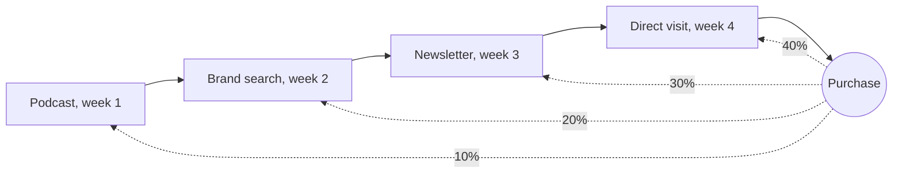
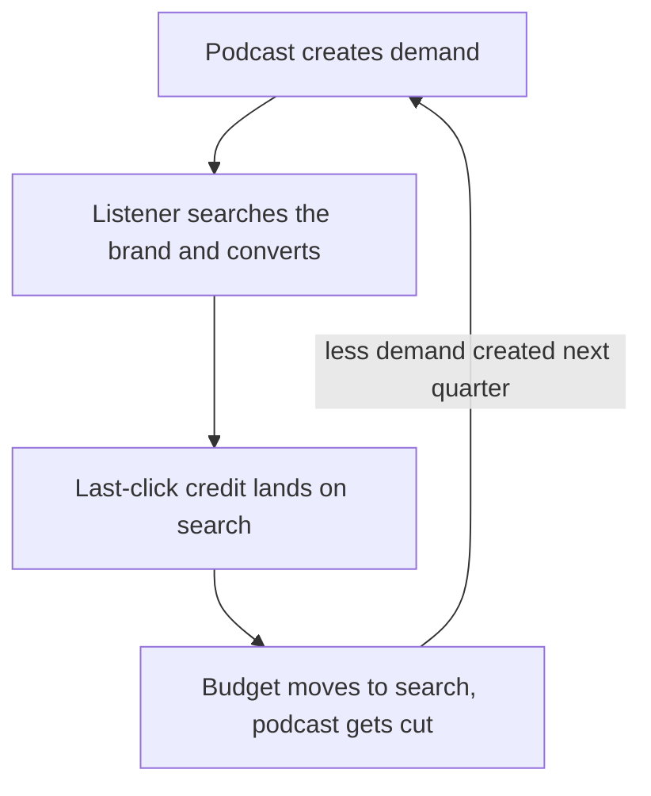

# Attribution

Attribution is the art of figuring out which actions lead to more of the outcome, and how to quantitatively credit them. It has many applications: in marketing, to figure out which ads lead to the most purchases; in go-to-market, to figure out which events or actions lead to the most sales. Attribution is a strategic tool as well. Often there is no absolute best answer.

Where to jump: the [credit models](#the-models-are-samples-not-truths) and [what happened to channel attribution](#classic-marketing-attribution) cover the marketing side; the [go-to-market section](#go-to-market-funnel-attribution) covers team credit and incentives; the [size guide](#when-attribution-is-not-worth-it) says how much attribution to build at your scale.

## What attribution is

An outcome happened. A purchase, a signup, a closed deal. Several touches came before it: a podcast mention, a search ad, a newsletter, a sales call. Attribution is the rule that decides how much credit each touch gets for the outcome. This looks like bookkeeping, but the credit split decides which channel gets next quarter's budget, which team made its number, and, in a go-to-market organization, how people are paid and scored. That is why attribution gets fought over in a way most metrics do not.

This page treats attribution as two connected problems. The first is the classic marketing question: which channel earns credit for a conversion. The second is the go-to-market question: which team earns credit for a deal. The same failure runs through both, and the position of this page is that both are incentive design wearing measurement clothes.

## The models are samples, not truths

Every attribution model is one assumption about how credit should flow, written down as arithmetic. No model measures what caused what. The models are opinions written as arithmetic, not measurements, and the cleanest way to see that is to run them all on the same journey.

Here is one four-touch journey for a company with no analyst: a podcast mentions the product in week 1, the listener searches the product's name in week 2 (a brand search), clicks a newsletter link in week 3, and types the site address in directly and purchases in week 4. Every number in this table is illustrative, chosen only to show the shape of each rule.

| Model | Podcast mention | Brand search | Newsletter click | Direct visit and purchase |
|---|---|---|---|---|
| Last-touch | 0% | 0% | 0% | 100% |
| First-touch | 100% | 0% | 0% | 0% |
| Linear | 25% | 25% | 25% | 25% |
| Time-decay | 10% | 20% | 30% | 40% |
| Position-based (40/20/40 default) | 40% | 10% | 10% | 40% |

The same table, drawn as a flow. Credit runs backward from the outcome to the touches; a different rule redraws the dotted arrows, and nothing about the journey itself changes. Shown here: the time-decay split.

Two approaches are missing from the table because they never look at a journey: marketing mix modeling fits outcome totals against channel spend, and incrementality asks what would have happened without the touch. Different question, no credit split.

Five rules, five different answers, and nothing was measured. How large can the gap between a credit rule and a measurement get? The eBay story below puts numbers on it.

**Last-touch.** All credit to the final touch. It became every tool's default because the converting visit was the one thing early tools could confidently observe [[KAUSHIK-2013]](../../REFERENCES.md). For a small team it is still the honest starting point: cheap, high signal, and everyone understands it (see the [conversion page](conversion.md)). For a sophisticated spender, Kaushik's verdict in 2013 was already: "The only use for last click attribution now is to get you fired. Avoid it." [[KAUSHIK-2013]](../../REFERENCES.md) Both are right. The model is fine as a first approximation and dangerous as a belief.

**First-touch.** All credit to the touch that started the journey. Kaushik's one-line failure mode: "First click attribution is akin to giving my first girlfriend 100% of the credit for me marrying my wife." [[KAUSHIK-2013]](../../REFERENCES.md)

**The rule-based multi-touch family.** Linear splits credit evenly, which Kaushik grades bluntly: "This is less wrong. That's it. Just less wrong." Time-decay gives later touches more credit, and was his recommended starting model because it at least passes a common-sense test. Position-based hands fixed shares to the first and last touch, 40 percent each in the common default with the remaining 20 percent spread over the middle, a default he called sub-optimal for beginners. His larger warning covers all three: the customization knobs are an invitation to encode your biases and call the result data [[KAUSHIK-2013]](../../REFERENCES.md).

**Data-driven.** Credit assigned by a model trained on conversion-path data rather than by a hand-written rule. It removes the hand-picked split and replaces it with a box the advertiser cannot inspect, and when the box is built by the vendor whose ads it grades, advertisers noticed the obvious worry (next section) [[OSMUNDSON-2023]](../../REFERENCES.md).

**Marketing mix modeling.** MMM for short: regression (statistical line-fitting) of outcome totals against channel spend over time, adjusting for things like seasonality. No individual user is tracked, so no journey is credited. It answers what a dollar in a channel appears to buy, slowly and with error bars.

**Incrementality.** The experimental answer. Hold out a region or a group, keep spending everywhere else, and compare. eBay's version was geographic: paid search off in a third of US media markets (the metro regions TV and radio advertising is bought by), sales compared against the rest [[FREAKONOMICS-2020]](../../REFERENCES.md).

## Classic marketing attribution

**The last-click decade.** For roughly a decade the default answer to "which channel gets credit" was the last click, because it was the click the tools could see [[KAUSHIK-2013]](../../REFERENCES.md). The distortion is structural: last click rewards the channel that harvests intent and starves the channels that create it. Attribution was already withering before the privacy shocks, because the channels marketers were diversifying into, TV, influencers, out-of-home, cannot be measured at the level of the individual user at all [[SEUFERT-2017]](../../REFERENCES.md). Teams clung to it anyway because it offered a veneer of control, "like a security blanket" [[SEUFERT-2023]](../../REFERENCES.md).

**Then the signal went away.** The chronology runs from the first limits on mobile ad identifiers in 2012, through GDPR in 2018, Apple's app-tracking consent pop-up enforced in 2021, and the announced deprecation of third-party cookies [[SEUFERT-2023]](../../REFERENCES.md). In 2023 Google retired first-click, linear, time-decay, and position-based attribution from its ads products, saying fewer than 3 percent of conversion actions still used them, which left last-click and its own data-driven model; advertisers publicly worried that the black box might favor the vendor's own channels [[OSMUNDSON-2023]](../../REFERENCES.md).

**The MMM renaissance.** With user-level signal dying, marketing mix modeling came back into fashion, and it has a long pedigree: "marketing mix" was coined in the early 1950s, operations researchers were modeling promotional effort by 1953, and the first regression-based advertising-profitability work dates to 1969, all decades before the click [[PEDANTICS-2023]](../../REFERENCES.md). The renaissance has a wrinkle: the largest ad platforms now publish their own free, open-source MMM frameworks. The question to ask about that: whether measurement can be trusted when it is provided by the same players who profit from the results [[HERCHER-2026]](../../REFERENCES.md). One operational honesty: the model's output does not plug into a last-click-shaped dashboard, it comes with uncertainty and needs interpretation [[SEUFERT-2023]](../../REFERENCES.md).

**The ceiling on certainty.** Across 25 large advertising field experiments, individual purchasing behavior is so volatile relative to what an ad costs per person that even massive randomized tests leave the return on ad spend inside a confidence interval (the plausible range around an estimate) more than 100 percentage points wide [[LEWIS-2015]](../../REFERENCES.md). A companion study at Facebook benchmarked observational methods, the same statistical machinery attribution rests on, against randomized experiments on the same campaigns, and found they often failed to recover the true effect [[GORDON-2019]](../../REFERENCES.md). If experiments barely answer the question, credit rules certainly do not.

Three stories carry the argument.

**eBay turned the ads off and sales stayed.** A search-engine contract renegotiation accidentally paused eBay's brand-keyword ads, and the clicks simply came back for free through the organic results. The economists then ran the real test: all paid search off in a third of US media markets. The company's attribution-based belief was that paid search drove about 5 percent of sales and returned about $1.50 per dollar spent. The measured effect was a sales drop of about 0.5 percent, not statistically different from zero, which meant eBay was losing more than 60 cents on every dollar; the president cut the paid-search budget by $100 million a year on the spot [[FREAKONOMICS-2020]](../../REFERENCES.md) [[BLAKE-2015]](../../REFERENCES.md). The incentive kicker belongs to the next section: a senior director told the economist that results that bad would simply not be believed.

**Uber found the fraud only by turning spend off.** Uber's former head of performance marketing describes discovering that the attribution dashboards were not just imprecise but gamed: ad networks were claiming credit, through click spamming, for app installs that were really organic. Pausing a large share of the paid budget left installs essentially unchanged, and installs the dashboards had credited to paid channels started showing up as organic. His advice: "you should start by assuming that half of what's on the display channels is fraud" [[FRISCH-2020]](../../REFERENCES.md). The exact budget figures live in the podcast audio rather than in print, so this page leaves them out; the shape of the story does not depend on them.

**P&G cut $200 million and nothing happened.** In the same reported account as the eBay story, Procter & Gamble cut roughly $200 million of digital ad spend over bot and brand-safety concerns, with no noticeable impact on the bottom line [[FREAKONOMICS-2020]](../../REFERENCES.md).

Three giants, one lesson: the holdout was the audit. The dashboards looked fine right up until someone stopped spending.

## Go-to-market funnel attribution

The second attribution problem lives inside the company. A deal closed. Which team gets it: the marketing campaign that generated the lead, the SDR (sales development rep) who cold-called, the partner who made the introduction, or the account executive who worked the deal? This is pipeline attribution; pipeline is the total value of open deals in progress.

**Four sources of pipeline.** One practitioner framework splits pipeline by the team that generated it: marketing inbound, SDR outbound, alliances and partners, and sales' own prospecting, with a deliberate balance across the four and targets set as opportunity counts rather than percentages, so a team cannot celebrate a growing share of a shrinking pie [[KELLOGG-2021]](../../REFERENCES.md). He also names the politics directly: when a team needs credit, sourcing definitions get bent, and in his words things get pretty icky. His fix is procedural rather than model-based: a neutral win-touch analysis (which teams touched the deals that actually closed), run by sales operations, presented at every quarterly business review, so the credit ledger is not kept by the teams being scored [[KELLOGG-2021]](../../REFERENCES.md).

**Hitting the proxy, missing the point.** The cleanest team-level distortion on record: marketing celebrates 105 percent of its pipeline-generation target for six straight quarters while sales attainment slides to 82 percent of plan and the coverage ratio (open pipeline divided by the sales target) decays from 3.1x to 2.4x. His verdict: "Marketing cannot be 'doing great' when sales is 82% of plan. Period. Always." [[KELLOGG-2024]](../../REFERENCES.md) Nobody lied. The credit metric was simply detached from the outcome it existed to serve.

**Owning the number without the credit.** The counter-model, from a CMO who ran marketing at several large software companies: marketing takes ownership of total pipeline even when it does not get the credit, a shareholder view of the number rather than a departmental one, enforced with monthly cross-team pipeline meetings and quarterly reporting across all sources [[VARNI-2025]](../../REFERENCES.md).

**Agree on one number first.** Advice for small companies that is upstream of any credit rule: the VP of sales and VP of marketing jointly pick one number earlier in the funnel than closed deals as marketing's top goal, define the qualified-lead threshold together, and keep their disagreements private [[LEMKIN-2021]](../../REFERENCES.md). Before you design a credit split, agree on a shared number.

**The early-stage playbook.** A practitioner setup for early B2B teams: first-touch as the primary lens, last-touch at the qualified stage as a supplement, inbound and outbound broken apart, all built on UTM tags (the tracking labels appended to links) and CRM hygiene rather than attribution software. Her warning matches this page's position: you do not need a complex multi-touch model to figure out what is actually going on [[KRAMER-2023]](../../REFERENCES.md).

**The position this framework takes: attribution is incentive design.** In a go-to-market organization, attribution is the measurement layer that compensation and OKRs (objectives and key results, the goal-scoring system) sit on. How an SDR, a marketing team, or a partnerships team drives revenue is how they get compensated and how their OKRs get measured. The credit rule feeds quota attainment and performance review, so the attribution model is really your compensation model. A wrong rule does more than misallocate budget: it mis-pays people and mis-scores teams, which is why accurately measuring the OKR matters in its own right, not only for the budget's sake. No published source states this claim; it is this framework's own position. The older canon backs the mechanism, briefly.

**The measure that is born a target.** "When a measure becomes a target, it ceases to be a good measure," the line behind Goodhart's law [[STRATHERN-1997]](../../REFERENCES.md) [[GOODHART-1975]](../../REFERENCES.md). Attribution is the special case where the measure does not become a target: it is born as one, because the entire reason to compute a credit split is to score people and spend. Management writing has known the twin failure for decades, reward systems that pay for one behavior while the organization hopes for another [[KERR-1975]](../../REFERENCES.md), and a sourced-pipeline target that pays for pipeline created while the company wants revenue closed is that failure on a dashboard [[KELLOGG-2024]](../../REFERENCES.md). If the number pays people, the ledger cannot be kept by the teams being scored [[KELLOGG-2021]](../../REFERENCES.md).

**The classic misalignment, in practice.** Marketing is incentivized to produce as many leads as possible, without caring about eventual conversion. Sales drowns in leads, and the overall conversion rate drops. Yet because every deal passed through marketing on the way in, it looks like 100 percent of signed deals are marketing-attributed: marketing holds all the credit, while the sales organization has a very hard time focusing on what it needs to sell.

**The budget-level distortion loop.** The same mechanism one level up from team credit: a podcast drives a listener to search, search gets the credit, executives conclude the budget should move to search, and the channel that created the demand gets cut [[FISHKIN-2020]](../../REFERENCES.md). The harder a channel is to measure, the less competitive and higher-return it usually is, so attribution starves exactly the channels that were quietly working [[FISHKIN-2020]](../../REFERENCES.md).

**Fix by experiment, not by argument.** Everything deserves a chance to be experimented on, but set the goal and the measurement at the beginning and do not change them later. And turning everything completely off to verify that things change should be a standard practice, not an emergency measure. Run it in the slow season if the topline number worries you, or turn spend off in one segment of the business and watch for the signal.

**Revisit on complexity, not headcount.** A company's first credit rule does not change much with headcount; it changes with the complexity of the business. Over time you develop more customer segments, more territories, and different incentives for different teams. That is the time to revisit how the incentives are designed and make sure everybody is contributing to the same goal.

**The afternoon smell test.** Ask each team, individually, whether the pipeline is running smoothly. Every team has inputs and outputs, and the conversion rate between them tells a big story (the [conversion page](conversion.md) covers the mechanics). A high rate means the upstream steps are handing over quality, and the attribution is probably well designed. A rate far below industry standard means someone upstream may be exaggerating their number without caring about downstream impact.

## When attribution is not worth it

The size guide first. The advice comes from practitioners at different ends of the scale, and they agree on the shape.

| Your size | What to do |
|---|---|
| Under roughly $100K of marketing spend | Skip attribution software. Run one channel test at a time, watch the obvious metrics like demos and signups, and treat "where did you hear about us?" as a sanity check, not a decision driver [[PIYUSH-2025]](../../REFERENCES.md). |
| Under roughly $50M of annual revenue | Last-touch plus a working list of channels proven to drive results, and judgment built on real customer knowledge. Attribution software and multi-touch modeling rarely return a profit at this size [[FISHKIN-2022]](../../REFERENCES.md). |
| Above roughly $10M of marketing spend | Skip the attribution-model debates and go to media-mix modeling and controlled experiments [[KAUSHIK-2013]](../../REFERENCES.md). |
| Any size | Periodically verify by turning spend off, in a slow season or in one business segment. The holdout is the audit. |

Two notes on the sources. The under-$100K advice comes from the CEO of a marketing measurement vendor, arguing against his own interest; his reasoning is that a click after an event does not make the event the cause, so click models over-credit the channels that capture demand rather than create it [[PIYUSH-2025]](../../REFERENCES.md). And by 2024 the under-$50M argument had hardened from not-worth-it to no-longer-possible: privacy law, walled gardens, and zero-click consumption mean click-level attribution mechanically stops working, and measurement returns to lift methods and influence you cannot trace [[FISHKIN-2024]](../../REFERENCES.md).

Below some scale, attribution machinery costs more than the decisions it informs are worth. Above some scale, experiments answer the question better. The band where rule-based modeling earns its keep is much narrower than the tooling industry suggests. Last-touch plus honest channel tests carries a small team a long way; the [conversion page](conversion.md) covers where last-touch enters.

**Testing at a small scale.** In the modern world the channels mix together, and clean A/B tests are very hard to run scientifically. Run tests at a very local level: copy A against copy B for the same audience, or the same copy for different audiences, tightly controlled. Beyond that, a scientific test costs more resources than a small or medium business can spare. Anecdotes, and taste built through user interviews, are a legitimate part of the toolkit at this scale. <!-- TODO(heqing): confirm this reading --> Modern campaign tools also auto-optimize parts of the funnel; a team that is just starting should lean on those instead of building testing in-house.

**When the machinery has outgrown the decisions.** Spend should scale with revenue. If the spend-to-revenue ratio is climbing to a concerning level, revisit the machinery and the channels it defends. If the ratio keeps dropping, the setup is earning its keep.

## Where else attribution shows up

Marketing and go-to-market are the two treatments on this page, but the credit-assignment question appears anywhere an outcome has many parents. Product work asks which feature or change gets credit for a [retention](retention.md) or [conversion](conversion.md) move. Partnerships ask which introduction gets credit for a deal. Finance asks which team or product a shared cost belongs to. These will grow into their own treatments as the library expands.

## Patterns & case studies

No pattern page yet. Candidate case studies from the research rounds, each traced to a first-party or near-first-party account:

- **eBay's holdout audit.** The attribution belief said 5 percent, the geographic holdout said roughly zero, and $100 million a year of spend moved [[FREAKONOMICS-2020]](../../REFERENCES.md) [[BLAKE-2015]](../../REFERENCES.md).
- **Uber's fraud discovery.** The attribution was not just wrong but gamed, and pausing spend, not reading the dashboard, is what surfaced it [[FRISCH-2020]](../../REFERENCES.md).
- **The pipeline-generation mirage.** Six quarters of marketing hitting 105 percent of its pipeline target while sales slid to 82 percent of plan: hit the proxy, miss the point [[KELLOGG-2024]](../../REFERENCES.md).
- **The budget distortion loop.** A podcast creates demand, search harvests it, credit moves the budget, and the creating channel dies [[FISHKIN-2020]](../../REFERENCES.md).

One honest research finding belongs on the record: no verified first-party story exists of a small team, this framework's audience, changing its attribution approach and reporting what happened. Every verified story above is a giant with an experimentation budget. The literature over-samples companies big enough to run holdouts, and this page says so. At small scale, judgment plays a bigger part: not everything can be measured scientifically, because the base population and the spend are not big enough, and even when you can measure, you may be spending energy on a signal that will not add much value to the business.

## Sources & Stories

Two threads run through this page.

The marketing-models thread: Avinash Kaushik's model-by-model walkthrough anchors the catalog and the quoted one-liners [[KAUSHIK-2013]](../../REFERENCES.md). Eric Seufert supplies the argument that attribution was structurally withering before privacy forced the issue [[SEUFERT-2017]](../../REFERENCES.md) and the signal-loss chronology, the "security blanket" diagnosis, and the marketing-economist framing after [[SEUFERT-2023]](../../REFERENCES.md). The industry's own retreat is documented in the reporting on Google retiring its rule-based models [[OSMUNDSON-2023]](../../REFERENCES.md), MMM's econometric lineage comes through a practitioner history [[PEDANTICS-2023]](../../REFERENCES.md), and the skeptical frame on the platform-published MMM renaissance is James Hercher's independent reporting [[HERCHER-2026]](../../REFERENCES.md). The academic ceiling comes from Lewis and Rao's near-impossibility result [[LEWIS-2015]](../../REFERENCES.md) and the Facebook comparison of observational methods to experiments [[GORDON-2019]](../../REFERENCES.md), both cited at the level of their published abstracts. The stories: Steven Tadelis's first-person eBay account and the P&G anecdote are in the Freakonomics transcript [[FREAKONOMICS-2020]](../../REFERENCES.md), with the underlying eBay paper cited through it [[BLAKE-2015]](../../REFERENCES.md), and Kevin Frisch's Uber account comes from his podcast interview [[FRISCH-2020]](../../REFERENCES.md), cited here without the budget figures that exist only in the audio.

The go-to-market thread: Dave Kellogg's four-sources framework and neutral win-touch ledger [[KELLOGG-2021]](../../REFERENCES.md) and his pipeline-coverage worked example [[KELLOGG-2024]](../../REFERENCES.md), SaaStr's account of Sara Varni's shared-number model [[VARNI-2025]](../../REFERENCES.md), Jason Lemkin on agreeing on one number before designing any credit split [[LEMKIN-2021]](../../REFERENCES.md), and Emily Kramer's early-stage setup, cited from the free section of her newsletter [[KRAMER-2023]](../../REFERENCES.md). The incentive canon behind this page's position: Steven Kerr on rewarding A while hoping for B [[KERR-1975]](../../REFERENCES.md), the Goodhart provenance chain as it actually runs, with Marilyn Strathern's verbatim sentence and her credit to Keith Hoskin for the "Goodhart's law" naming [[STRATHERN-1997]](../../REFERENCES.md) alongside Goodhart's drier 1975 original [[GOODHART-1975]](../../REFERENCES.md), and Rand Fishkin's budget-distortion loop [[FISHKIN-2020]](../../REFERENCES.md) together with his when-not-to arguments [[FISHKIN-2022]](../../REFERENCES.md) [[FISHKIN-2024]](../../REFERENCES.md) and the skip-the-software advice from a measurement vendor's CEO arguing against his own interest [[PIYUSH-2025]](../../REFERENCES.md).

The incentive-design thesis, that attribution is the measurement layer compensation and OKRs sit on, is this framework's own position, drafted from the author's framing; no published source states it in this form, and the page says so where it makes the claim. The opening and the practice-grounded passages, the classic misalignment, fix-by-experiment, the complexity rule, the smell test, testing at a small scale, and the spend-to-revenue rule, are drafted from the author's interview answers (2026-08-05). The worked-example journey and its credit splits are illustrative placeholders, not benchmarks.
