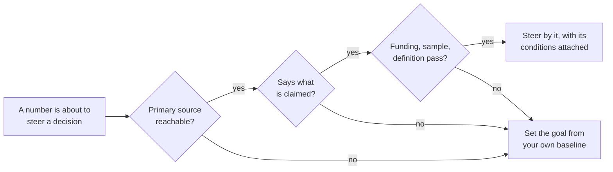

# Benchmarks

A benchmark is an industry standard for judging whether a number is good or bad. A conversion rate on its own is just a number; a benchmark is what tells you whether it is healthy for your industry or a problem to work on. A benchmark is also how a team measures its own success: it gives the team a goal to climb toward, and that is the most important thing it does.

Both jobs depend on the number being real. Many figures that circulate as benchmarks arrive through blog posts and pitch decks, and they steer real hiring and budget decisions whether or not they are true. So this page runs in two halves: what a benchmark is for and what a well-built one looks like, then how to check a number before it steers a decision.

Where to jump: [what a benchmark is for](#what-a-benchmark-is-for) and [what a well-built benchmark looks like](#what-a-well-built-benchmark-looks-like) cover the standard itself, [setting a goal from a benchmark](#setting-a-goal-from-a-benchmark) is the method for your own targets, [check a number before you steer by it](#check-a-number-before-you-steer-by-it) is the audit, and [the version for a team of ten](#the-version-for-a-team-of-ten) compresses the page into a week.

## What a benchmark is for

The first job is comparison. The metric pages in this library show how to compute retention, conversion, or active users on your own data, and none of those computations says whether the result is good. A benchmark is the common standard that turns your number into a position, ahead of the industry or behind it.

The second job matters more, and the framework's position is that it is the benchmark's real product. A benchmark gives a team a goal, and a goal turns a metric from a report into a direction. A team that knows the standard for its industry, and where it stands against that standard, has something to climb toward and a way to measure its own success. How to set that goal well is the subject of [its own section below](#setting-a-goal-from-a-benchmark).

In practice, most of the benchmarks a company runs on are not published anywhere. They come from experience and best practice: what a founder saw at the last company, or what an investor repeats across a portfolio. They are usually not written down, and there is no common standard behind them. That is not a disqualification. At the end of the day conviction can still win: a team that believes its target is the right one will outwork a team holding a better-sourced number it does not believe. The framework's position is to treat these inherited numbers as goals a team chooses, not as facts about the industry, and this library repeats no external number it has not verified.

## What a well-built benchmark looks like

The clearest example right now comes from AI. Language models are scored against published evaluation suites: fixed sets of tasks with known answers, taken by every model under the same conditions. One widely used suite is a test of knowledge and problem solving across 57 tasks, from elementary mathematics to law, published in full [^hendrycks-2020]. A larger effort evaluated 30 models on the same scenarios under standardized conditions and released every prompt and completion behind its scores; before it existed, a typical model had been evaluated on about 18 percent of those scenarios, and afterwards all 30 models had been scored on essentially all of them [^liang-2022]. The tasks are definitive, so a lab knows whether it is climbing in the right direction, and a claim of progress can be checked by anyone who reruns the suite.

The publishing is what makes the checking possible. When researchers suspected that models were in effect being trained on a popular arithmetic test set, they built a fresh set of matching problems and scored the same models again: accuracy dropped by up to 8 percent for some model families, which is what overfitting to a benchmark looks like, while models at the frontier showed little sign of it [^zhang-2024]. That audit only works because the original tasks are public. A benchmark you can rerun is a benchmark you can check.

The same principle applies in about any business area, and the same anatomy exists in published business benchmarks, though far less often than the folklore suggests. Two examples survived checking for this page.

**Advertising cost per lead, by industry.** A search-advertising vendor has published a benchmark report from its clients' campaigns every year for ten years. The current edition states its sample: 13,474 US search campaigns over twelve months, a floor of 52 campaigns under every industry figure, and medians rather than means so outliers do not move the result. Across industries the 2026 median cost per lead is $66.69, and the industry medians run from about $27 in arts and entertainment to about $132 in legal services [^wordstream-2026]. That five-fold spread is the useful finding: a cost-per-lead or cost-per-acquisition benchmark only means something inside one industry. Carry two conditions with the numbers: the sample is one vendor's client base, which skews to small US advertisers, and a lead is whatever the ad platform counted as one.

**Software gross margin.** An annual survey of private software companies, run by a venture firm with its partners, publishes gross margin with the definition attached (subscription revenue less cost of goods sold, divided by subscription revenue) and segments by revenue band. In the 2025 edition the median sits near 80 percent for companies above $5 million of annual recurring revenue, and in the mid-70s below that, with quartiles published around every median [^highalpha-2025]. The common expectation that a software company runs somewhere near an 80 percent gross margin is, for once, a claim with a stated sample behind it: more than 800 respondents, most of them US companies. Three conditions attach: respondents selected themselves into the survey, the figures are self-reported, and the publisher invests in the category it benchmarks.

Those two reports cover different worlds and share a shape. Before trusting any published benchmark, look for the same four features:

- The sample is stated: who is in it, how many, over what period.
- The definition is attached to the metric, so you can compute yours the same way.
- The figures are medians and quartiles by segment, not one impressive number.
- The publisher and its interest are named, so you know which way the number would lean if it leaned.

A report with all four can be used with its conditions written next to it. A report with none of them goes to [the audit below](#check-a-number-before-you-steer-by-it).

## Setting a goal from a benchmark

This section is the framework's own method, drafted from the author's practice.

**Compare only what is highly comparable.** A goal set from a benchmark is only as good as the match between the benchmark's sample and your company. The margin survey above segments by revenue band because a company under $1 million and a company above $50 million are not comparable even inside the same industry, and the advertising report segments by industry because the medians differ five-fold across industries. Check the definition first, since the [retention](retention.md) and [active users](active-users.md) pages show how far definition choices alone move a number, then check segment and size. A goal taken from a sample that does not look like you is an artificial goal, and teams can tell.

**Set the goal where ambition meets belief.** Goal setting is one of the most-replicated results in organizational psychology, so the framework leans on it: specific hard goals produce higher performance than easy goals or "do your best", and performance rises with goal difficulty until the team runs out of ability or stops being committed to the goal. The canonical summary of that literature covers more than 100 tasks and 40,000 participants [^locke-latham-2002]. A goal does not have to be certain to be reached to motivate, but it does have to stay believed. The same literature carries the warning label: goals prescribed too aggressively narrow a team's focus and invite gaming of the number, which is the Goodhart failure the [attribution](attribution.md) page treats at length [^ordonez-2009]. The calibration the framework recommends sits between the two findings: a goal should feel ambitious and achievable at the same time, and the author's working rule is to set it at about 80 percent of what is achievable.

<!-- TODO(heqing): pin down the 80 percent rule. 80 percent of what: the ceiling you estimate the team could reach in the period, or a target you estimate an 80 percent chance of hitting? And does the rule apply before or after the growth extrapolation below? One worked example would settle it. -->

**Extrapolate your own growth into the goal.** The starting point for next period's goal is this period's trajectory, not zero and not the industry median. If this quarter grew 25 percent, next quarter's goal starts at 25 percent, and the question becomes what justifies moving off that number. Competitive pressure and seasonality usually argue for setting slightly above the current rate, because a market rarely lets a team keep its growth rate by repeating what it did last quarter.

**When no external number survives, benchmark against your own history.** A baseline is your own number on your own definition, and it is the only benchmark whose sample and definition you fully control.

1. Write the definition down first: the entity, the action that counts, and the window. The [retention](retention.md) and [active users](active-users.md) pages walk through these choices, and holding the definition still is what makes your history comparable.
2. Compute the number on a regular cadence in whatever tool you already have. A spreadsheet updated weekly is a working baseline.
3. After a few periods, set goals against yourself: this quarter against last, and this month's cohort against earlier cohorts at the same age. Goals extrapolated from your own history pass the comparability test automatically, because the sample is you.

<!-- TODO(heqing): have you built a baseline from zero at a company with no measurement history? How long before it was decision-grade, and what did you compare against in the meantime? -->

## Check a number before you steer by it

The published benchmarks above earn their place because their chains can be walked, since the sample and the definition are stated and the funder is named. Many numbers that arrive in decks and blog posts are the other kind. Good retention supposedly flattens near some level, and companies your size supposedly hire their first data person at some head count. Checking is cheap: a trace takes about an hour, and steering a quarter by a wrong number costs far more.

The trouble is that numbers shed their conditions as they travel. A range published for 1990 financial services becomes a law of software, and an estimate from interviews becomes a measurement. No bad faith is required: every retelling drops a qualifier, until the number stands alone, precise-looking and unfalsifiable. The version that reaches you is the last link of that chain, and you cannot see the chain by looking at the number.

### The five questions

Ask them in order. Each takes minutes, and a failed answer at any step ends the trace early.

1. **Where does the number claim to come from?** Follow the citation to the thing it cites, and keep going until you reach a primary source: the study or first-party account where the number was produced rather than repeated. In this field the normal case is blogs citing blogs, and the chain often ends in air.
2. **Does the primary source say what is claimed?** Read the sentence with your own eyes. Ranges lose their bottom half in transit and hedges fall off. Denominators get swapped for bigger ones.
3. **Who funded it?** A vendor-funded number is not automatically false, but it is unauditable, because the methodology stays private and nobody outside can rerun it. Treat funding as a cap on how much weight the number can bear.
4. **What was the sample?** Ask how many companies were measured and how they were selected. A survey of a vendor's own customers describes that vendor's customers.
5. **Does the definition match yours?** Churn counted on customers is not churn counted on revenue, and a share of one denominator is not a share of another. A benchmark inherits every definition choice invisibly.

### Three cautionary traces

The three numbers below are widely repeated and differently broken. The full traces were run for this page; this is the short form.

**The retention number that grew in transit.** The circulating claim says that increasing customer retention by 5 percent increases profits by 25 to 95 percent, and credits a 1990 Harvard Business Review article. The 1990 article is real and does not contain the range. Its own sentence says almost 100 percent, and its worked cases are 85, 50, and 30 percent in specific service industries [^reichheld-sasser-1990]. The 25-to-95 sentence was written ten years later, as a one-line summary in a 2000 article by the same lead author [^reichheld-schefter-2000]. The analysis behind both is unpublished consulting data from 1990-era service businesses, so the number is a real finding about those industries and says nothing about your business.

**The productivity number nobody published.** The circulating claim says that a large technology company saves 140,000 hours a month by letting employees generate SQL, the language used to query databases, from plain English, and cites the company's own engineering post. The post is real and contains no hours figure at all; it reports minutes saved per query and a limited release averaging about 300 daily users [^uber-2024]. The 140,000 is third-party arithmetic that multiplies the pilot's per-query saving across all 1.2 million monthly queries at the company, and retellings cite the very post that never says it.

**The benchmark whose source no longer exists.** The circulating claim says that a support-software startup cut churn by 71 percent using early-warning metrics, a story that has anchored churn folklore for a decade. The trail leads to a 2015 post on the company's own blog; the blog moved in a rebrand, the old address now returns nothing, and the Internet Archive holds no capture [^turnbull-2015]. Even live, the post was a marketing anecdote with no stated baseline or churn definition. A number whose only home is one company's blog is one rebrand away from untraceable, and this one crossed that line while everyone kept citing it.

### The trace log

The same check, one line per number. Two rows reach an honest primary and fail only in retelling, which is the most common outcome of a trace: the number is not false, but it is true about something narrower than you were told.

| The number as it circulates | What the trace finds |
|---|---|
| Acquiring a customer costs 5 to 25 times more than retaining one | The usual citation is a 2014 Harvard Business Review piece whose own sentence begins "Depending on which study you believe". No study is named anywhere in the chain [^gallo-2014]. |
| Analysts spend 80 percent of their time cleaning data | The primary is a 2014 New York Times article reporting "interviews and expert estimates" of 50 to 80 percent. The 50 and the sourcing fall away in retelling, and no measurement has ever backed the figure [^lohr-2014]. |
| Facebook grew because of 7 friends in 10 days | One executive's 2012 conference talk, with no published analysis [^palihapitiya-2012]. Facebook's own vice president of growth teaches 10 friends in 14 days, credits a different person, and says the causal question was settled by argument rather than by analysis [^schultz-2014]. |
| A ratio of daily to monthly active users above 50 percent is world class | The most-cited version reads "apps over 20% are said to be good, and 50%+ is world class", on an undated page, with "are said to be" as the entire sourcing [^chen-daumau]. The nearest first-party number is Facebook's own filing, which works out to 57 percent for one exceptional company in December 2011 [^facebook-2012]. |
| Poor data quality costs organizations $12.9 million a year | The sentence is real Gartner marketing copy from 2021. No methodology or sample has ever been public, and the research behind it is a paid product [^gartner-2021]. |
| 60 to 80 percent of dashboards go unused | Vendor blogs cite each other, and no primary study exists. The one first-party measurement found is a single company deleting about a quarter of its dashboards against a 90-day threshold [^freeagent-2020]. |
| Hire your first data person at 20 to 50 employees | Traces cleanly to one consultant's 2017 stage model, stated from work with about a dozen companies. The primary is honest about its basis; the retellings present it as a law [^handy-2017]. |
| 81.2 percent of text-to-SQL failures are schema errors | The figure is real, but it is measured on the 389 errors, out of 3,655, that stopped a query from executing at all. Most wrong answers execute fine, so quoting it as a share of all failures flips the practical lesson [^shen-2025]. |
| Respond to a sales lead within 5 minutes or lose it | The study behind the response-time multipliers was funded by a company selling response-time software, whose chief executive co-authored the article, and no independent replication exists [^oldroyd-2011] [^insidesales-2007]. |

### When a trace fails

Most traces fail, and the move that follows matters. Say that it failed, in the deck and in the goal document: no citable figure survived checking. Do not repeat the number with a caveat attached, because the number will be remembered and the caveat will not. Then set the goal from your own history, using the [baseline steps above](#setting-a-goal-from-a-benchmark). When an external number is genuinely required, for a board or an investor, prefer figures from regulatory filings over content marketing, because companies file under liability for misstatement and bloggers do not.

<!-- TODO(heqing): when an executive or investor asks "what is a good retention rate" and expects the folklore answer, what do you actually say in the room? The page teaches the trace; your answer under pressure is the missing voice. -->

## The version for a team of ten

You do not need a research function for any of this. This week:

1. List the external numbers currently doing work in your company: anything in a goal document or a deck that came from outside your own data. The list is usually under ten items.
2. Run the five questions on the two or three that steer money or hiring. Budget about an hour each; most traces end fast.
3. For what survives, check comparability before it becomes a goal: does the benchmark's sample look like you on definition, industry, and size? Write the source and its conditions next to the number, so the next reader inherits the chain instead of the bare figure.
4. Set next period's goals from your own trajectory, extrapolated as above, and use a surviving benchmark to judge whether the trajectory itself is good. Where nothing survives, write "no citable external figure; our own baseline is this" where the folklore used to sit.

Safe to ignore at this size: gated vendor benchmark reports, and any figure whose primary you cannot reach inside an hour. A chain that cannot be walked in an hour is a failed trace, not a reason to spend a day.

<!-- TODO(heqing): a class-level story of a benchmark steering a real decision you watched: what the number claimed, what it steered, and what checking would have changed. The examples on this page are all public ones until a lived one exists. -->

## Where benchmarks connect

Benchmark discipline shapes where several pages in this library end. [Retention](retention.md) publishes no retention benchmark and sends you to your own earlier cohorts. [Active users](active-users.md) publishes no engagement-ratio benchmark, because the honest survey evidence shows the same word meaning a threefold difference across product categories [^rachitsky-winters-2020]. [Conversion rate](conversion-rate.md) cites an activation survey that discloses its method and segments by product type, which is the anatomy this page asks for. And [attribution](attribution.md) asks the same funding question of measurement tools that this page asks of published numbers, and carries the Goodhart warning that applies to any benchmark the moment it becomes a target.

Value retention and lifetime value, where benchmark folklore runs thickest, get their own pages as the library grows.

## Patterns & case studies

No pattern page yet. Candidate case studies from the traces above, each documented at its entry in the references:

- **The number manufactured by aggregation.** A first-party engineering post reports minutes saved per query in a 300-user pilot; circulation multiplies that across a whole company's query volume and cites the post that never says it [^uber-2024].
- **The primary that vanished.** A founder's churn story outlives its own source: the post is gone, the archive holds no copy, and the figure keeps circulating [^turnbull-2015].

## Sources & Stories

The goal-setting thread: the canonical consolidation of goal-setting theory was read in full via a university-hosted copy, and the sentences used here, the do-your-best comparison and the linear difficulty effect with its two limits, were checked verbatim [^locke-latham-2002]. The framework cites it as canonical rather than pairing it with a newer study because it is the theory's own summary of 35 years of evidence; the standard caution against overprescribed goals, read at its open-access copy, is cited alongside it [^ordonez-2009].

The evaluation-suite thread: the two suites and the contamination audit are cited at abstract level from their arXiv records, and the audit authors' affiliation with an evaluation vendor is noted at its entry [^hendrycks-2020] [^liang-2022] [^zhang-2024].

The published-benchmark research: the advertising benchmark was verified against an archived copy of the vendor's page, because the live page sits behind a bot check, and its methodology sentence is quoted at the entry [^wordstream-2026]. The margin survey was read in full at its published report [^highalpha-2025]. A second annual survey of private software companies, run by an investment bank with a venture firm, was checked as a candidate: its press release states the sample and retention medians, but the full report is form-gated and was not read, so its figures stay out of the body [^kbcm-sapphire-2024].

The three full traces rest on primary documents re-read for this page: the 1990 retention article, its profit sentences checked against a verbatim reproduction because the full text is paywalled [^reichheld-sasser-1990]; the 2000 restatement, read in full in a course-hosted reprint [^reichheld-schefter-2000]; and the engineering post behind the hours claim, read in full with its impact figure [^uber-2024]. The vanished churn post is documented at its reference entry, which records that the primary is unretrievable rather than lending the figures authority [^turnbull-2015].

For the trace log: Gallo's hedge was read on the live page [^gallo-2014], Lohr's sentence on a syndicated reproduction of the paywalled original [^lohr-2014], the seven-friends talk at title level with the formulation attested across independent transcriptions, and the counter-version in Alex Schultz's lecture transcript [^palihapitiya-2012] [^schultz-2014]. The engagement thresholds are an undated sentence [^chen-daumau], with Facebook's S-1 the only first-party ratio nearby [^facebook-2012]. The Gartner sentence was read on an archived copy of Gartner's own page [^gartner-2021], the dashboard cleanup is the one first-party measurement found [^freeagent-2020], the hiring guide was read in full at its republication [^handy-2017], and the error study at its second arXiv version [^shen-2025]. The lead-response pair carries the funding disclosure its entries have always carried [^oldroyd-2011] [^insidesales-2007]; the category-spread survey is cited for the spread, not its numbers [^rachitsky-winters-2020].

Every trace was re-run on 2026-08-26, and the new benchmark and goal-setting sources were verified on 2026-08-27. The five questions, the say-it-failed rule, and the baseline instruction are the framework's own positions. The framing of what a benchmark is for, the conviction point, the comparability rule, the 80 percent calibration, and the growth extrapolation are drafted from the author's review answers (2026-08-27).

<!-- Footnote targets; full entries with links and caveats live in REFERENCES.md -->

[^chen-daumau]: [[CHEN-DAUMAU]](../../REFERENCES.md)
[^facebook-2012]: [[FACEBOOK-2012]](../../REFERENCES.md)
[^freeagent-2020]: [[FREEAGENT-2020]](../../REFERENCES.md)
[^gallo-2014]: [[GALLO-2014]](../../REFERENCES.md)
[^gartner-2021]: [[GARTNER-2021]](../../REFERENCES.md)
[^handy-2017]: [[HANDY-2017]](../../REFERENCES.md)
[^hendrycks-2020]: [[HENDRYCKS-2020]](../../REFERENCES.md)
[^highalpha-2025]: [[HIGHALPHA-2025]](../../REFERENCES.md)
[^insidesales-2007]: [[INSIDESALES-2007]](../../REFERENCES.md)
[^kbcm-sapphire-2024]: [[KBCM-SAPPHIRE-2024]](../../REFERENCES.md)
[^liang-2022]: [[LIANG-2022]](../../REFERENCES.md)
[^locke-latham-2002]: [[LOCKE-LATHAM-2002]](../../REFERENCES.md)
[^lohr-2014]: [[LOHR-2014]](../../REFERENCES.md)
[^oldroyd-2011]: [[OLDROYD-2011]](../../REFERENCES.md)
[^ordonez-2009]: [[ORDONEZ-2009]](../../REFERENCES.md)
[^palihapitiya-2012]: [[PALIHAPITIYA-2012]](../../REFERENCES.md)
[^rachitsky-winters-2020]: [[RACHITSKY-WINTERS-2020]](../../REFERENCES.md)
[^reichheld-sasser-1990]: [[REICHHELD-SASSER-1990]](../../REFERENCES.md)
[^reichheld-schefter-2000]: [[REICHHELD-SCHEFTER-2000]](../../REFERENCES.md)
[^schultz-2014]: [[SCHULTZ-2014]](../../REFERENCES.md)
[^shen-2025]: [[SHEN-2025]](../../REFERENCES.md)
[^turnbull-2015]: [[TURNBULL-2015]](../../REFERENCES.md)
[^uber-2024]: [[UBER-2024]](../../REFERENCES.md)
[^wordstream-2026]: [[WORDSTREAM-2026]](../../REFERENCES.md)
[^zhang-2024]: [[ZHANG-2024]](../../REFERENCES.md)
