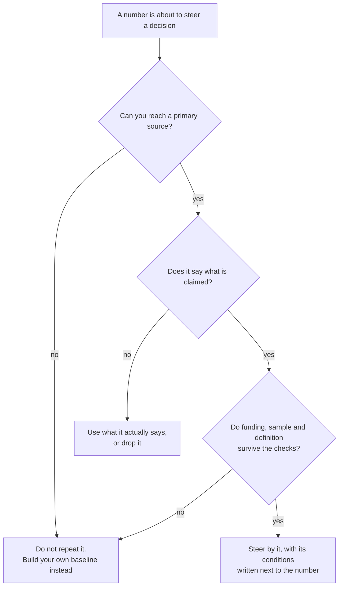

# Benchmarks

A benchmark is somebody else's number used to judge your own. Good retention supposedly flattens near some level, and companies your size supposedly hire their first data person at some head count. Numbers like these arrive through blog posts and pitch decks, and they steer real hiring and budget decisions whether or not they are true.

This framework's own position is that a large share of the most-repeated numbers in this field cannot be traced to any primary source, and that among those that can, the primary routinely says something narrower than the version in circulation. Checking is cheap: a trace takes about an hour, and steering a quarter by a wrong number costs far more.

Where to jump: [the five questions](#the-five-questions) are the method, [three traces run in full](#three-traces-run-in-full) show what checking looks like in practice, [the trace log](#the-trace-log) covers more famous numbers in brief, and [when the trace fails](#when-the-trace-fails) says what to build instead.

## What a benchmark is worth

Even a well-sourced benchmark answers a narrow question: how a particular sample, measured a particular way in a particular period, performed on a definition that may not be yours. With those conditions attached it is a legitimate sanity check, and sometimes the only one available to a team with no history of its own.

The trouble is that numbers shed their conditions as they travel. A range published for 1990 financial services becomes a law of software, and an estimate from interviews becomes a measurement. No bad faith is required: every retelling drops a qualifier, until the number stands alone, precise-looking and unfalsifiable. The version that reaches you is the last link of that chain, and you cannot see the chain by looking at the number.

This library repeats no number it has not verified, and the same rule is the recommendation to you. It is why the [retention](retention.md) and [active users](active-users.md) pages publish no benchmark at all.

## The five questions

Ask them in order. Each one takes minutes, and a failed answer at any step ends the trace early.

1. **Where does the number claim to come from?** Follow the citation to the thing it cites, and keep going until you reach a primary source: the study or first-party account where the number was produced rather than repeated. In this field the normal case is blogs citing blogs, and the chain often ends in air.
2. **Does the primary source say what is claimed?** Read the sentence with your own eyes. Ranges lose their bottom half in transit and hedges fall off. Denominators get swapped for bigger ones.
3. **Who funded it?** A vendor-funded number is not automatically false, but it is unauditable, because the methodology stays private and nobody outside can rerun it. Treat funding as a cap on how much weight the number can bear.
4. **What was the sample?** Ask how many companies were measured and how they were selected. A survey of a vendor's own customers describes that vendor's customers, and a study of companies with growth teams says nothing about companies without them.
5. **Does the definition match yours?** Churn counted on customers is not churn counted on revenue, and a share of one denominator is not a share of another. The [retention](retention.md) and [active users](active-users.md) pages show how far definition choices move a number; a benchmark inherits every one of them invisibly.

## Three traces, run in full

The three numbers below are widely repeated and differently broken, so together they exercise every question above.

### The retention number that grew in transit

The claim in circulation: increasing customer retention by 5 percent increases profits by 25 to 95 percent, usually credited to a 1990 Harvard Business Review article or to Harvard Business School research.

The primary exists, which already puts this claim ahead of most. The 1990 article, by Frederick Reichheld of Bain and Earl Sasser of Harvard, is real [^reichheld-sasser-1990]. It does not contain the sentence. Its own prose says companies "can boost profits by almost 100% by retaining just 5% more of their customers", and its worked cases are specific: cutting defections 5 percent generated 85 percent more profit in one bank's branch system, 50 percent in an insurance brokerage and 30 percent in an auto-service chain. The 25-to-95 sentence was written ten years later, in a 2000 article on e-commerce loyalty by Reichheld and a Bain colleague, as a one-line summary of the earlier analysis [^reichheld-schefter-2000]. The range the internet now credits to a 1990 study is a 2000 paraphrase of it.

The analysis behind it is Bain client work in service businesses measured around 1990, where profit means profit over a customer's whole life. Nothing in the sample is a software company, the client data was never published, and nobody outside Bain can rerun it. The number is a real finding about specific 1990 service industries, and it is silent about your business.

### The productivity number nobody published

The claim in circulation: Uber saves 140,000 hours a month by letting employees generate SQL, the language used to query databases, from plain English. The citation offered is usually Uber's own engineering post about the tool.

The post exists and is worth reading [^uber-2024]. It reports about 1.2 million interactive queries a month, roughly 10 minutes to author a query by hand against 3 with the tool, and a limited release averaging 300 daily active users, 78 percent of whom said it saved them time. Its impact figure shows an estimated 18 percent productivity gain for one organization. No hours total appears anywhere in the text or the figures.

The 140,000 is arithmetic someone else performed: the seven-minute difference multiplied across all 1.2 million monthly queries, as though a tool 300 people were piloting had authored every query at the company. Retellings then cite the very post that does not contain the number. Read the primary and look for the sentence; there is no sentence.

### The benchmark whose source no longer exists

The claim in circulation: a support-software startup cut its churn by 71 percent using red-flag metrics, early-warning signs in user behavior. The story has circulated for a decade as proof of what churn work can achieve, down to memorable details such as churned users' first sessions lasting 35 seconds.

The trail leads to a 2015 post by the company's founder on its own blog [^turnbull-2015]. The old address now redirects to a domain where the page no longer exists, because the blog moved when the product rebranded, and the Internet Archive holds no capture. The primary is gone from the reachable web, and with it the later questions: no retelling states what churn rate the fall started from, or whether churn was counted on customers or on revenue.

Even live, the post was a first-party marketing anecdote with no methodology; now nobody can read it. A number whose only home is one company's blog is one rebrand away from untraceable, and this one crossed that line while everyone kept citing it.

## The trace log

The pattern generalizes well past retention. Each row below is the one-line version of the same check. Two rows reach an honest primary and fail only in retelling, which is the most common outcome of a trace: the number is not false, but it is true about something narrower than you were told.

| The number as it circulates | What the trace finds |
|---|---|
| Acquiring a customer costs 5 to 25 times more than retaining one | The usual citation is a 2014 Harvard Business Review piece whose own sentence begins "Depending on which study you believe". No study is named anywhere in the chain [^gallo-2014]. |
| Analysts spend 80 percent of their time cleaning data | The primary is a 2014 New York Times article reporting "interviews and expert estimates" of 50 to 80 percent. The 50 and the sourcing fall away in retelling, and no measurement has ever backed the figure [^lohr-2014]. |
| Facebook grew because of 7 friends in 10 days | One executive's 2012 conference talk, with no published analysis [^palihapitiya-2012]. Facebook's own vice president of growth teaches 10 friends in 14 days, credits a different person, and says the causal question was settled by argument rather than by analysis [^schultz-2014]. |
| A ratio of daily to monthly active users above 50 percent is world class | The most-cited version reads "apps over 20% are said to be good, and 50%+ is world class", on an undated page, with "are said to be" as the entire sourcing [^chen-daumau]. The nearest first-party number is Facebook's own filing, which works out to 57 percent for one exceptional company in December 2011 [^facebook-2012]. |
| Poor data quality costs organizations $12.9 million a year | The sentence is real Gartner marketing copy from 2021. No methodology or sample has ever been public, and the research behind it is a paid product [^gartner-2021]. |
| 60 to 80 percent of dashboards go unused | Vendor blogs cite each other, and no primary study exists. The one first-party measurement found is a single company deleting about a quarter of its dashboards against a 90-day threshold [^freeagent-2020]. |
| Hire your first data person at 20 to 50 employees | Traces cleanly to one consultant's 2017 stage model, stated from work with about a dozen companies. The primary is honest about its basis; the retellings present it as a law [^handy-2017]. |
| 81.2 percent of text-to-SQL failures are schema errors | The figure is real, but it is measured on the 389 errors, out of 3,655, that stopped a query from executing at all. Most wrong answers execute fine, so quoting it as a share of all failures flips the practical lesson [^shen-2025]. |
| Respond to a sales lead within 5 minutes or lose it | The study behind the response-time multipliers was funded by a company selling response-time software, whose chief executive co-authored the article, and no independent replication exists [^oldroyd-2011] [^insidesales-2007]. |

## When the trace fails

Most traces fail. When one does, two moves follow, and the order matters.

**Say that it failed.** Say so in the deck and in the goal document: no citable figure survived checking. Do not repeat the number with a caveat attached, because the number will be remembered and the caveat will not. A team that hears "the 71 percent story has no retrievable source" makes different choices than one that hears "reportedly, churn fell 71 percent".

**Build the baseline the benchmark was standing in for.** A baseline is your own number on your own definition, compared against your history, and it is the only benchmark whose sample and definition you fully control.

1. Write the definition down first: the entity, the action that counts, and the window. The [retention](retention.md) and [active users](active-users.md) pages walk through these choices; holding the definition still is what makes your history comparable.
2. Compute the number on a regular cadence in whatever tool you already have. A spreadsheet updated weekly is a working baseline.
3. After a few periods, compare against yourself: this quarter against last, and this month's cohort against earlier cohorts at the same age. The comparison that means something is your own earlier numbers, which is the same conclusion the retention page reaches about cohort curves.

<!-- TODO(heqing): have you built a baseline from zero at a company with no measurement history? How long before it was decision-grade, and what did you compare against in the meantime? -->

When an external number is genuinely required, for a board or an investor, prefer figures from regulatory filings over content marketing, because companies file under liability for misstatement and bloggers do not. Carry the conditions with the number: whose sample it was, and which definition it used.

<!-- TODO(heqing): when an executive or investor asks "what is a good retention rate" and expects the folklore answer, what do you actually say in the room? The page teaches the trace; your answer under pressure is the missing voice. -->

## The version for a team of ten

You do not need a research function, because the check only has to cover the numbers that steer decisions. This week:

1. List the external numbers currently doing work in your company: anything in a goal document or a deck that came from outside your own data. The list is usually under ten items.
2. Run the five questions on the two or three that steer money or hiring. Budget about an hour each; most traces end fast.
3. Replace what fails with your own baseline, built as above, and write "no citable external figure; our own baseline is this" where the folklore used to sit.
4. For what survives, write the source and its conditions next to the number, so the next reader inherits the chain instead of the bare figure.

Safe to ignore at this size: gated vendor benchmark reports, and any figure whose primary you cannot reach inside an hour. A chain that cannot be walked in an hour is a failed trace, not a reason to spend a day.

<!-- TODO(heqing): a class-level story of a benchmark steering a real decision you watched: what the number claimed, what it steered, and what checking would have changed. The examples on this page are all public ones until a lived one exists. -->

## Where benchmarks connect

Benchmark discipline is why several pages in this library end where they do. [Retention](retention.md) publishes no retention benchmark and sends you to your own earlier cohorts. [Active users](active-users.md) publishes no engagement-ratio benchmark, because the honest survey evidence shows the same word meaning a threefold difference across product categories [^rachitsky-winters-2020]. [Conversion rate](conversion-rate.md) cites an activation survey that discloses its method and segments by product type, which is what a usable external number looks like. And [attribution](attribution.md) asks the same funding question of measurement tools that this page asks of published numbers: whether a figure can be trusted when the party producing it profits from the answer.

Value retention and lifetime value, where benchmark folklore runs thickest, get their own pages as the library grows.

## Patterns & case studies

No pattern page yet. Candidate case studies from the traces above, each documented at its entry in the references:

- **The number manufactured by aggregation.** A first-party engineering post reports minutes saved per query in a 300-user pilot; circulation multiplies that across a whole company's query volume and cites the post that never says it [^uber-2024].
- **The primary that vanished.** A founder's churn story outlives its own source: the post is gone, the archive holds no copy, and the figure keeps circulating [^turnbull-2015].

## Sources & Stories

The three full traces rest on primary documents re-read for this page: the 1990 retention article, its profit sentences checked against a verbatim reproduction because the full text is paywalled [^reichheld-sasser-1990]; the 2000 restatement, read in full in a course-hosted reprint [^reichheld-schefter-2000]; and the engineering post behind the hours claim, read in full with its impact figure [^uber-2024]. The vanished churn post is documented at its reference entry, which records that the primary is unretrievable rather than lending the figures authority [^turnbull-2015].

For the trace log: Gallo's hedge was read on the live page [^gallo-2014], Lohr's sentence on a syndicated reproduction of the paywalled original [^lohr-2014], the seven-friends talk at title level with the formulation attested across independent transcriptions, and the counter-version in Alex Schultz's lecture transcript [^palihapitiya-2012] [^schultz-2014]. The engagement thresholds are an undated sentence [^chen-daumau], with Facebook's S-1 the only first-party ratio nearby [^facebook-2012]. The Gartner sentence was read on an archived copy of Gartner's own page [^gartner-2021], the dashboard cleanup is the one first-party measurement found [^freeagent-2020], the hiring guide was read in full at its republication [^handy-2017], and the error study at its second arXiv version [^shen-2025]. The lead-response pair carries the funding disclosure its entries have always carried [^oldroyd-2011] [^insidesales-2007]; the category-spread survey is cited for the spread, not its numbers [^rachitsky-winters-2020].

Every trace was re-run on 2026-08-26, and where a re-check disagreed with this library's earlier notes, the re-check appears here; the schema-error figure is the example, found present in its paper with a narrower denominator than circulation gives it. The five questions, the say-it-failed rule, and the build-your-own-baseline instruction are this framework's own positions.

<!-- Footnote targets; full entries with links and caveats live in REFERENCES.md -->

[^chen-daumau]: [[CHEN-DAUMAU]](../../REFERENCES.md)
[^facebook-2012]: [[FACEBOOK-2012]](../../REFERENCES.md)
[^freeagent-2020]: [[FREEAGENT-2020]](../../REFERENCES.md)
[^gallo-2014]: [[GALLO-2014]](../../REFERENCES.md)
[^gartner-2021]: [[GARTNER-2021]](../../REFERENCES.md)
[^handy-2017]: [[HANDY-2017]](../../REFERENCES.md)
[^insidesales-2007]: [[INSIDESALES-2007]](../../REFERENCES.md)
[^lohr-2014]: [[LOHR-2014]](../../REFERENCES.md)
[^oldroyd-2011]: [[OLDROYD-2011]](../../REFERENCES.md)
[^palihapitiya-2012]: [[PALIHAPITIYA-2012]](../../REFERENCES.md)
[^rachitsky-winters-2020]: [[RACHITSKY-WINTERS-2020]](../../REFERENCES.md)
[^reichheld-sasser-1990]: [[REICHHELD-SASSER-1990]](../../REFERENCES.md)
[^reichheld-schefter-2000]: [[REICHHELD-SCHEFTER-2000]](../../REFERENCES.md)
[^schultz-2014]: [[SCHULTZ-2014]](../../REFERENCES.md)
[^shen-2025]: [[SHEN-2025]](../../REFERENCES.md)
[^turnbull-2015]: [[TURNBULL-2015]](../../REFERENCES.md)
[^uber-2024]: [[UBER-2024]](../../REFERENCES.md)
