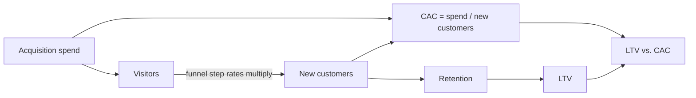
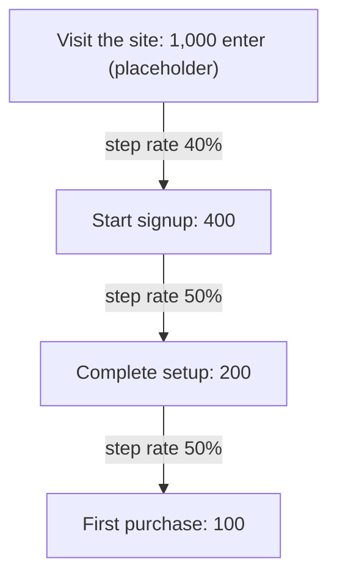
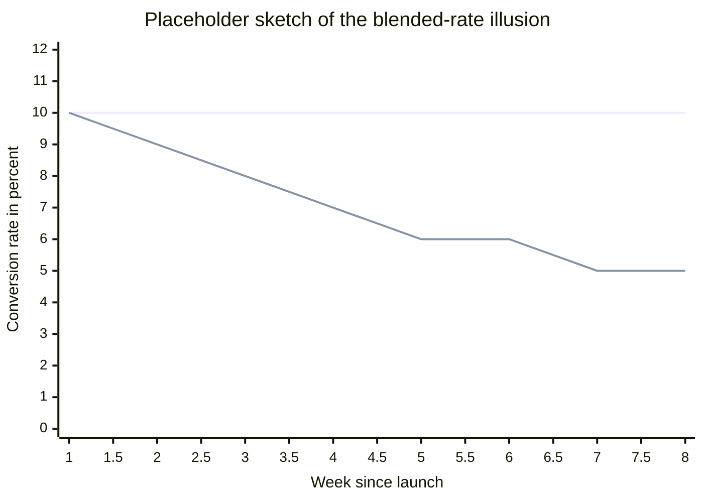
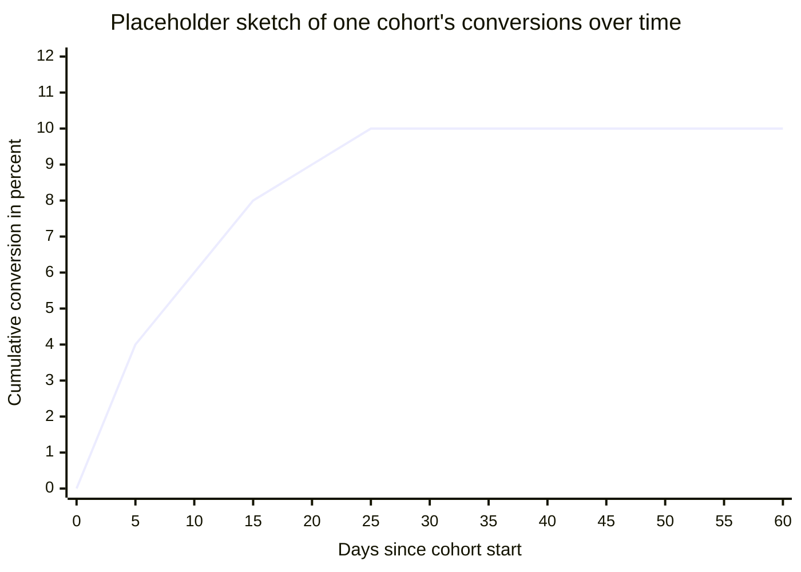

# Conversion

Conversion is the movement of the business towards your final goal, whether that's monthly active users or revenue. Funnel analysis was a big part of my last job. One part of the company's business is working with domain experts who create training data for AI models. An expert passes several steps before they can contribute: identity checks, quality screens, and training on the platform. Each step loses people. My role was the analytics function: measuring the pass rate at every step and segmenting to see which experts were getting stuck and where, so the team could fix the worst step and measure again. If your product has steps between signup and value, you have the same problem, and the same method works.

## What conversion is

A conversion rate is the fraction of entities that pass from one funnel step to the next. That sounds like one number. It is really four choices, and the rate means nothing until all four are written down and held fixed.

| Choice | The question | What goes wrong when it floats |
|---|---|---|
| Entity | Do you count visits, unique visitors, users, accounts, or leads? | This is the classic definition fight. Kaushik argues for unique visitors over visits, since buying spans multiple sessions, and concedes the opposite convention exists. His larger point is that consistency matters more than the choice [^kaushik-2006]. |
| Numerator event | What exactly counts as converting? | Fix the business outcome first, then measure. Kaushik's rule is to never measure conversion before the goals of the site are named, and to show the revenue next to the percentage [^kaushik-2006]. |
| Denominator population | Who was actually eligible to convert? | Count only the entities that reached the step; including everyone else adds noise to the comparison [^kohavi-2007]. |
| Window | How long after entering the denominator may an entity still convert? | Conversions arrive late. The experimentation literature calls these delayed or latent conversions [^kohavi-2007]. With an unclosed window the rate is a moving target, not a number [^bernhardsson-2017]. |

The early canonical definition, from the web experimentation literature, is the percentage of visits that include a purchase [^kohavi-2007]. Note that it silently fixes all four choices: visit, purchase, visits to the site, within the visit. Your funnel will need its own four answers. The modern book-length treatment of doing this measurement right is [^kohavi-2020].

How should a team make these choices for its first conversion metric? To get the easy version started, use an unlimited window first and take the rough read. The window is very much a conviction game: when the team has more resources, pick a couple of ideal customer conversion flows and use those as the cutoff window.

The most common definition mistake before a team has an analyst is boiling the ocean: overthinking the choices instead of relying on conviction. Put the resources into the roughly three questions or steps the company cares about most, and define those well.

And whichever steps you pick, the conversion metrics should always align with the company north star. If moving a step's rate does not move the number the company steers by, the metric is measuring effort, not progress.

## Not activation, not retention

Conversion is a step ratio, and a journey has many steps. The AARRR framing (acquisition, activation, retention, referral, revenue) puts a conversion rate at every step from acquisition through revenue, and advises picking a handful of steps and measuring each one [^mcclure-2007]. Two neighboring ideas get folded into "conversion" and should not be.

**Activation** is one specific conversion: the one into first realized value. The modern working definition is a key action, at a set frequency, by a set time after signup. Pinterest's was users still saving content weekly, four weeks after signup [^winters-2017]. A survey of over 500 products gives activation-rate benchmarks by product type and warns explicitly against conflating activation with conversions or transactions [^rachitsky-2022].

**Retention** is what happens after the conversion: whether the converted entity keeps coming back. Conversion asks whether they passed the step. Retention asks whether they stayed. That side of the story lives on the [retention page](retention.md).

Where is the boundary in practice? Activation usually means what is important for that team. For an onboarding team, the goal is to get people onboarded, so that is activation. For a business team, activation is when people start paying. The same word carries different meanings in different contexts, and that is workable, as long as the people in the room clarify which one they mean and check that the definition they are improving actually aligns with the company goal.

Facebook is the classic case at scale. Zuckerberg held every team to one company-level number, monthly active users, meaning everyone active on Facebook rather than everyone signed up, and the number he published externally was the same one teams were held to internally [^schultz-2014]. When the company went public, the definition was written down precisely: a registered user who logged in and visited within the last 30 days of measurement, with caveats documented for duplicate accounts and for devices that contact servers without user action, and the filing states these same numbers are used in managing the business [^facebook-2012]. One definition, held to inside and out, with its edge cases written down.

## Why conversion is worth measuring

Three classical arguments, each with a real story behind it.

1. **A single friction point at a bottleneck step can carry enormous value.** The "$300 Million Button" is the canonical story: a large retailer's checkout demanded registration before purchase. Replacing the Register button with Continue, plus one sentence saying an account was optional, raised purchases 45 percent, worth $15 million the first month and $300 million the first year [^spool-2009].
2. **Expert opinion reliably mispredicts what converts.** The experimentation literature names this the HiPPO problem, for the highest paid person's opinion. Its examples include a checkout page that was "upgraded" and lost most of its revenue, and a coupon-code field whose removal raised conversion by 6.5 percent [^kohavi-2007]. At early Amazon, a senior vice president forbade shopping-cart recommendations for fear of distracting buyers from checkout. The engineer ran a controlled test anyway, the feature won by a wide margin, and it shipped [^linden-2006].
3. **Conversion is where qualitative friction becomes quantifiable.** In the $300 Million Button story, usability sessions surfaced the frustration in customers' own words, and the database put numbers on it: 45 percent of customers had multiple registrations, the site handled 160,000 password-reset requests a day, and 75 percent of the people requesting one never completed their purchase [^spool-2009].

The modern process argument goes one step further: conversion work as a standing testing program rather than a one-off fix, run by a cross-functional team [^ellis-2017] [^ellis-2024]. Verna is the counterweight: she warns low-volume teams away from cosmetic micro-optimizations like button colors and from chasing statistical significance their traffic cannot support; sometimes judgment has to decide [^verna-2025].

If you watch signups and revenue but never the rates between them, here is the case for looking. Companies focus on the north-star metrics, the revenue, the active users. What really unlocks those numbers is the funnel conversions between the friction points. Each drop-off is usually the user telling you what they need help with the most to unlock your final goal.

Where is the line between running the test, watching the trend, and just deciding? There are unlimited things to test and to instrument. This is where good conviction comes in. Sometimes you cannot let the user tell you what the onboarding experience should be; you have to define it. The general rule of thumb is that the easier it is for the user to unlock the value of the product, the better, in as few steps and as little time as possible.

## Conversion, CAC, and the funnel math

Funnel step rates multiply. If 40 percent of visitors sign up, half of signups finish setup, and half of those purchase, then 10 percent of visitors purchase, because the overall rate is the product of the step rates. This arithmetic is what connects conversion to the money metrics. Customer acquisition cost is what you spend divided by how many customers come out of the funnel, so CAC moves inversely with conversion: double the funnel's overall rate and the same spend acquires customers at half the cost [^skok-2013]. Downstream, the customer's lifetime value depends on retention, and the SaaS metrics literature frames the whole business question as whether LTV sufficiently exceeds CAC, with a ratio above three as the commonly cited guideline [^skok-2013].

Conversion hands the customer to retention, and the two multiply into everything after. The same chain is drawn from the other end on the [retention page](retention.md).

For a small startup, start with last-touch attribution: credit the conversion to the last channel the user touched before converting. It is the easiest way to start with high signal. The world is more complicated than last touch, and when the company grows into that complexity, or a specific business case shows last touch failing, attribution deserves its own treatment. Attribution is planned as its own topic page in the [metrics library](README.md); this section will link to it when it exists.

## Classical ways to see it

The standard visualizations, per the presentation guidance in [the pattern template](../pattern-template.md). All numbers in the figures below are round placeholders, not benchmarks.

**The funnel chart.** The classic funnel metaphor applied to measured step rates. Steps in order, counts and pass rates at each:

**Step / drop-off analysis.** Conversion measured per step, counted only among the entities that actually reached that step [^kohavi-2007]. The funnel chart shows where the counts shrink; the per-step view shows which rate is worst, which is a different question, because a step early in the funnel can lose more people at a better rate.

**Cohorted vs. blended conversion.** The aggregate (blended) rate lies in known ways. With a growing user base and slow conversion, new users flood the denominator before they have had time to convert, so the blended rate falls while every cohort is healthy [^bernhardsson-2017]. Mix shifts can do the reverse trick inside an experiment: a published case shows a treatment that looked 4 percent worse in aggregate while being better on almost every individual day. The cause was a mid-experiment change to the traffic split, which shifted the mix of users; the statistics literature calls this Simpson's paradox [^kohavi-2010]. Cohorting by start date separates conversion likelihood from conversion speed [^bernhardsson-2017].

The flat line is each weekly cohort's eventual conversion rate, held at a placeholder 10 percent. The falling line is the blended rate measured each week while signups grow: the newest users have not had time to convert, and they dominate the denominator. Nothing got worse. The other side of the trade: fixed-window blended rates are cheap, computable in plain SQL, and legible to stakeholders, and modeling pays off only when the window or the timing itself matters [^kent-2021]. A blended number can still earn a place in executive reporting alongside the cohorted view [^berezovsky-2024].

**The time-to-convert curve.** Conversions arriving over time since cohort start, the survival-analysis view: entities that have not converted yet are censored, not failed. "Has not converted yet" is not the same as "never will," and the curve shows when a window can honestly be closed [^bernhardsson-2017] [^kent-2021]. A go-deeper pointer for most small teams, but the concept fits in one figure:

Where the curve flattens is where the window can close. Before that point, any rate you quote is still moving.

**When the funnel is the wrong model.** The modern growth-loops critique argues that funnels describe one-way flow, while fast-growing products often grow through closed loops whose output feeds back in as input [^balfour-2018]. Loops, long research phases, and sales-assisted journeys all strain the funnel picture.

Which visualization first: a trend line of one step's conversion rate over time, with one line per cohort, colored by cohort age. Older cohorts in darker shades, newer cohorts in lighter ones. One chart then shows the step, its trend, and whether newer cohorts behave differently from older ones.

When should a team graduate from a fixed window to time-to-convert curves? This page adopts Kent's triggers as the working rule [^kent-2021]: stay with fixed windows while they are honest, and switch when no practical window exists, when the time to convert is itself the number the decision needs, or when adoption curves make a fixed window conceptually wrong. A practical restatement for small teams: if the lag to convert is long enough to blur the decisions you make weekly, the curve is worth the effort.

When both views are reported, each chart has to say plainly what it is really measuring. A blended rate answers "as of this moment, what can we expect." A cohort view shows the trend over time, so the team can retro on what they learned and improve the process overall. Neither misleads when labeled that way; they answer different questions.

## Finding and fixing the bottleneck

The practitioner methodology on record is an audit: instrument the funnel end to end, measure the drop-off at every step, find the largest one, and start there, which in product-led funnels is often the activation step [^qu-2023]. The loop parallels the coarse-first bottleneck hunt in the [state-based retention pattern](../modules/01-ai-data-quality/state-based-retention-measurement.md): rough-locate the loss, get a qualitative anecdote for why it happens, attempt a fix, and re-measure. The opening story on this page is the same loop run on an expert-onboarding funnel.

Honest note: no vendor-neutral practitioner treatment applies the theory of constraints to conversion funnels. The search was run and came up empty. This is original-content territory for this framework.

One transfer from constraint thinking does hold: when you believe the funnel is as optimized as it is going to get, the constraint has moved to the top of the funnel. What improves the final number then is volume in: a broader audience to influence, or creative ways to bring more people into the funnel, so that the end of the funnel meets the business goal.

When you ship a fix, timestamp it and label the cohorts on either side, so the change is comparable over time. Small companies often do not have the resources for well-designed controlled experiments, and sometimes that is fine: a single step's conversion rate over time will tell you whether the step is fixed or still moving. The learning matters as much as the number. A team that watches its funnel this way develops judgment, and the next funnel design gets easier, quicker, and better.

- [TODO(heqing): the fuller theory-of-constraints treatment remains to be written: where Goldratt's five focusing steps hold for a funnel, and where the analogy breaks.]

## Patterns & case studies

No pattern page yet. The funnel-audit methodology [^qu-2023] is a candidate seed for the first conversion pattern. One finding from the research is worth recording: public conversion work is narrated almost entirely as single experiments, and no multi-year program account equivalent to the Duolingo retention story surfaced. Candidate case studies, all first-party accounts, verified 2026-08-03:

- **The $300 Million Button.** A drop-off located at one checkout step, qualitative research explaining why, a one-word fix, a measured $300M/year gain [^spool-2009]. The complete conversion loop in miniature, doable with zero analysts.
- **The Obama 2008 splash-page experiment.** A multivariate test of four buttons and six media panels over roughly 310,000 visitors. Intuition favored video and a "Sign Up" button; the winner was "Learn More" with a family photo, lifting signups from 8.26 to 11.6 percent. Each signup was valued downstream at about $21 in donations, which is the bridge from a conversion rate to LTV thinking [^siroker-2010].
- **Experiments at Airbnb.** The measurement-discipline counterweight: a test that looked significant at day seven and converged to neutral, answered by pre-committing sample size, and a "neutral" search redesign that was a greater than 2 percent booking win hidden by a browser bug, found only by segmenting [^overgoor-2014].

## Sources & Stories

The stories above are the spine: Jared Spool's $300 Million Button [^spool-2009], Dan Siroker's first-party account of the Obama campaign's splash-page test [^siroker-2010], and Jan Overgoor's account of experimentation at Airbnb [^overgoor-2014]. The classical definition and measurement treatment draws on Avinash Kaushik's conversion-rate writing [^kaushik-2006], the Microsoft experimentation team's KDD paper [^kohavi-2007], Dave McClure's AARRR framing [^mcclure-2007], Greg Linden's early-Amazon story [^linden-2006], and David Skok's SaaS metrics work for the CAC/LTV connection [^skok-2013].

The modern, instrumentation-era layer: Erik Bernhardsson's cohort-conversion and survival-curve treatment from his Spotify and Better work [^bernhardsson-2017], the Kohavi lineage's published mix-shift pitfalls [^kohavi-2010] and book-length successor [^kohavi-2020], Casey Winters on activation [^winters-2017], the Rachitsky–Timen activation-rate survey [^rachitsky-2022], the growth-loops critique of the funnel itself [^balfour-2018], and product-manager voices from the podcast circuit (Hila Qu on funnel auditing [^qu-2023], Sean Ellis on the testing tempo [^ellis-2024] alongside the book [^ellis-2017], and Elena Verna on what not to optimize [^verna-2025]). The Facebook single-definition story comes from Alex Schultz's startup lecture [^schultz-2014], with the formal definition in Facebook's S-1 [^facebook-2012].

The opening story is from the author's own practice, on an expert-onboarding funnel, and the practice-grounded passages on activation boundaries, testing judgment, attribution, visualization choices, reporting, and fixing bottlenecks are drafted from the author's interview answers (2026-08-04), with the definition defaults and the boil-the-ocean warning added from the follow-up interview (2026-08-05). The theory-of-constraints treatment in the bottleneck section is reserved as the author's original contribution. Placeholder figures on this page use deliberately round invented numbers and are not benchmarks.

<!-- Footnote targets; full entries with links and caveats live in REFERENCES.md -->

[^kaushik-2006]: [KAUSHIK-2006](../../REFERENCES.md)
[^kohavi-2007]: [KOHAVI-2007](../../REFERENCES.md)
[^bernhardsson-2017]: [BERNHARDSSON-2017](../../REFERENCES.md)
[^kohavi-2020]: [KOHAVI-2020](../../REFERENCES.md)
[^mcclure-2007]: [MCCLURE-2007](../../REFERENCES.md)
[^winters-2017]: [WINTERS-2017](../../REFERENCES.md)
[^rachitsky-2022]: [RACHITSKY-2022](../../REFERENCES.md)
[^schultz-2014]: [SCHULTZ-2014](../../REFERENCES.md)
[^facebook-2012]: [FACEBOOK-2012](../../REFERENCES.md)
[^spool-2009]: [SPOOL-2009](../../REFERENCES.md)
[^linden-2006]: [LINDEN-2006](../../REFERENCES.md)
[^ellis-2017]: [ELLIS-2017](../../REFERENCES.md)
[^ellis-2024]: [ELLIS-2024](../../REFERENCES.md)
[^verna-2025]: [VERNA-2025](../../REFERENCES.md)
[^skok-2013]: [SKOK-2013](../../REFERENCES.md)
[^kohavi-2010]: [KOHAVI-2010](../../REFERENCES.md)
[^kent-2021]: [KENT-2021](../../REFERENCES.md)
[^berezovsky-2024]: [BEREZOVSKY-2024](../../REFERENCES.md)
[^balfour-2018]: [BALFOUR-2018](../../REFERENCES.md)
[^qu-2023]: [QU-2023](../../REFERENCES.md)
[^siroker-2010]: [SIROKER-2010](../../REFERENCES.md)
[^overgoor-2014]: [OVERGOOR-2014](../../REFERENCES.md)
