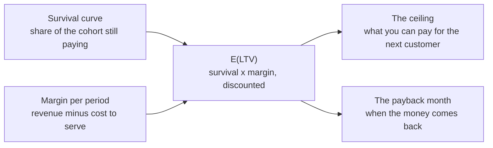

# Lifetime value

<!-- TODO(heqing): interview — the opening is yours, as on the other pages. The argument to land: this is the page where the other two meet. Entity retention says whether they stayed, value retention says how much they kept, and LTV multiplies the two into one number that a lot of people then steer the whole company by. -->

The [entity page](retention.md) asks whether customers came back. The [value page](value-retention.md) asks how much of what they had they kept. This page is where the two meet: lifetime value, LTV, is what one customer is worth in total before they leave, and it is a survival curve multiplied by a margin.

That makes it the most useful number on these three pages, and the easiest one to get badly wrong. Every error in the two inputs arrives here multiplied. It is also the number that decides how much you can pay for the next customer, and for most companies that is the largest recurring spending decision they make. CAC is customer acquisition cost: the acquisition spend divided by the customers that spend produced.

Where to jump: [what the number is](#what-lifetime-value-is) fixes the four decisions that set what your figure means, [how to compute it](#how-to-compute-it-from-your-own-cohort-table) is the arithmetic with a worked example, [the two ways it goes wrong](#the-two-ways-the-number-goes-wrong) is where almost everyone loses it, [what the number is for](#what-the-number-is-for) is the acquisition ceiling and the payback window, and [the five percent claim](#what-the-five-percent-claim-actually-says) is the most quoted sentence in this subject read against its source.

## What lifetime value is

Lifetime value is the total margin one customer produces over the whole relationship, expressed in today's money. Three things go into it and nothing else: how long they stay, how much margin they leave behind each period they are there, and what future money is worth today.

There are four decisions that fix what your number means. Each one has a common wrong answer, and each wrong answer moves the figure in a direction you can predict.

| The decision | The common answer, and what it costs | Use instead |
|---|---|---|
| Revenue or margin | Revenue, because it is the number already in the dashboard. It counts money you never keep, and overstates lifetime value by exactly your cost to serve: at a 70 percent gross margin, a revenue-based figure is about 1.4 times too big. | Contribution margin: that customer's revenue minus what it costs to serve them. Acquisition spend stays out of it, because it is the other side of the comparison. |
| Whose lifetime, counted from when | One number for both questions. The value of a customer at the moment you win them and the value remaining in a customer you already have are different numbers with different uses. | The at-acquisition figure for acquisition decisions. The remaining, or residual, value for deciding what to spend keeping someone, and for valuing the base you already have. |
| One customer or the average one | A single company-wide figure. There is no average customer; a base is a mixture, which is the whole subject of [why curves flatten](retention.md#why-curves-flatten). | One figure per segment that behaves differently, and never a blended figure divided by a blended CAC. |
| How far into the future | Silence about the horizon. A sum that stops at month 24 gets quoted as the lifetime value. | Compute over the periods you can actually see, and label it: that number is a floor, because the value beyond your data is real and missing from it [^fader-hardie-2014]. |

Every version of this number is a forecast about people who have not left yet. That makes it an expected value with a range around it rather than a fact about any customer. The careful notation is E(LTV), and it is worth using [^fader-hardie-2014].

## How to compute it from your own cohort table

The formula is one line, and every term in it comes off a spreadsheet you can already build:

> **E(LTV) = the sum, over each period _t_ = 0, 1, 2 and so on, of margin in period _t_ x share of the cohort still paying in period _t_, divided by (1 + _d_) to the power _t_**, where _d_ is the discount rate for one period. Period 0 is the period the customer arrives in, so the first period is not discounted.

There are five steps to calculating lifetime value, and no model is needed.

1. **Take the survival curve off your cohort table.** Take one cohort and write down the share of it still paying in each period. This is the [triangle](retention.md#reading-a-cohort-curve) from the entity page. Use the survival curve, which is the share still subscribed, rather than an activity curve. A customer who stops paying does not come back into the count.
2. **Compute margin per surviving customer per period.** Take the revenue that customer produced in the period and subtract what it costs to serve them: infrastructure, payment fees, support, and anything third-party that scales with them. Leave sales and marketing out. That spend is CAC, and counting it here as well is the most common way this number gets quietly deflated.
3. **Pick a discount rate and write it down.** Money three years out is worth less than money now. If nobody in the company can tell you a cost of capital, run the arithmetic at 5 percent a year and again at 15 percent, and see whether your decision flips between them. If it does, the decision was too close to call on this number.
4. **Multiply the three columns together and add them up.** That is the whole calculation.
5. **Stop where your data stops, and label what you stopped at.** A sum that ends at month 24 is the value of the first 24 months. Say so. Call it the lifetime value instead and a floor quietly becomes a forecast [^fader-hardie-2014].

**A worked example.** The numbers here are illustrative. Monthly survival comes off the cohort table, each surviving customer leaves $20 of contribution margin a month, and future money is discounted at 10 percent a year, which works out to a factor of about 0.992 a month.

| Month | Still paying | Margin that month | Discount factor | Discounted | Running total |
|---|---|---|---|---|---|
| 1 | 100.0% | $20.00 | 1.000 | $20.00 | $20.00 |
| 2 | 88.0% | $17.60 | 0.992 | $17.46 | $37.46 |
| 3 | 79.0% | $15.79 | 0.984 | $15.54 | $53.00 |
| 4 | 72.0% | $14.40 | 0.976 | $14.06 | $67.06 |
| 5 | 66.5% | $13.30 | 0.969 | $12.89 | $79.95 |
| 6 | 62.1% | $12.42 | 0.961 | $11.94 | $91.89 |

Carry the same three columns out to month 24 and the total reaches $236, with the curve still climbing when the data runs out. That is the entire method. It assumes nothing about the shape of the curve, and a spreadsheet does it in one column.

**The shortcut that looks like a formula.** If retention really were constant at rate _r_ every period, and margin constant at _m_, the sum above collapses to _m_ x _r_ / (1 + _d_ − _r_). That is the version usually taught as the lifetime value formula. The algebra is exact. The premise is what fails, and it fails in the direction the next section describes. Use it as a sanity check on a number you computed the long way, and never as the number itself.

<!-- TODO(heqing): interview — how deep into the math should this page go for a reader with no analyst? The worked table above, or the formulas with a diagram? This was left open on the old combined page too. -->

## The two ways the number goes wrong

**One over the churn rate is not a lifetime.** Most people get from a churn rate to a lifetime by dividing one by the churn rate. A 5 percent monthly churn rate becomes a 20-month average lifetime, and the calculation is quick enough that it rarely gets questioned. It holds only if customer lifetimes follow a geometric distribution. That means every customer has the same constant chance of leaving in every period, and real customer bases do not work that way. Run the formula on real filings and it shows. A Netflix 8-K reporting 7.2 percent monthly churn comes out at an average lifetime of 13.9 months. A Peloton S-1 comes out at 154 months [^fader-hardie-2026a].

The reason is the [sorting effect](retention.md#why-curves-flatten). Your churn rate is a mixture rather than a constant, and the mixture keeps re-weighting itself as the fragile customers leave first. Take the worked cohort above. First-month churn is 12 percent, so the shortcut gives an 8.3-month lifetime and a lifetime value of $167. The two years actually observed are worth $236, and that figure is still a floor, because the curve has not stopped climbing. The shortcut does not shave the number. It loses a third of it before the horizon even runs out.

**Pooling cohorts understates the base, and that is unusually good news.** Collapse a multi-cohort retention table into one aggregate retention rate and you understate what the base is worth. In one published example the aggregate rate came out at 0.6912, and the residual value of the customer base was understated by 38 percent. The bias runs the same way every time cohort-level rates rise. Rates rise whenever the base is a mixture of different customers, and a base is a mixture almost always [^fader-hardie-2010]. For a small team that is worth more than it sounds. The pooled number is not just noisy, it is systematically low, so you know which way you are wrong before you do any work.

Know both errors together, because they do not cancel out. Skipping the discount inflates the answer by about 8 percent over the two years in the worked example, and by more over a longer horizon. Dividing one by a churn rate deflates it by a third over the same two years, and by more as the curve flattens. A company that makes both mistakes lands on a plausible-looking number and is wrong twice.

## What the number is for

A lifetime value nobody spends against is trivia. The number exists to answer planning questions, and the biggest one is how much you are allowed to pay for the next customer.

**It sets the ceiling on acquisition cost.** You break even when acquisition cost equals lifetime value. Nobody sensible works at break-even, because lifetime value is a forecast and acquisition cost is a receipt. One of those two numbers can be wrong by half. The convention is to require a lifetime value of at least three times acquisition cost [^skok-2013], and the extra two thirds is the margin for error. Treat the three as a convention rather than a finding. It comes from practitioner writing rather than from a study, and this library plans a [benchmarks](README.md) page because numbers like it travel further than their evidence does.

**The ratio does not tell you whether you can afford the price.** A ratio compares two totals, and companies run out of cash on timing rather than on totals. The second number you need is the payback month. It is how long it takes for the margin from a customer to cover what you paid to get them.

The chart above runs one cohort against two different acquisition prices. The customer and the curve are the same in both cases, and only the price changes. Both prices sit below what that customer is worth over the full relationship, so neither one loses money in the end. Only one of them is a price a ten-person company can actually pay. The other is a 22-month loan, and the company has to fund it out of its own cash before any of it comes back. The commonly cited threshold is to recover acquisition cost inside twelve months [^skok-2013]. The more useful discipline is to know the month at all, and to know it for each channel separately.

**Prices differ by channel and by segment, and they move while you spend.** A blended lifetime value divided by a blended acquisition cost is the most misleading slide in this subject. The decision it gets used for is never about the average customer you already bought. It is about the next one. Push more spend into a channel and the acquisition cost goes up with it, and the customers that extra spend buys tend to retain worse, so both sides of the ratio move against you at the same time. Lifetime value earns its keep as a way to compare one channel or campaign against another. It stops earning it the moment the number becomes the plan [^gurley-2012].

Two rules keep the comparison honest, and both are free. Compute acquisition cost and lifetime value over the same cohort, so that this quarter's spend is not divided by customers you won last year. And compute both of them per channel and per segment before you average anything.

**Where the next dollar goes.** Retention, margin and acquisition cost are three levers on the same number, and they are not the same size. Improving customer retention by 1 percent improves customer and firm value by 3 to 7 percent. The same 1 percent improvement in margin is worth about 1 percent, and in acquisition cost it is worth between 0.02 and 0.3 percent [^gupta-2004]. Two caveats come with that finding, and both are the authors' own. The cost of buying the retention improvement is not in the number, so it does not follow that a firm should always improve retention. And eliminating churn entirely is not advisable, because a firm with 100 percent customer loyalty may simply be underpricing [^gupta-2004].

**What else the number decides.** Once it exists and people trust it, the same number tells you what a price change is worth, because a margin improvement compounds over the whole lifetime. It tells you how much service and support a segment justifies. It tells you which segments the product should be built for next, since the spread between segment lifetime values is usually wider than the spread between channels. And it tells you what the customer base you already have is worth. That last one is the residual-value question, and it is the one the [pooling bias](#the-two-ways-the-number-goes-wrong) distorts [^fader-hardie-2010].

**When not to compute it at all.** With one year of data and a curve that has not flattened, a lifetime value is a forecast with an error bar wider than the number itself. It will still get quoted to two decimal places. You do not need a lifetime value to know that retention is bad, that a channel is expensive, or that payback takes longer than your runway. The cohort table and the payback month show all three, and that is why both of them come first on this page.

<!-- TODO(heqing): interview — at what size does a company actually need LTV as a number, rather than just needing to know that retention is bad? You have made the argument before that a lot of small companies compute this far too early. -->

## What the five percent claim actually says

Almost every argument for spending on retention ends at one sentence: increasing customer retention by 5 percent increases profits by 25 to 95 percent. The document behind that sentence does not say it.

| | The source | The version in circulation |
|---|---|---|
| Where | A Bain brief by Fred Reichheld [^bain-2001] | A 2014 _Harvard Business Review_ piece, which links to the brief [^gallo-2014] |
| The sentence | "In financial services, for example, a 5% increase in customer retention produces more than a 25% increase in profit." | "increasing customer retention rates by 5% increases profits by 25% to 95%" |
| What moved | One named sector, offered as an example, stated as a floor. The number 95 appears nowhere in the document. | The sector is dropped, the "for example" is dropped, the floor becomes a range, and a 95 percent ceiling arrives from nowhere. |

**And the arithmetic nobody does.** A 5 percent increase in retention means moving a retention rate from 90 percent to 95 percent. That is cutting churn in half. Halving churn is the hardest thing most subscription businesses ever attempt, and a company that could do it on demand would have done it already. Read the claim that way and it is far less surprising, and much less useful as a target. That reading is this framework's own. It needs no citation, because it is arithmetic you can check in your head.

The defensible version of the same argument is the elasticity finding in [where the next dollar goes](#what-the-number-is-for). Retention is the strongest of the three levers, the size of the gap is published, and the authors' own caveats come with it.

**One line to stop repeating.** You will also hear that keeping a customer costs five times less than winning one. No primary source for it is traceable. Keep it as a slogan if it helps you argue, but do not put it in a plan as a number.

<!-- TODO(heqing): interview — the strongest version of the retention-is-worth-paying-for argument you would actually make to a founder, now that the famous number turns out to be one sector and a floor. Your entity-page answer was the leaky bucket; is this the same argument with money attached, or a different one? -->

## What a team of ten does

Do not build a customer-base valuation model. There are four steps, they go in this order, and all of them are free.

- **Compute the payback month before anything else.** You need three things: margin per customer per month, acquisition spend per channel over the window that produced those customers, and the month where the first covers the second. If that month is past twelve, you have a cash problem now, and you did not need a lifetime value to find it.
- **Run the survivor-ratio check on your own cohort table.** Divide each period's survivors by the period before. If those ratios rise, the base is a mixture and no single churn rate describes it [^fader-hardie-2026a].
- **If they rise, know which way you are wrong.** Any lifetime you got by dividing one by a churn rate is too short, any lifetime value built on it is too low, and any LTV-to-CAC ratio you are steering by is understated. Knowing the direction and the rough size is most of what a model would have bought you.
- **Then add up the three columns.** Survival, margin and discount factor, stopped where your data stops. Label the result the value of the first _N_ months, not the lifetime.

There is one thing not to do. Never put a blended lifetime value over a blended acquisition cost on a slide. It is the number most likely to be quoted back at you in a board meeting, and the least likely to survive the question of which customers it describes.

## Patterns & case studies

No pattern page yet. Three candidates:

- **The lifetime you can defend.** Survivor ratios, the added-up survival curve, and the error direction, as a repeatable check rather than a model [^fader-hardie-2026a] [^fader-hardie-2010].
- **What you can pay for a customer.** The payback ledger, computed per channel on one cohort, with the ceiling and the cash constraint kept separate [^skok-2013] [^gurley-2012].
- **Checking a number before you steer by it.** The five percent claim traced from restatement to source, as the worked example of a general method [^bain-2001] [^gallo-2014].

## Sources & Stories

The two mechanical failures are Fader and Hardie's. The average-lifetime argument and the Netflix and Peloton filings worked through under the formula come from a self-published technical note, read in full [^fader-hardie-2026a]. The pooling bias, the 0.6912 aggregate rate and the 38 percent understatement come from their _Marketing Science_ article, read in full [^fader-hardie-2010]. The sorting effect that explains why both happen is on the [entity page](retention.md) and is not re-derived here. Their December 2014 note on what is wrong with the standard CLV formula is the source for the E(LTV) notation and for the point that a bounded sum ignores everything past the horizon; it could not be fetched from this session's network, so it is cited at thesis level and its entry carries a verification note [^fader-hardie-2014].

The calculation section is method rather than citation. The five steps, the worked table, the two-rate test for the discount rate, and the instruction to label the horizon are this framework's, and the arithmetic is checkable by anyone with a spreadsheet. The closed-form shortcut is the geometric-series collapse of the same sum, derived here rather than imported, and it is presented as a sanity check because its constant-retention premise is the one the rest of the page dismantles.

The elasticity finding is peer-reviewed and was read in full through the authors' hosted copy [^gupta-2004]. Both caveats stated alongside it are the authors' own words rather than this page's hedging, which matters, because the finding is usually quoted without them.

The five percent set piece rests on two documents that were both read directly. The Bain brief was fetched and its full text extracted, and the sentence quoted here is verbatim: one sector, offered as an example, stated as a floor, with no 95 anywhere in it [^bain-2001]. Worth recording that earlier work in this repository listed this document as unreachable; it is reachable, and the entry now carries a working link. The _Harvard Business Review_ restatement is paywalled, but the sentence that matters and its link back to the Bain brief are both in the readable portion [^gallo-2014]. The halving-of-churn reading is this framework's own and needs no citation, because it is arithmetic.

The acquisition-side guidelines are practitioner conventions and are labeled as such on the page. Both the three-times ratio and the twelve-month payback threshold come from David Skok's SaaS metrics writing [^skok-2013]; the article host was unreachable from this session, so the entry records what is cited from it and marks the specifics for verification against the live page, including whether the lifetime value in his ratio is margin-adjusted. Bill Gurley's essay is the source for lifetime value as a tool for comparing channels rather than a plan, and for the observation that acquisition cost rises and customer quality falls as spend is pushed into a channel [^gurley-2012]; it was also unreachable from this session and is cited at thesis level with the same note. Neither source is quoted directly here.

One source is deliberately not used for its numbers. The _Harvard Business Review_ article usually cited as the counterweight, that long-lived customers are not automatically profitable ones, is paywalled beyond its opening [^reinartz-2002]. The figures commonly attributed to it could not be verified, so they do not appear on this page and should not be added without a copy in hand.

The figure is illustrative and says so on its face. It plots the same cohort as the worked table above, carried from month 6 out to month 24, so the table really is the first six rows of what the chart draws: monthly retention starting at 88 percent and drifting up as the fragile customers leave first, $20 of contribution margin a month, discounted at 10 percent a year. The two acquisition prices on it are chosen to make the payback point, not drawn from any company.

Interview questions on this page are unanswered by design, per this repository's working method.

<!-- Footnote targets; full entries with links and caveats live in REFERENCES.md -->

[^bain-2001]: [[BAIN-2001]](../../REFERENCES.md)
[^fader-hardie-2010]: [[FADER-HARDIE-2010]](../../REFERENCES.md)
[^fader-hardie-2014]: [[FADER-HARDIE-2014]](../../REFERENCES.md)
[^fader-hardie-2026a]: [[FADER-HARDIE-2026A]](../../REFERENCES.md)
[^gallo-2014]: [[GALLO-2014]](../../REFERENCES.md)
[^gupta-2004]: [[GUPTA-2004]](../../REFERENCES.md)
[^gurley-2012]: [[GURLEY-2012]](../../REFERENCES.md)
[^reinartz-2002]: [[REINARTZ-2002]](../../REFERENCES.md)
[^skok-2013]: [[SKOK-2013]](../../REFERENCES.md)
