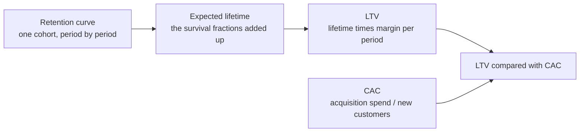

# Lifetime value

<!-- TODO(heqing): interview — the opening is yours, as on the other pages. The argument to land: this is the page where the other two meet. Entity retention says whether they stayed, value retention says how much they kept, and LTV multiplies the two into one number that a lot of people then steer the whole company by. -->

The [entity page](retention.md) asks whether customers came back. The [value page](value-retention.md) asks how much of what they had they kept. This page is where the two meet: lifetime value, LTV, is what a customer is worth in total before they leave, and it is built by multiplying a survival curve by a margin.

That makes it the most useful number on these three pages and the easiest one to get badly wrong, because every error in the two inputs arrives here multiplied. CAC is customer acquisition cost, the acquisition spend divided by the customers that spend produced.

Where to jump: [the chain](#the-chain-and-where-it-breaks) is how the pieces fit together, [one over the churn rate](#one-over-the-churn-rate-is-not-a-lifetime) is the shortcut almost everyone uses and the reason it fails, [the five percent claim](#what-the-five-percent-claim-actually-says) is the most quoted sentence in this subject read against the document it comes from, and [comparing with CAC](#comparing-lifetime-value-with-acquisition-cost) is what the number is actually for.

## The chain, and where it breaks

Read left to right, nothing in that chain is controversial. The trouble is that the first arrow is where almost everyone takes a shortcut, and the shortcut is wrong in a direction that matters.

The same chain drawn from the other end, starting at the funnel rather than at the cohort, is on the [conversion rate page](conversion-rate.md).

## One over the churn rate is not a lifetime

The standard way to get from a churn rate to a lifetime is to divide one by the churn rate. A 5 percent monthly churn rate becomes a 20-month average lifetime, and the calculation is so quick that it rarely gets questioned.

It holds only if customer lifetimes follow a geometric distribution, which means every customer really does have the same constant chance of leaving in every period. Real customer bases do not look like that [^fader-hardie-2026a]. Fader and Hardie work the failure through on actual filings: a Netflix 8-K reporting 7.2 percent monthly churn implies an average lifetime of 13.9 months under the formula, while a Peloton S-1 implies 154 months [^fader-hardie-2026a].

The reason is the subject of [why curves flatten](retention.md#why-curves-flatten) on the entity page. Your churn rate is a mixture rather than a constant, and the sorting effect keeps re-weighting that mixture underneath you as the fragile customers leave first. A single number cannot describe a base that is changing composition every period.

**Pooling is wrong in a known direction, which is unusually good news.** Collapsing a multi-cohort retention table into one aggregate retention rate, 0.6912 in Fader and Hardie's worked example, understated the residual value of the customer base by 38 percent. The bias always runs the same way whenever cohort-level rates rise, which is whenever the base is heterogeneous, which is essentially always [^fader-hardie-2010]. For a small team that is worth more than it sounds: the pooled number is not merely noisy, it is systematically low, so you know which way you are wrong before you do any work.

**The honest version needs no model.** Add up the survival fractions period by period, straight off your own cohort curve. If 100 customers start and 60 are still there in period two and 45 in period three, you are adding 1.00 plus 0.60 plus 0.45 and so on. That assumes nothing about the curve's shape, which is the entire point, and it is arithmetic you can do in a spreadsheet.

<!-- TODO(heqing): interview — how deep into the math should this page go for a reader with no analyst? One worked example like the one above, or the formulas with a diagram? This was left open on the old combined page too. -->

## What the five percent claim actually says

Almost everyone arguing for retention money eventually reaches for one sentence. It is worth knowing what the document behind it says, because the version in circulation and the version in the source are not the same claim.

**The source.** A Bain brief by Fred Reichheld puts it this way, verbatim: "In financial services, for example, a 5% increase in customer retention produces more than a 25% increase in profit." [^bain-2001] One named sector, offered as an example, stated as a floor. The number 95 appears nowhere in that document.

**The version you have heard.** A 2014 Harvard Business Review piece restates it as increasing customer retention rates by 5 percent increasing profits by 25 to 95 percent, while linking to the Bain brief itself [^gallo-2014]. Between the two, the sector is dropped, the "for example" is dropped, a floor becomes a range, and a 95 percent ceiling arrives from nowhere.

**And the arithmetic nobody does.** In the original setup, a 5 percent increase in retention means moving a retention rate from 90 percent to 95 percent. That is cutting churn in half. Halving churn is not a tweak, it is the hardest thing most subscription businesses ever attempt, and a company that could do it on demand would have done it already. Read that way the claim is far less surprising and much less useful as a target. That reading is this framework's, and it needs no citation, because it is arithmetic you can check in your head.

**The honest replacement.** A peer-reviewed study in the _Journal of Marketing Research_ reports elasticities instead, meaning the percent change in one quantity produced by a 1 percent change in another. Improving customer retention by 1 percent improves customer and firm value by 3 to 7 percent; the same 1 percent improvement in margin is worth about 1 percent, and in acquisition cost between 0.02 and 0.3 percent [^gupta-2004]. Retention is the strongest of the three levers, and now you have a defensible size for how much stronger.

Two caveats travel with that finding, and both are the authors' own. They did not include what the improvement costs to buy, and say so directly: even though retention has the largest impact on customer value, they cannot suggest that a firm should always improve its retention [^gupta-2004]. And they cite a result that it is not advisable to eliminate churn entirely, because a firm with 100 percent customer loyalty may simply be underpricing [^gupta-2004]. Both of those cut against the way the five percent claim is normally deployed.

**One line to stop repeating.** You will also hear that keeping a customer costs five times less than winning one. No primary source for it is traceable. Keep it as a slogan if it helps you argue, but do not put it in a plan as a number.

<!-- TODO(heqing): interview — the strongest version of the retention-is-worth-paying-for argument you would actually make to a founder, now that the famous number turns out to be one sector and a floor. Your entity-page answer was the leaky bucket; is this the same argument with money attached, or a different one? -->

## Comparing lifetime value with acquisition cost

The number exists to be compared with what you paid to get the customer. The SaaS metrics literature frames the whole business question as whether LTV sufficiently exceeds CAC, with a ratio above three as the commonly cited guideline [^skok-2013].

Treat that three as a convention rather than a finding. It is a rule of thumb from practitioner writing, not a result from a study, and the pages in this library on [benchmarks](README.md) exist because numbers like it travel further than their evidence does.

**What a team of ten does.** Do not build a customer-base valuation model. Three steps, all free:

- Compute the successive survivor ratios from your own cohort table, the check described on the [entity page](retention.md#why-curves-flatten). If they rise, your base is heterogeneous.
- If they rise, then any lifetime you got by dividing one by a churn rate is too short, any LTV built on it is too low, and any LTV-to-CAC ratio you are steering by is understated. Knowing the direction and rough size of the error is most of what a model would have bought you.
- Compute the honest lifetime by adding up the survival fractions off your own curve, and use that instead.

<!-- TODO(heqing): interview — at what size does a company actually need LTV as a number, rather than just needing to know that retention is bad? You have made the argument before that a lot of small companies compute this far too early. -->

## Patterns & case studies

No pattern page yet. Two candidates:

- **The lifetime you can defend.** Survivor ratios, the added-up survival curve, and the error direction, as a repeatable check rather than a model [^fader-hardie-2026a] [^fader-hardie-2010].
- **Checking a number before you steer by it.** The five percent claim traced from restatement to source, as the worked example of a general method [^bain-2001] [^gallo-2014].

## Sources & Stories

The two mechanical failures are Fader and Hardie's. The average-lifetime argument and the Netflix and Peloton filings worked through under the formula come from a self-published technical note, read in full [^fader-hardie-2026a]. The pooling bias, the 0.6912 aggregate rate and the 38 percent understatement come from their _Marketing Science_ article, read in full [^fader-hardie-2010]. The sorting effect that explains why both happen is on the [entity page](retention.md) and is not re-derived here.

The five percent set piece rests on two documents that were both read directly. The Bain brief was fetched and its full text extracted, and the sentence quoted here is verbatim: one sector, offered as an example, stated as a floor, with no 95 anywhere in it [^bain-2001]. Worth recording that earlier work in this repository listed this document as unreachable; it is reachable, and the entry now carries a working link. The Harvard Business Review restatement is paywalled, but the sentence that matters and its link back to the Bain brief are both in the readable portion [^gallo-2014]. The halving-of-churn reading is this framework's own and needs no citation, because it is arithmetic.

The peer-reviewed replacement is fully readable through the authors' hosted copy and was read in full [^gupta-2004]. Both caveats stated alongside it are the authors' own words rather than this page's hedging, which matters, because the finding is usually quoted without them.

One source is deliberately not used for its numbers. The Harvard Business Review article usually cited as the counterweight, that long-lived customers are not automatically profitable ones, is paywalled beyond its opening [^reinartz-2002]. The figures commonly attributed to it could not be verified, so they do not appear on this page and should not be added without a copy in hand. The LTV-to-CAC framing is David Skok's practitioner guideline [^skok-2013], presented here as a convention rather than a finding.

Interview questions on this page are unanswered by design, per this repository's working method.

<!-- Footnote targets; full entries with links and caveats live in REFERENCES.md -->

[^bain-2001]: [[BAIN-2001]](../../REFERENCES.md)
[^fader-hardie-2010]: [[FADER-HARDIE-2010]](../../REFERENCES.md)
[^fader-hardie-2026a]: [[FADER-HARDIE-2026A]](../../REFERENCES.md)
[^gallo-2014]: [[GALLO-2014]](../../REFERENCES.md)
[^gupta-2004]: [[GUPTA-2004]](../../REFERENCES.md)
[^reinartz-2002]: [[REINARTZ-2002]](../../REFERENCES.md)
[^skok-2013]: [[SKOK-2013]](../../REFERENCES.md)
