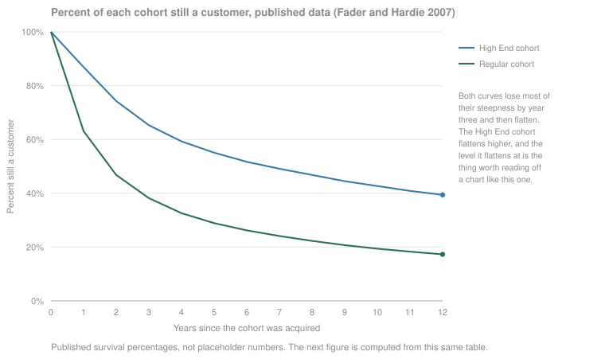
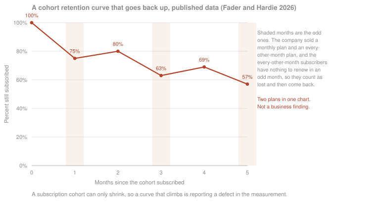
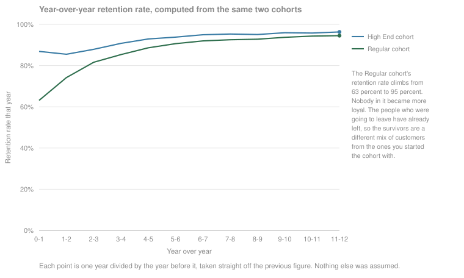
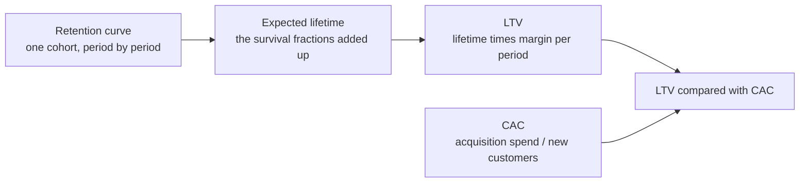

# Retention

You spent all the time and energy getting the user finally to be a part of your monthly paying group. Now what? Retention is the science of getting your user to keep engaging with your product, to keep getting value from it, and to become a long-running revenue-generating unit for your business.

Retention can be measured and tailored to your own business, but the whole point of it is the same everywhere: keep your customer happy, so they come back to you and keep adding value.

Where to jump: [what retention is](#what-retention-is) fixes the definition, and [two kinds of retention](#two-kinds-of-retention-and-the-hybrid) is the split the rest of the page runs on. If you sell something people use, read [classical ways to see it](#classical-ways-to-see-it) and then [why the curve flattens](#why-the-curve-flattens), which is the section most teams have never been shown. If you sell contracts, [value retention](#value-retention-and-why-nrr-is-not-one-metric) is where the money argument lives. [Retention, LTV, and CAC](#retention-ltv-and-cac) joins the two halves, and [when a retention metric misleads the team](#when-a-retention-metric-misleads-the-team) is the counterweight to everything above it.

## What retention is

Retention could be almost anything. It could be your typical user activities. It could be your B2B accounts coming back to you year over year. It could be a dollar amount, the enterprise contracts you keep signing. What matters is the fundamental value your company is trying to create over the long term, because that is the thing you are trying to retain.

The most common definition mistake is copying someone else's. A famous retention model, Duolingo's for instance, may have nothing to do with your business, and a definition being well known does not make it yours. Look at your retention definition and ask whether it actually contributes to your north star. If it does not, it is the wrong definition, however respectable its pedigree.

Three choices turn that idea into a number, and the number means nothing until all three are written down and held fixed.

| Choice | The question | What goes wrong when it floats |
|---|---|---|
| Entity | What is coming back: a user, an account, a workspace, a subscription, a dollar of contract value? | This is the split the [next section](#two-kinds-of-retention-and-the-hybrid) is built on. Two teams measuring different entities will disagree about the same quarter and both be right. |
| Activity event | What counts as coming back? | Pick the one core action that means the customer got what they came for [^tavel-2017] [^tavel-2023]. Gluing two actions into one number lets a gain in one hide a loss in the other, which is how [Pinterest's engagement metric went wrong](#when-a-retention-metric-misleads-the-team). |
| Window | What counts as one period, and how long after the start are you checking? | This is where the number moves most, and it moves by more than most teams expect. |

**The window is not a detail.** Day-N retention counts an entity as retained if it was active on exactly day N. Rolling or unbounded retention counts it if it was active on day N or any day after. And a day can mean a calendar day or a rolling 24 hours from signup. One published worked example on a single app puts day-1 retention at 32 percent using rolling 24-hour windows, 43 percent using calendar days, and 59 percent using the rolling definition [^yakubenkov-2019]. Same app, same users, same day, three answers. N-day and unbounded definitions likewise produce completely different retention data from the same events [^berezovsky-2022].

Rolling retention has one property worth knowing before you adopt it: as more data arrives, a given day's number can only go up, because a user who comes back late retroactively becomes retained on every earlier day. The curve it produces can never decrease. That is a property of the definition rather than a finding about your product, and it can look a lot like the [smiling curve](#two-kinds-of-retention-and-the-hybrid) people get excited about [^yakubenkov-2019].

**What to do this week.** Write the three choices down in one place before you compute anything, then hold them. Set the window to the natural frequency of the product rather than to the calendar: a tool people genuinely use once a month has no meaningful day-1 retention, and measuring it weekly will only produce noise [^sequoia-2018]. Use one activity event, not a combination. Pick either N-day or unbounded and never quote both in the same conversation without saying which is which. None of that needs an analyst, and skipping it is what makes every later number unarguable-with rather than true.

## Two kinds of retention, and the hybrid

Retention divides into two kinds. The first is retention of the entity: users, accounts, activity, whether they come back. The second is retention of the amount: contract value, whether the dollars renew and expand. Then there is the hybrid world, where revenue and churn combine into lifetime value.

|  | Entity retention | Value retention | LTV, the hybrid |
|---|---|---|---|
| What is retained | Users, accounts, workspaces | Contract dollars | Both, collapsed into one number |
| Usual form | A cohort curve and a cohort table | Net revenue retention, usually written NRR | Expected margin per acquired customer |
| Who asks for it | Product and growth | Finance, the board, investors | Both, usually in the same argument |
| Can it exceed 100 percent | No, a cohort cannot grow | Yes, expansion inside surviving accounts can outrun losses | Not a percentage |
| Where it breaks | The window and the event definition | The construction, and the same name meaning five things | Assuming one constant churn rate |
| On this page | [Classical ways to see it](#classical-ways-to-see-it) and [why the curve flattens](#why-the-curve-flattens) | [Value retention](#value-retention-and-why-nrr-is-not-one-metric) | [Retention, LTV, and CAC](#retention-ltv-and-cac) |

**A note on the smiling curve, because the published sources contradict each other.** Sequoia lists a smiling curve, one that falls and then climbs back, among its three archetypes [^sequoia-2018b], and a16z's growth team reports smiling curves at AI-native companies, where customers who churned or went quiet come back later [^rodriguez-immerman-2025]. Andrew Chen says flatly that he has never seen one, that a curve which starts high, goes low, and becomes high again is not something that shows up in the data he has looked at [^chen-2025]. This framework's reading is that the split above settles it, because the three are not plotting the same quantity. The a16z curve is net dollar retention, where expansion inside surviving accounts can lift the line at any point. A survival curve, the share of a cohort still subscribed, cannot climb at all. An activity curve, the share of a cohort active in a given period, sits between the two, because a dormant user can come back. Ask which of those three a smile is drawn on before arguing about whether it is real. Worth reading the a16z piece with its authorship in view, since the firm invests in the category it is describing.

## The other side of churn

For one fixed cohort over one fixed window, retention and churn are the same measurement read from opposite ends: they add to one. A 92 percent monthly retention rate is an 8 percent monthly churn rate, and neither is more true than the other.

The two words carry different baggage in practice. Churn is where the definitional damage concentrates, because a churn rate has more construction choices sitting under it than a retention curve does. Dave Kellogg's enumeration of them, written for subscription businesses, is the useful list: whether you count logos or dollars, where a logo is one customer account regardless of what it pays and dollars means annual recurring revenue, whether you measure at the product level or the account level, how much of a shrinking account is offset by expansion elsewhere, when in the period you take the measurement, whether the denominator is the whole revenue pool or only the contracts actually up for renewal that period, and whether a contract is valued at its original or its current price [^kellogg-2016]. His summary of the stakes: those choices can move the same business between a 10 percent and a 20 percent churn rate, which is a 100 percent difference in the answer [^kellogg-2016].

The one distinction worth carrying everywhere is logo churn against dollar churn, because it is the [two-kinds split](#two-kinds-of-retention-and-the-hybrid) wearing different words. A company can lose a quarter of its customers and grow its revenue in the same year, and both statements are honest.

<!-- TODO(heqing): interview — with the two-kinds split above in place, does the churn framing belong mostly to the dollar side (finance, LTV, renewals) and the retention framing to the entity side (product, engagement loops)? Or do both sides need both words? -->

## Why retention is worth measuring

Somebody is going to quote you a number in this argument. Here is what the primary documents actually say, so you can decide whether to repeat it.

**The famous one.** The sentence everyone is paraphrasing comes from a Bain publication in 2001, and it reads: "In financial services, for example, a 5% increase in customer retention produces more than a 25% increase in profit." [^bain-2001] One sector, offered as an example, stated as a floor. The number 95 appears nowhere in that document. The 25-to-95 range in circulation today comes from a 2014 Harvard Business Review piece that restates the claim with the sector dropped, the for-example dropped, the floor converted into a range, and a 95 percent ceiling added, while linking to the Bain document itself [^gallo-2014].

**And the arithmetic nobody does.** In the original setup, a 5 percent increase in retention means moving a retention rate from 90 percent to 95 percent. That is cutting churn in half. Halving churn is not a tweak, it is the hardest thing most subscription businesses ever attempt, and a business that could do it on demand would have done it already. Read that way the claim is much less surprising and much less useful as a target. That reading is this framework's, and it needs no citation, because it is arithmetic you can check in your head.

**The honest replacement.** A peer-reviewed study in the Journal of Marketing Research reports elasticities instead, meaning the percent change in one quantity produced by a 1 percent change in another. A 1 percent improvement in retention raised customer value, and with it firm value, by 3 to 7 percent. The same 1 percent improvement in margin was worth about 1 percent, and in acquisition cost between 0.02 and 0.3 percent [^gupta-2004]. Two things travel with that finding. It is firm value, not profit. And the authors explicitly decline to conclude that firms should therefore always push retention higher, because they did not model what the improvement costs to buy [^gupta-2004].

**The counterweight.** Long-lived customers are not automatically profitable ones. A study of more than 16,000 customers across four companies over four years found correlations between customer longevity and profitability of only 0.20 to 0.45, and at one of the four companies the loyal customers were more expensive to serve than the others [^reinartz-2002].

**One line to stop repeating.** You will also hear that keeping a customer costs five times less than winning one. No primary source for that is traceable, and the people who have gone looking end up at a study from the late 1980s that nobody can produce. Keep it as a slogan if it helps you argue, but do not put it in a plan as a number.

<!-- TODO(heqing): interview — the strongest version of this argument you would make to a founder who only watches signups. -->

## Classical ways to see it

Three standard views, each answering a different question.

**The retention curve.** Take one cohort, meaning the group of entities that started in the same period, and plot the share of it still active at each period afterwards. Three shapes get named [^sequoia-2018b]:

- **Flattening.** The curve falls steeply, then levels off. The level it flattens at is the share of that cohort you actually keep, and the higher it flattens, the higher your long-term retention.
- **Declining.** It never levels off and heads for zero. This is the leaky bucket: growth has to be bought again every period, because nothing accumulates.
- **Smiling.** It falls and then climbs. See the [note on smiles](#two-kinds-of-retention-and-the-hybrid) before you celebrate one.

Sequoia's own caveat is worth keeping attached: for most products retention eventually trends to zero, so a curve that looks flat is flat over the horizon you have measured, not forever [^sequoia-2018b].

**Flattening and product-market fit.** If the curve flattens, you have probably found product-market fit, with the caveat that it is fit for some market and the next job is to segment the curve and find out whose [^balfour-2013]. The condition that usually gets skipped comes from Casey Winters: a flat curve is necessary but not sufficient. If the business is not growing then it does not have product-market fit, whatever the curve looks like, so retention alone cannot measure it [^winters-2021].

**A shape to expect, not a target to hit.** Andrew Chen, an investor who has looked at a great many of these curves, offers a rule of thumb: whatever day-1 retention is, expect roughly half of it by day 7, and half again by day 30, with most products losing more than 90 percent of new users inside the first month [^chen-2025]. Treat that as the shape of the world rather than a bar to clear. This page publishes no retention benchmark, because no benchmark survived checking, and the reasons are in [Sources & Stories](#sources--stories). The steepest part of every curve here is the first period, which is why onboarding is where new-user retention is won or lost [^winters-2017].

**The cohort table.** Cohorts as rows, age as columns, one retention percentage per cell. The useful skill is not building it, it is reading the shapes in it [^sequoia-2018b]:

| What you see | What it usually means |
|---|---|
| A horizontal streak: one row unlike its neighbors | Something specific to that cohort. A bad acquisition campaign is the standard cause. |
| A diagonal streak: cutting across cohorts | Something that hit everyone on the same date. A release, an outage, a pricing change. |
| A vertical streak: one column unlike its neighbors | Something tied to age rather than to date. Annual plans coming up for renewal, trials expiring. |

Two facts about the table that decide what you can say with it. Total retention is the weighted average of your cohort retentions, so a month that acquired ten times as many entities as the others effectively sets your headline number by itself [^sequoia-2018b]. And a blended figure computed across everyone at once is cheap, fine in a report, and answers a different question from the cohort view, as long as everyone in the room knows which one is on the slide [^berezovsky-2024]. The same argument, worked through with figures, is on the [conversion rate page](conversion-rate.md) [^bernhardsson-2017].

**When the curve is telling you about your SQL, not your customers.** A widely shared cohort retention chart for a subscription razor company ran 100, 75, 80, 63, 69, 57: down, up, down, up, down. Fader and Hardie's rule for spotting this is one sentence: "by definition, a cohort-level retention plot for a subscription business should be monotonically decreasing" [^fader-hardie-2026b], meaning it can only go down, because a cohort that has lost a subscriber does not get them back inside the same count. The cause turned out to be a plan mix. The company sold a monthly plan and an every-other-month plan, and the every-other-month subscribers have nothing to renew in an odd month, so they drop out of the numerator and come back the following month [^fader-hardie-2026b].

A retention curve that violates its own definition is a measurement bug, not a business insight. Before you explain a surprising shape, check whether the shape is possible.

**The state model.** The third view stops treating the base as a curve and treats it as a set of activity states with measurable rates between them: new, current, reactivated, resurrected, at risk, dormant. It is the view that turns retention from a number you watch into a rate you can hand to a team with a goal on it. This framework covers it in full in [state-based retention measurement](../modules/01-ai-data-quality/state-based-retention-measurement.md), including the published Duolingo model it draws on and the sensitivity analysis that picks which rate is worth working on [^gustafson-2023] [^mazal-2023]. It is not re-derived here.

If the full model is more than you want right now, growth accounting is the cheap cousin: split a period's active count into new, retained and resurrected entities, and the previous period's into retained and churned, which is enough to say whether growth is coming from new entities or from keeping the ones you already had [^hsu-2015].

<!-- TODO(heqing): interview — which visualization should a team build first, and which are decoration until a certain size? -->

## Why the curve flattens

Every curve in the section above bends the same way: steep, then flat. The usual explanation is that customers become more loyal the longer they stay. That explanation is wrong, and knowing why changes what you do with the chart.

Peter Fader and Bruce Hardie published the correction in 2007 [^fader-hardie-2007]. In their model of a subscription base, each individual customer has a constant probability of leaving in any period, one that never changes for as long as they are a customer. What differs is that the probability is not the same for everyone: the base is a mixture of different people rather than one average person, which is what heterogeneity means. Run that mixture forward and the aggregate retention rate rises anyway. Their phrase for the rise is that it is "simply a sorting effect in a heterogeneous population" [^fader-hardie-2007], and they reject the folk reading in the same breath: this is not a story about individual customers becoming increasingly loyal.

The mechanism is a sort, and it is not subtle. Customers with a high chance of leaving leave sooner, so with every period that passes the survivors contain a larger share of the people who were never likely to leave. Nobody changed. The mix changed. Demographers found the same effect first and named it: as a cohort ages, the individuals at highest risk exit first, which produces population-level patterns that can be surprisingly different from the pattern of any subpopulation or individual inside it [^vaupel-yashin-1985].

**A little arithmetic makes it obvious.** Fader and Hardie's teaching example splits one cohort into two segments whose retention rates never move: one third of the cohort retains at 90 percent every period, the other two thirds at 50 percent [^fader-hardie-2010]. Start with 300 customers.

| Period | Segment at 90 percent | Segment at 50 percent | Cohort still alive | Cohort retention that period |
|---|---|---|---|---|
| 0 | 100 | 200 | 300 | |
| 1 | 90 | 100 | 190 | 63.3% |
| 2 | 81 | 50 | 131 | 68.9% |
| 3 | 72.9 | 25 | 97.9 | 74.7% |
| 4 | 65.6 | 12.5 | 78.1 | 79.8% |
| 5 | 59.0 | 6.3 | 65.3 | 83.6% |

Computed from their published example; neither segment's rate ever moves. The cohort rate climbs anyway, and keeps climbing toward 90 percent, the rate of the segment that is all that will be left [^fader-hardie-2010]. That is where the flattening level comes from, derived rather than observed: a retention curve flattens at the retention rate of your stickiest segment, because in the end that segment is the cohort.

**The same thing in real published data.** Divide each year of the survival curves above by the year before it. That is the retention rate the base actually experienced in each year, computed from the numbers already in the first figure and nothing else:

The Regular cohort's retention rate climbs from 63 percent in year one to 95 percent in year twelve. Had you been running that business, you would have watched your retention rate improve every year while doing nothing at all, and every individual customer's chance of leaving would have stayed exactly where it started.

**The two-line check to run this week.** Take one cohort's survivor counts and divide each period by the period before it. In Fader and Hardie's worked example the ratios run 0.506, then 0.692, then 0.780: 50.6 survivors out of the original 100, then 35.0 out of those 50.6, then 27.4 out of those 35.0 [^fader-hardie-2026a]. If your ratios rise like that, a single churn rate cannot describe your customer base, and everything you have computed from one is wrong in a direction you can now predict. This is a spreadsheet with two columns. It is the highest-value thing on this page for a team with no analyst.

**Do not fit a line to it.** Fitting a curve to the history you have and extending it forward is the obvious move and it fails badly. Fader and Hardie fit linear, exponential and quadratic curves to seven years of the same data and projected to year twelve: the linear fit underestimated year-twelve survival by 81 percent, the exponential by 30 percent, and the quadratic overestimated it by 92 percent [^fader-hardie-2007]. The fitted curves are not even coherent as descriptions of a customer base. The linear one implies negative survival after year fourteen, which is not a forecast, it is an error message.

**What this changes on Monday.** Three things, all free. Stop reporting a rising retention rate as an improvement until you have checked whether the base is simply sorting itself. Stop projecting the curve by fitting a trendline through it. And when the curve flattens, treat the level it flattens at as a description of one segment rather than of your customers in general, then go and find out which segment that is, which is the segmentation question [Balfour points at](#classical-ways-to-see-it) [^balfour-2013].

## Value retention, and why NRR is not one metric

The other half of the split. Here the thing being retained is contract value, and the metric almost everyone reaches for is net revenue retention, NRR: what last year's customers are worth today, compared with what the same set of customers was worth a year ago. Above 100 percent means expansion inside the surviving base outran everything lost. ARR is annual recurring revenue and MRR is its monthly version.

**There are two things called NRR, and only one of them is NRR.** Real NRR is snapshot-based and cohort-based: take the customers who existed a year ago, and compare what that same set is worth now against what it was worth then. The imposter, which Dave Kellogg calls lazy NRR, is starting ARR plus net expansion, over starting ARR. That is a quarterly expansion measure wearing the other metric's name, and it does not answer the same question [^kellogg-2022].

**Five filings, five constructions, one metric name.** These are primary documents, filed with the SEC, where an S-1 is the registration statement a company files to go public and a 10-K is its annual report. Every one of these companies warns in its own filing that its number may not be comparable to anyone else's, and reading them side by side shows why.

| Filing | What the metric actually counts | Window | Disclosed |
|---|---|---|---|
| Snowflake S-1, 2020 [^snowflake-2020] | Product revenue from capacity customers who used the platform in the first month of year one; customers who stopped using it stay in the denominator at zero | Trailing two years | 180%, 169%, 223%, 158% |
| Slack S-1, 2019 [^slack-2019] | MRR, excluding new paid customers and free-to-paid conversions | Trailing twelve months | 171%, 152%, 143% |
| HubSpot S-1, 2014 [^hubspot-2014] | Subscription Dollar Retention Rate, computed monthly and then annualized | Monthly, annualized | 71.6%, 82.4%, 82.9%, 90.3% |
| WeWork S-1, 2019 [^wework-2019] | Desks, under the name net membership retention rate | One window | 119% |
| Innovid 10-K, FY2022 [^innovid-2023] | Core clients, with the definition widened to include publishers after an acquisition; prior years not restated | Annual | 111% on the new definition, against 127% and 121% on the prior methodology |

Four things fall out of that table.

**The celebrated number was already falling.** Snowflake's 158 percent is the one people quote, and it is the lowest of the four figures the company disclosed, down from 223 percent. The filing forecasts its own decline, and says plainly that its metrics may differ from similarly titled metrics used by other companies [^snowflake-2020]. Slack's disclosed series falls too, without the fanfare, from 171 to 152 to 143 percent over three years [^slack-2019]. If you are about to benchmark yourself against a famous NRR, check whether the famous number was the last one in the series.

**Read HubSpot's S-1 if you have been taught that dollar retention above 100 percent is the normal condition of a healthy subscription business.** Every Subscription Dollar Retention Rate figure it discloses is below 100 percent, from 71.6 percent in 2011 to 90.3 percent in the second quarter of 2014. The word churn does not appear anywhere in the document [^hubspot-2014].

**The name does not tell you the unit.** WeWork's net membership retention rate counts desks, not dollars, in a filing that says outright it is borrowing conventional subscription-software measurement conventions for a real-estate business [^wework-2019]. One data point, one window, and the offering was withdrawn.

**A redefinition and a decline look identical from outside.** Innovid changed which clients counted, reported 111 percent against prior-year figures of 127 and 121 percent computed the old way, and did not restate the prior years [^innovid-2023]. The drop mixes a real change in the business with a change in the definition, and from outside the two cannot be separated. This is not misconduct. It is what happens whenever a definition moves and history does not move with it, which is a thing metric definitions do quietly and constantly [^stancil-2021].

**Five questions to ask before you believe anyone's NRR**, including your own. Drawn from the filings above and from Kellogg's enumeration of churn-rate choices [^kellogg-2016] [^kellogg-2022]:

1. Which cohort of customers, and over what window?
2. Are the customers who left still in the denominator at zero, or dropped out of it?
3. Are new customers and free-to-paid conversions inside or outside the calculation?
4. Is the unit dollars, or something else with a dollars-sounding name?
5. Has the definition changed since the year you are comparing against, and were the prior years restated?

**One more disclosure decision worth borrowing.** In its first-quarter 2024 shareholder letter, Netflix announced it would stop reporting quarterly membership numbers and average revenue per membership. The stated reason is a metrics argument, not a retention one: with several price tiers in the market, each additional membership now has a very different business impact, so a count of memberships no longer maps onto value [^netflix-2024]. That is a change in what the company discloses rather than an admission that the metric was wrong, but the underlying observation generalizes. When your units stop being interchangeable, counting them stops being informative.

**What a team of ten does.** You do not need NRR machinery, and you should not buy any. You need a renewal ledger: one row per account, the contract value it had twelve months ago and the contract value it has today, taken from the same list of accounts, with the accounts that left still on the list at zero. That is the cohort NRR above, computed by hand in a spreadsheet [^kellogg-2022]. This framework's position is that you should build the ledger before you buy anything that offers to compute this for you, because the ledger is the only thing you will have to check the tool against.

## Retention, LTV, and CAC

LTV is lifetime value, the total margin you expect from a customer before they leave. CAC is customer acquisition cost: acquisition spend divided by the customers that spend produces. Retention is the input that decides whether the first number is large, small, or meaningless.

The same chain drawn from the other end, starting at the funnel, is on the [conversion rate page](conversion-rate.md), and the SaaS metrics literature frames the whole business question as whether LTV sufficiently exceeds CAC, with a ratio above three as the commonly cited guideline [^skok-2013].

**The shortcut that breaks the chain.** The standard way to get from a churn rate to a lifetime is to divide one by the churn rate. Fader and Hardie take that apart: the formula holds only if customer lifetimes follow a geometric distribution, meaning every customer really does have the same constant chance of leaving in every period, and real customer bases do not look like that [^fader-hardie-2026a]. They work it through on filings. A Netflix 8-K reporting 7.2 percent monthly churn implies an average lifetime of 13.9 months under the formula; a Peloton S-1 implies 154 months [^fader-hardie-2026a]. The [previous section](#why-the-curve-flattens) is the reason: your churn rate is a mixture, not a constant, and the sorting effect keeps re-weighting the mixture underneath you.

**And pooling is wrong in a known direction.** Collapsing a multi-cohort retention table into one aggregate retention rate, 0.6912 in Fader and Hardie's worked example, understated the residual value of the customer base by 38 percent. The bias always runs the same way whenever cohort-level rates rise, which is whenever the base is heterogeneous, which is essentially always [^fader-hardie-2010]. That is unusually good news for a small team: the pooled number is not merely noisy, it is systematically low, so you know which way you are wrong before you do any work.

**What a team of ten does.** Do not build a customer-base valuation model. Compute the survivor ratios from the [two-line check](#why-the-curve-flattens). If they rise, then any lifetime you got by dividing one by a churn rate is too short, any LTV built on it is too low, and any LTV-to-CAC ratio you are steering by is understated. Knowing the direction and roughly the size of your error is most of what the model would have bought you. The honest version of the lifetime calculation is to add up the survival fractions period by period straight off your own curve, which assumes nothing about its shape.

<!-- TODO(heqing): interview — how deep into the math should this go for the no-analyst audience? One worked example, or formulas with a diagram? -->

## When a retention metric misleads the team

Everything above assumes the metric you picked is pointed at the thing you want. The failure mode of this whole subject is that it quietly is not, and the clearest account on record comes from Casey Winters, who watched it happen three different ways [^winters-2016].

**Pinterest and the combined metric.** Pinterest's top engagement metric became the weekly active repinner or clicker: a user who did either of two actions in a week. Combining two actions into one number produced what Winters calls false rigor. An experiment could raise the metric while quietly trading repins away for clicks, and the readout would look like progress. Taken to its logical end, a ranking algorithm optimizing that number optimizes for clickbait, an empty-calorie form of engagement that costs long-term engagement to get [^winters-2016]. The metric had a second hole: it described only the demand side, so at a product whose entire promise is finding new ideas, no team had a reason to work on getting new content into the system. Pinterest stopped using it [^winters-2016]. The alternative is the core-action framing: pick the single action that means the user got what they came for, and measure retention of that [^tavel-2017] [^tavel-2023].

**One marketplace, two top metrics, two products.** Before they merged, Grubhub goaled on revenue and Seamless on gross merchandise value, the total value of orders placed. Same business model, same market. Seamless sorted restaurants alphabetically; Grubhub sorted them by average commission. Winters reports that the sort order was one of the first things changed after the merger [^winters-2016].

**And the version that ends the company.** Homejoy goaled on revenue, and found that revenue was easier to move by driving first-time use than by driving repeat use. The retention underneath was terrible. The company shut down [^winters-2016].

**The honest counterweight.** Real retention interventions do not usually produce the numbers in growth stories. Researchers at Wikimedia ran one with a control group: MoodBar, a lightweight way for new editors to ask for help. The reported result was a small but statistically significant increase in retention, an effect size of 0.22 percent measured at the population level. The authors also say plainly that an observational method can only reveal whether using the tool is associated with retention, not that the association is causal [^ciampaglia-2014]. That is what a careful retention experiment looks like. It is worth calibrating against before you go hunting for a 40 percent lift.

The pattern in the first three: the metric a team is goaled on becomes the product they build. That is not specific to retention, and the go-to-market version of it is worked through on the [attribution page](attribution.md). What is specific to retention is that engagement metrics are unusually easy to assemble out of two or three actions glued together, and every glue joint is a place where a trade can hide.

<!-- TODO(heqing): interview — your own story of a retention or engagement definition that drove the wrong behavior on a team, abstracted to class level per AGENTS.md constraint 8. The Pinterest account is the sourced version; a first-hand one would carry the section. -->

## Patterns & case studies

- [State-based retention measurement](../modules/01-ai-data-quality/state-based-retention-measurement.md). Decompose the aggregate into user states and goal a team on the highest-leverage transition rate. Case study: the Duolingo growth model.

Candidates for the next pattern, all traced to primary documents:

- **The sorting effect.** Two published cohorts whose retention rates improved for twelve years while nobody became more loyal, and the two-column spreadsheet that detects it [^fader-hardie-2007] [^fader-hardie-2026a].
- **The curve that could not exist.** A cohort retention plot that climbed, diagnosed as two subscription plans sharing one chart rather than as a business finding [^fader-hardie-2026b].
- **Five filings, one metric name.** Snowflake, Slack, HubSpot, WeWork and Innovid, each computing something different and each disclosing that it is not comparable [^snowflake-2020] [^slack-2019] [^hubspot-2014] [^wework-2019] [^innovid-2023].
- **The combined engagement metric.** Pinterest's repinner-or-clicker number, the trade it hid, and the supply side it ignored [^winters-2016].

## Sources & Stories

Two threads run through this page, plus a set piece.

**The entity thread, and the page's core.** Peter Fader and Bruce Hardie's 2007 paper is the spine of [why the curve flattens](#why-the-curve-flattens); the free working paper was read in full [^fader-hardie-2007]. The sorting-effect quotation and their explicit rejection of the increasing-loyalty reading are theirs; the phrase ruthless sorting effect, which circulates alongside them, is not theirs and is not used here. The two-segment worked example and the pooling bias come from their 2010 Marketing Science article, read in full [^fader-hardie-2010]; the arithmetic table on this page is computed from their example's parameters rather than copied from the paper. The demographic ancestor is cited at abstract level only, because the full text is paywalled [^vaupel-yashin-1985]. The average-lifetime and definitionally-broken-curve material comes from two self-published technical notes, both read in full [^fader-hardie-2026a] [^fader-hardie-2026b]. Curve shapes and the cohort-table reading grammar come from Sequoia's retention piece [^sequoia-2018b], which is a different article from the product-health piece already cited in this library [^sequoia-2018], hence the suffixed key. Brian Balfour supplies the flattening-as-product-market-fit claim with his own caveat attached [^balfour-2013], Casey Winters the insufficiency condition [^winters-2021] and the onboarding argument [^winters-2017], and Andrew Chen the decay rule of thumb [^chen-2025], which is 2025 commentary from a venture investor with portfolio exposure rather than a study, and is presented here as a shape to expect rather than a benchmark. The a16z smiling-curve report is net dollar retention rather than user retention, and the firm invests in the category it describes; both facts are stated where it is cited [^rodriguez-immerman-2025]. Window definitions come from Oleg Yakubenkov [^yakubenkov-2019], whose company sells paid courses, so he is commercially interested though not an analytics vendor, and from Olga Berezovsky on N-day against unbounded [^berezovsky-2022], which may be partially paywalled, and on blended reporting [^berezovsky-2024]. Growth accounting is Jonathan Hsu's [^hsu-2015], the core-action framing is Sarah Tavel's [^tavel-2017] [^tavel-2023], and the state model is not re-derived here because it already has its own page [^gustafson-2023] [^mazal-2023].

**The value thread.** Dave Kellogg supplies both the real-versus-lazy NRR distinction [^kellogg-2022] and the enumeration of churn-rate construction choices [^kellogg-2016]. The five-filing table is built entirely from primary SEC documents, each verified directly [^snowflake-2020] [^slack-2019] [^hubspot-2014] [^wework-2019] [^innovid-2023], as is the Netflix disclosure change [^netflix-2024], which is a change in what the company reports rather than an admission that the metric was wrong. One caveat belongs on the record: HubSpot is the company most often named when negative churn is taught, and its own prospectus does not support that teaching. This page therefore states only what the filing itself says and draws no conclusion about any secondary source, none of which was verified in this round. The definition-drift mechanism is Benn Stancil's [^stancil-2021], noted there with his BI-vendor affiliation. The LTV-to-CAC framing is David Skok's [^skok-2013].

**The five percent set piece.** The Bain publication was downloaded and its full text extracted, and the sentence quoted here is verbatim: one sector, offered as an example, stated as a floor, with no 95 anywhere in the document [^bain-2001]. The identical sentence reappears in Reichheld and Detrick's 2003 Marketing Management piece. The Harvard Business Review restatement that produced the familiar 25-to-95 range is paywalled, but the sentence that matters sits in the readable portion [^gallo-2014]. The 1990 Harvard Business Review article usually credited with the claim states a different number again, almost 100 percent; its full text is paywalled and no legitimate public copy was reachable, so anything attributed to it is secondary and none of it is used here. The honest limit: bain.com and hbs.edu were both unreachable from the research environment, so the finding is that this framework could not source the 95 percent, never that it does not exist. The halving-of-churn reading is the framework's own and needs no citation, because it is arithmetic. The peer-reviewed replacement is the Gupta study, fully readable through the author's hosted copy [^gupta-2004]; note that the elasticity is of firm value, not profit, and that the authors decline to conclude that firms should always push retention higher, because they did not model the cost of doing so. The longevity-versus-profit counterweight was published in Harvard Business Review itself and the full scan is readable [^reinartz-2002].

**Held back for lack of a source.** No retention or DAU-to-MAU benchmark survived verification, which is why this page publishes none; the practitioner survey that exists is cited here for its existence rather than its numbers [^rachitsky-winters-2020], as is the ratio-reporting piece whose free excerpt covers benchmark caveats [^berezovsky-2025]. The five-times-cheaper-to-retain claim has no traceable primary source, and its own debunkers reach only a late-1980s study nobody can produce. The seven-friends-in-ten-days story is folklore rather than a finding: it traces to a single talk in October 2012 with no published analysis, and Facebook's own vice president of growth later gave a different number, attributed it to a different person, and said the causal question was settled by executive decision rather than by analysis [^schultz-2014]. Groove's much-cited churn-reduction figure lost its primary source in a site migration and survives only in retellings. Slack's message-count activation threshold has no first-party source. Superhuman's widely circulated product-market-fit piece is routinely cited as a retention source and is not one. No non-vendor origin story for the startup cohort table survived checking either; the technique's real lineage is demographic, which is why this page reaches for Vaupel and Yashin rather than for a growth blog.

The opening and the definition passages are the author's own, from the session of 2026-08-08. The two-kinds split, the reading of the smiling-curve contradiction, the halving arithmetic, the renewal-ledger advice, and the small-team framing throughout are this framework's positions and are marked as such where they appear. Interview questions on this page are unanswered by design, per this repository's working method. The three figures use published data rather than placeholders, and the two survival figures are computed from a single table so that the second really is what the first produces.

<!-- Footnote targets; full entries with links and caveats live in REFERENCES.md -->

[^bain-2001]: [[BAIN-2001]](../../REFERENCES.md)
[^balfour-2013]: [[BALFOUR-2013]](../../REFERENCES.md)
[^berezovsky-2022]: [[BEREZOVSKY-2022]](../../REFERENCES.md)
[^berezovsky-2024]: [[BEREZOVSKY-2024]](../../REFERENCES.md)
[^berezovsky-2025]: [[BEREZOVSKY-2025]](../../REFERENCES.md)
[^bernhardsson-2017]: [[BERNHARDSSON-2017]](../../REFERENCES.md)
[^chen-2025]: [[CHEN-2025]](../../REFERENCES.md)
[^ciampaglia-2014]: [[CIAMPAGLIA-2014]](../../REFERENCES.md)
[^fader-hardie-2007]: [[FADER-HARDIE-2007]](../../REFERENCES.md)
[^fader-hardie-2010]: [[FADER-HARDIE-2010]](../../REFERENCES.md)
[^fader-hardie-2026a]: [[FADER-HARDIE-2026A]](../../REFERENCES.md)
[^fader-hardie-2026b]: [[FADER-HARDIE-2026B]](../../REFERENCES.md)
[^gallo-2014]: [[GALLO-2014]](../../REFERENCES.md)
[^gupta-2004]: [[GUPTA-2004]](../../REFERENCES.md)
[^gustafson-2023]: [[GUSTAFSON-2023]](../../REFERENCES.md)
[^hsu-2015]: [[HSU-2015]](../../REFERENCES.md)
[^hubspot-2014]: [[HUBSPOT-2014]](../../REFERENCES.md)
[^innovid-2023]: [[INNOVID-2023]](../../REFERENCES.md)
[^kellogg-2016]: [[KELLOGG-2016]](../../REFERENCES.md)
[^kellogg-2022]: [[KELLOGG-2022]](../../REFERENCES.md)
[^mazal-2023]: [[MAZAL-2023]](../../REFERENCES.md)
[^netflix-2024]: [[NETFLIX-2024]](../../REFERENCES.md)
[^rachitsky-winters-2020]: [[RACHITSKY-WINTERS-2020]](../../REFERENCES.md)
[^reinartz-2002]: [[REINARTZ-2002]](../../REFERENCES.md)
[^rodriguez-immerman-2025]: [[RODRIGUEZ-IMMERMAN-2025]](../../REFERENCES.md)
[^schultz-2014]: [[SCHULTZ-2014]](../../REFERENCES.md)
[^sequoia-2018]: [[SEQUOIA-2018]](../../REFERENCES.md)
[^sequoia-2018b]: [[SEQUOIA-2018B]](../../REFERENCES.md)
[^skok-2013]: [[SKOK-2013]](../../REFERENCES.md)
[^slack-2019]: [[SLACK-2019]](../../REFERENCES.md)
[^snowflake-2020]: [[SNOWFLAKE-2020]](../../REFERENCES.md)
[^stancil-2021]: [[STANCIL-2021]](../../REFERENCES.md)
[^tavel-2017]: [[TAVEL-2017]](../../REFERENCES.md)
[^tavel-2023]: [[TAVEL-2023]](../../REFERENCES.md)
[^vaupel-yashin-1985]: [[VAUPEL-YASHIN-1985]](../../REFERENCES.md)
[^winters-2016]: [[WINTERS-2016]](../../REFERENCES.md)
[^winters-2017]: [[WINTERS-2017]](../../REFERENCES.md)
[^winters-2021]: [[WINTERS-2021]](../../REFERENCES.md)
[^wework-2019]: [[WEWORK-2019]](../../REFERENCES.md)
[^yakubenkov-2019]: [[YAKUBENKOV-2019]](../../REFERENCES.md)
