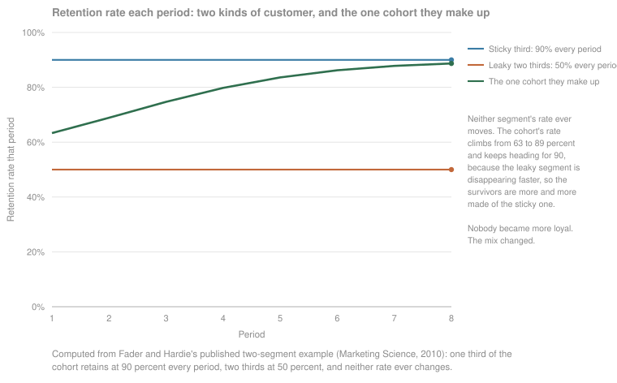

# Retention

You spent all the time and energy getting the user finally to be a part of your monthly paying group. Now what? Retention is the science of getting your user to keep engaging with your product, to keep getting value from it, and to become a long-running revenue-generating unit for your business.

Retention can be measured and tailored to your own business, but the whole point of it is the same everywhere: keep your customer happy, so they come back to you and keep adding value.

Where to jump: [what entity retention is](#what-entity-retention-is) fixes the definition, [the retention window](#the-retention-window) is the choice that moves the number most, and [why curves flatten](#why-curves-flatten) is the part most teams have never been shown.

<!-- TODO(heqing): interview — the strongest version of this argument you would make to a founder who only watches signups. -->

## What entity retention is

Retention could be almost anything. It could be your typical user activities. It could be your B2B accounts coming back to you year over year. It could be a dollar amount, the enterprise contracts you keep signing. What matters is the fundamental value your company is trying to create over the long term, because that is the thing you are trying to retain.

The most common definition mistake is copying someone else's. A famous retention model, Duolingo's for instance, may have nothing to do with your business, and a definition being well known does not make it yours. Look at your retention definition and ask whether it actually contributes to your north star. If it does not, it is the wrong definition, however respectable its pedigree.

This page covers retention of the entity: users, accounts, workspaces, and whether they come back. Retention of contract value, where the question is whether the dollars renew and expand, and lifetime value, where retention meets acquisition cost, each get their own page in this library.

Two choices turn the idea into a number, and a third is big enough to have its own section below.

| Choice | The question | What goes wrong when it floats |
|---|---|---|
| Entity | What is coming back: a user, an account, a workspace, a seat? | Two teams measuring different entities will disagree about the same quarter and both be right. An account can look perfectly retained while every individual user inside it leaves. |
| Activity event | What counts as coming back? | Pick the one core action that means the customer got what they came for [^tavel-2017] [^tavel-2023]. Glue two actions into one number and a gain in one hides a loss in the other, with the readout still looking like progress. |

Write both down in one place before you compute anything, and hold them. If either changes quietly later, your history changes with it, and nobody will be able to tell a real move from a definition move.

<!-- TODO(heqing): interview — your own story of a retention or engagement definition that drove the wrong behavior on a team, abstracted to class level per AGENTS.md constraint 8. -->

## The retention window

The third choice is the window, and it is where the number moves most, by more than most teams expect.

**Day-N or rolling.** Day-N retention counts an entity as retained only if it was active on exactly day N. Rolling retention, also called unbounded, counts it if it was active on day N or on any day after that. Those are different questions, and the same events run through them produce completely different retention data [^berezovsky-2022].

**And what a day is.** A day can mean a calendar day, or a rolling 24 hours from the moment the entity signed up. One published worked example runs a single app through all of it: day-1 retention comes out at 32 percent on rolling 24-hour windows, 43 percent on calendar days, and 59 percent on the rolling definition [^yakubenkov-2019]. Same app, same users, same day, three answers, and nothing about the product was different between them.

Rolling retention carries one property worth knowing before you adopt it. A user who comes back late retroactively becomes retained on every earlier day, so as more data arrives a given day's number can only go up, and the curve it draws can never decrease. That is a property of the definition rather than a finding about your product [^yakubenkov-2019].

**What to do this week.** Set the window to the natural frequency of the product rather than to the calendar. A tool people genuinely use once a month has no meaningful day-1 retention, and measuring it weekly will only produce noise [^sequoia-2018]. Then pick either day-N or rolling, write down which one next to the entity and the event, and never quote both in the same conversation without saying which is on the slide.

## Reading a cohort curve

A cohort is the group of entities that started in the same period. A retention curve takes one cohort and plots the share of it still active at each period afterwards, so every line starts at 100 percent and describes one group over its own life rather than the business as a whole.

Read it two ways. Down one line: how fast that group falls away, and where it settles. Across lines at the same age: whether the groups you acquired recently are doing better or worse than the ones before them. Newer cohorts have shorter lines because they have had less time, and comparing a young cohort's month-2 number with an old cohort's month-6 number is the mistake this chart exists to prevent. It is also why the cohort view beats a single blended retention number: total retention is the weighted average of your cohort retentions, so one month that acquired ten times as many entities as the others sets your headline figure by itself [^sequoia-2018b] [^berezovsky-2024].

Two shapes are worth naming [^sequoia-2018b]. A **flattening** curve falls steeply and then levels off, and the level it flattens at is the share of that cohort you actually keep. A **declining** curve never levels off and heads for zero, which is the leaky bucket: growth has to be bought again every period, because nothing accumulates. One caveat stays attached to both. For most products retention eventually trends to zero, so a curve that looks flat is flat over the horizon you have measured, not forever [^sequoia-2018b].

A flattening curve is the usual evidence for product-market fit, with two conditions. It is fit for some market, and the next job is to segment the curve and find out whose [^balfour-2013]. And it is necessary rather than sufficient: a company that is not growing does not have product-market fit whatever its curve looks like, so retention alone cannot measure it [^winters-2021].

**Before you explain any shape, know which line you are looking at.** A survival curve, the share of a cohort still subscribed, can only go down, because a cohort does not get a lost subscriber back inside the same count. A line like that which climbs is telling you about your query or your plan mix rather than about your customers [^fader-hardie-2026b]. An activity curve, the share of a cohort active in a given period, can climb, because a dormant user can come back.

The steepest part of every curve is the first period, which is why onboarding is where new-user retention is won or lost [^winters-2017]. On the level, expect roughly half of whatever day-1 retention is by day 7, and half again by day 30, with most products losing more than 90 percent of new users inside the first month [^chen-2025]. Treat that as the shape of the world rather than a bar to clear. This page carries no retention benchmark to measure yourself against; the comparison that means anything is your own earlier cohorts.

<!-- TODO(heqing): interview — which visualization should a team build first, and which are decoration until a certain size? -->

## Why curves flatten

Every curve above bends the same way: steep, then flat. The usual explanation is that customers become more loyal the longer they stay. That explanation is wrong, and knowing why changes what you do with the chart.

Give one cohort two kinds of customer, each with a chance of leaving that never changes. The ones likely to leave go first, so with every period that passes the survivors contain a larger share of the people who were never going to leave. The cohort's retention rate climbs on its own.

Nobody in that picture changed. The mix changed. Fader and Hardie call the rise "simply a sorting effect in a heterogeneous population", heterogeneous meaning the base is a mixture of different people rather than one average person, and they reject the loyalty reading in the same breath [^fader-hardie-2007]. Demographers found the effect first, in mortality data, where the individuals at highest risk exit earliest and leave a population that behaves unlike anyone in it [^vaupel-yashin-1985]. It also says what the flattening level is: a curve flattens at the retention rate of your stickiest segment, because in the end that segment is what the cohort has become [^fader-hardie-2010].

**The two-column check.** Take one cohort's survivor counts and divide each period by the period before it. If those ratios rise, then no single churn rate, the share that leaves in a period, can describe your customer base, and anything you computed from one is wrong [^fader-hardie-2026a]. That is a spreadsheet with two columns, and for a team with no analyst it is the highest-value thing on this page.

Two things follow from it, both free. A rising retention rate is not an improvement until you have ruled out sorting. And fitting a trendline to the curve and extending it forward does not work: fitted to seven years of one published data set and projected to year twelve, a linear fit understated survival by 81 percent and a quadratic overstated it by 92 percent, and the linear one implies negative survival after year fourteen [^fader-hardie-2007].

## The state model

A curve is not the only way to look at the same events. Instead of one line per cohort, you can put every user into one of a handful of states each day, new, current, at risk, dormant or returned, and measure how many move from each state to each other state overnight. What that buys is ownership. A curve is a number a team watches; a movement rate between two states is something a team can be goaled on and can actually move. This framework covers the model in full, with its case study, in [state-based retention measurement](../modules/01-ai-data-quality/state-based-retention-measurement.md), and does not re-derive it here.

If that is more than you want to build, the cheap version is growth accounting: split this period's active count into new, retained and resurrected entities, and last period's into retained and churned. That is enough to say whether growth is coming from new entities or from keeping the ones you already had [^hsu-2015].

## Patterns & case studies

- [State-based retention measurement](../modules/01-ai-data-quality/state-based-retention-measurement.md). Decompose the aggregate into user states and goal a team on the highest-leverage transition rate. Case study: the Duolingo growth model.

Candidates for the next pattern, both traced to primary documents:

- **The sorting effect.** Two published cohorts whose retention rates improved for twelve years while nobody became more loyal, and the two-column spreadsheet that detects it [^fader-hardie-2007] [^fader-hardie-2026a].
- **The curve that could not exist.** A cohort retention plot that climbed, diagnosed as two subscription plans sharing one chart rather than as a business finding [^fader-hardie-2026b].

## Sources & Stories

The spine of [why curves flatten](#why-curves-flatten) is Peter Fader and Bruce Hardie's 2007 paper; the free working paper was read in full [^fader-hardie-2007]. The sorting-effect quotation and their explicit rejection of the increasing-loyalty reading are theirs; the phrase "ruthless sorting effect", which circulates alongside them, is not theirs and is not used here. The two-segment example behind the second figure is from their 2010 _Marketing Science_ article, read in full [^fader-hardie-2010]; the figure is computed from that example's parameters rather than copied from the paper. The demographic ancestor is cited at abstract level only, because the full text is paywalled [^vaupel-yashin-1985]. The survivor-ratio check and the monotonic-decrease rule come from two self-published technical notes, both read in full [^fader-hardie-2026a] [^fader-hardie-2026b].

Curve shapes, the weighted-average point and the trend-to-zero caveat come from Sequoia's retention piece [^sequoia-2018b], a different article from the product-health piece already cited in this library [^sequoia-2018], hence the suffixed key. Brian Balfour supplies flattening-as-product-market-fit with his own segmentation caveat attached [^balfour-2013], Casey Winters the insufficiency condition [^winters-2021] and the onboarding argument [^winters-2017], and Andrew Chen the decay rule of thumb [^chen-2025], which is 2025 commentary from a venture investor with portfolio exposure rather than a study, and is presented here as a shape to expect rather than a benchmark. Window definitions come from Oleg Yakubenkov [^yakubenkov-2019], whose company sells paid courses, so he is commercially interested though not an analytics vendor, and from Olga Berezovsky on N-day against unbounded [^berezovsky-2022], which may be partially paywalled, and on blended reporting [^berezovsky-2024]. Growth accounting is Jonathan Hsu's [^hsu-2015], the core-action framing is Sarah Tavel's [^tavel-2017] [^tavel-2023], and the state model is not re-derived here because it already has its own page.

Held back for lack of a source. No retention benchmark survived verification, which is why this page publishes none; the practitioner survey that exists is cited here for its existence rather than its numbers [^rachitsky-winters-2020], as is the ratio-reporting piece whose free excerpt covers benchmark caveats [^berezovsky-2025]. The seven-friends-in-ten-days story is folklore rather than a finding: it traces to a single talk in October 2012 with no published analysis, and Facebook's own vice president of growth later gave a different number, attributed it to a different person, and said the causal question was settled by executive decision rather than by analysis [^schultz-2014]. Slack's message-count activation threshold has no first-party source. Superhuman's widely circulated product-market-fit piece is routinely cited as a retention source and is not one. No non-vendor origin story for the startup cohort table survived checking either; the technique's real lineage is demographic, which is why this page reaches for Vaupel and Yashin rather than for a growth blog.

The opening and the definition passages are the author's own, from the session of 2026-08-08. The small-team framing throughout is this framework's position. Interview questions on this page are unanswered by design, per this repository's working method. The first figure is illustrative and says so on its face; the second is computed from published parameters, with the source named on the figure itself.

<!-- Footnote targets; full entries with links and caveats live in REFERENCES.md -->

[^balfour-2013]: [[BALFOUR-2013]](../../REFERENCES.md)
[^berezovsky-2022]: [[BEREZOVSKY-2022]](../../REFERENCES.md)
[^berezovsky-2024]: [[BEREZOVSKY-2024]](../../REFERENCES.md)
[^berezovsky-2025]: [[BEREZOVSKY-2025]](../../REFERENCES.md)
[^chen-2025]: [[CHEN-2025]](../../REFERENCES.md)
[^fader-hardie-2007]: [[FADER-HARDIE-2007]](../../REFERENCES.md)
[^fader-hardie-2010]: [[FADER-HARDIE-2010]](../../REFERENCES.md)
[^fader-hardie-2026a]: [[FADER-HARDIE-2026A]](../../REFERENCES.md)
[^fader-hardie-2026b]: [[FADER-HARDIE-2026B]](../../REFERENCES.md)
[^hsu-2015]: [[HSU-2015]](../../REFERENCES.md)
[^rachitsky-winters-2020]: [[RACHITSKY-WINTERS-2020]](../../REFERENCES.md)
[^schultz-2014]: [[SCHULTZ-2014]](../../REFERENCES.md)
[^sequoia-2018]: [[SEQUOIA-2018]](../../REFERENCES.md)
[^sequoia-2018b]: [[SEQUOIA-2018B]](../../REFERENCES.md)
[^tavel-2017]: [[TAVEL-2017]](../../REFERENCES.md)
[^tavel-2023]: [[TAVEL-2023]](../../REFERENCES.md)
[^vaupel-yashin-1985]: [[VAUPEL-YASHIN-1985]](../../REFERENCES.md)
[^winters-2017]: [[WINTERS-2017]](../../REFERENCES.md)
[^winters-2021]: [[WINTERS-2021]](../../REFERENCES.md)
[^yakubenkov-2019]: [[YAKUBENKOV-2019]](../../REFERENCES.md)
