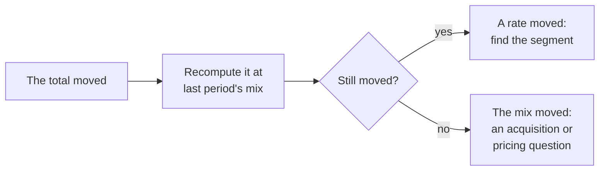

# Segmentation

Segmentation is where the manufacturing lens stops working. The method that runs through this library treats a number as one process with one specification, and computes control limits from that process's own history. A business metric is not one process. An active-user count or a conversion rate is a total over populations that behave differently, and the total can sit inside its limits while one of those populations is failing. It can also move when no population moved, because the mix between them moved. In a factory the subgroups are known before the first chart is drawn. There is a machine, a shift, a lot and an operator, and the list is finite. In a business the right split is the thing you are trying to find, and the number of ways to split a customer base has no end. So segmentation turns a control problem into an analysis problem, and that is the point where the lens I was trained in stops carrying the weight.

<!-- TODO(heqing): this paragraph and the next are drafted from your backlog thesis. Your sharper statement of where the lens stops replaces them without touching the rest of the page. -->

The practice this argues with is steering by the aggregate and splitting only when something looks wrong. Its appeal is real. One number fits on one chart, and most weeks nothing looks wrong, so splitting on demand seems free until the day it is needed. That day is not visible from the aggregate. A total that stayed inside its limits while a segment failed never asked to be split.

Where to jump: [the mechanisms](#why-an-aggregate-misleads), [the three levels](#the-three-levels), [the first cuts](#how-to-see-it), [the boundary](#where-the-manufacturing-lens-still-works), and [the week](#the-version-for-a-team-of-ten).

## What segmentation is

Segmentation is computing the same metric, on the same definition, for parts of the population instead of the whole. A segment is any group of entities you can name before you look at the result: accounts on the free plan, or companies over fifty people. The definition stays fixed and only the population changes, and that is what keeps the segment numbers comparable.

When the total moves, segmentation says which part moved, and when the total holds still, it says whether every part is still or two parts are cancelling. And since the rate worth improving is rarely the same in every segment, a target set on the total is set on nobody.

## Why an aggregate misleads

Three mechanisms do the damage.

**Mixture.** A total over unlike groups behaves like none of them. The cleanest case is on the [retention page](retention.md): two segments with constant retention rates produce a cohort whose rate climbs every period, because the segment that leaves fastest leaves first [^fader-hardie-2010]. Nobody's behaviour changed. The composition did. Auditing a customer base starts from how customers differ, not from their average [^fader-hardie-ross-2022].

**Mix shift.** Weights can move while rates do not. Meta's annual report says so about its own revenue per user: because user growth comes mostly from regions with lower revenue per user, worldwide ARPU "may decrease at a higher rate, or increase at a slower rate, relative to ARPU in any geographic region in a particular period, or potentially decrease even if ARPU increases in each geographic region" [^meta-2023]. Airbnb reported the mirror image in 2021: its average daily rate rose 35 percent on bookings shifting toward North America and toward whole homes outside cities, and it warned that the rate would fall back if the mix did [^airbnb-2021].

**Simpson's reversal.** The extreme form of mix shift is the one where every segment improves and the total gets worse. The clearest recent instance is from the pandemic: early Italian data showed a case fatality rate lower than China's for every age group and higher overall, because Italy's confirmed cases were older [^vonkugelgen-2021]. Experimenters meet the same reversal when a test is ramped up unevenly across days, and treat it as a trustworthiness check [^kohavi-2020].

The table is illustrative, and every number reconciles. A trial-to-paid rate rises in both segments and falls in total, because a campaign nearly doubled the self-serve share of trials.

| Segment | Trials, month 1 | Paid, month 1 | Rate | Trials, month 2 | Paid, month 2 | Rate |
|---|---|---|---|---|---|---|
| Self-serve signups | 800 | 80 | 10.0% | 1,500 | 165 | 11.0% |
| Sales-assisted signups | 200 | 60 | 30.0% | 200 | 64 | 32.0% |
| Total | 1,000 | 140 | 14.0% | 1,700 | 229 | 13.5% |

The check is one line of arithmetic. Recompute month 2 at month 1's mix, 80 percent self-serve and 20 percent sales-assisted: 0.8 times 11.0 plus 0.2 times 32.0 is 15.2 percent. So the rates added 1.2 points, the mix took away 1.7, and the total fell by half a point. A team steering by the total would have gone looking for a product problem that does not exist.

The other direction is a segment failing under a total that looked fine. Netflix added 2.7 million paid memberships worldwide in the second quarter of 2019 while its United States membership fell by 126 thousand [^netflix-2019]. Zoom's customers with more than ten employees grew from 81,900 to 467,100 in a year, while the share of revenue from customers with ten or fewer employees doubled from 18 to 36 percent, a cohort the company expected to churn faster because it bought monthly [^zoom-2021] [^zoom-2020]. Uber's second quarter of 2020 is two segments cancelling: rides fell 73 percent, delivery rose 113 percent, and gross bookings fell 35 percent [^uber-2020]. The total described neither business.

<!-- TODO(heqing): a class-level story of your own for this section: a total that looked fine while one segment failed, or a number that moved on mix alone and got treated as a product problem. What was the metric, who noticed, and what did the split cost? -->

## The three levels

A metric has three depths, and each has its own reader and its own decision. The aggregate is for the founder and the board, and the goal lives there. The sector is the segment the business is organised around, an industry vertical or a plan tier, read by whoever owns go-to-market and product to decide where effort goes next. The account is the individual customer, read by the person who talks to that customer, and its question is what to do about this one this week. A number healthy at the top and unread below is a number nobody can act on, because the levers live in the bottom two levels.

<!-- TODO(heqing): this section is drafted from your three-levels position. Who reads the sector level at a ten-person company, and does sector mean vertical, plan tier or both? -->

The framework's position is that the levels are also where the target comes from. Every metric has a success pattern inside it, the behaviour or threshold that separates the accounts that go on to retain from the ones that do not. Finding it is segmentation run backwards, from the outcome to the group that reached it, and the evidence it produces is what should set the target, not a tipping-point number somebody else published.

<!-- TODO(heqing): how do you find the tipping point in practice, and how does evidence turn into a target? -->

## How to see it

**Make the first cuts before anything looks wrong.** For a company of ten, the cuts that pay first match a real difference in how the customer buys or uses the product. My order is plan tier first, because the pricing page already sorted customers by value. Customer size is second, because a two-person company and a two-hundred-person one do not use software the same way. Acquisition channel is third, because it is the segment whose mix you control, and signup cohort is fourth, because the [retention page](retention.md) already asks you to build it.

**Know when a slice is too small to steer by.** A segment's rate carries noise that grows as the segment shrinks, and the arithmetic is the p-chart's: for a proportion p measured on n entities, the three-sigma limits sit at p plus and minus three times the square root of p(1 − p)/n [^mohammed-2008]. Illustratively, a segment of 40 accounts whose true conversion is 30 percent will wander between about 8 and 52 percent from period to period while nothing changes. At 400 accounts the band is 23 to 37 percent. Below a few hundred entities in a cell, read a segment's direction over several periods and never its level in one. Below a few dozen, stop reporting a rate and report the count and the names.

<!-- TODO(heqing): do you use a minimum entity count per segment, and what is it? The rule above is derived from the p-chart arithmetic, not from your practice. -->

**Do not go looking for the segment that moved.** The number of splits is unbounded, and if you try enough of them one will look significant by chance. Experimenters list it among the degrees of freedom that inflate false positives: segmenting by gender, age or geography and reporting only the slices that came out significant [^kohavi-deng-vermeer-2022]. The discipline is to fix the segments before the data arrives and keep them static, and to treat a surprising slice as a hypothesis for a fresh period [^machmouchi-2021] [^kohavi-deng-vermeer-2022]. The same literature now builds algorithms to search the splits for effects that differ by subgroup, an admission that the space is too large to walk by hand [^wager-athey-2018].

## Where the manufacturing lens still works

Segmentation inside statistical process control has a name, rational subgrouping. Wheeler's rule is that things that might be different belong in different subgroups and things likely to be the same belong in the same one, because the variation inside a subgroup is the yardstick the chart uses to detect differences between subgroups [^wheeler-2015]. His worked example charts a four-cavity mould as one stream and then as four, and the one-stream limits widen until the chart sees nothing. That is the factory form of charting every plan on one line [^wheeler-2015]. The [SPC pattern](../modules/01-ai-data-quality/statistical-process-control-for-pipelines.md) already splits weekday from weekend charts for this reason, and the textbooks carry the rule under the same name [^mohammed-2008] [^montgomery-2019]. Experimentation platforms call the same idea stratification and use it for the same reason [^xie-aurisset-2016].

So the lens carries as far as the subgroups are known. Once you have named plan tiers or size bands, one control chart per segment is the right tool. What the lens cannot do is tell you which split to make. In a factory the cavities are numbered on the mould. In a business the split is settled by analysis. That is the line I draw. Control charts belong on the segments you already know. Finding the next segment is analysis, and a segment you cannot fill gets no chart at all.

## The version for a team of ten

This week:

1. Pick one metric that a decision already hangs on, and split it by plan tier and by customer size. Keep the definition fixed.
2. Recompute last period's total at the mix of the period before. If the constant-mix number tells a different story, say so in the sentence that reports the total.
3. Write the entity count next to every segment rate. Below a few dozen, report names and counts rather than a percentage.
4. Fix the two or three segments you will watch, and watch them every period whether or not the total looks fine.

Safe to ignore at this size: automated segment scanning, and any slice that changes from period to period.

## Where segmentation connects

[Retention](retention.md) flattens at the rate of the stickiest segment and tells you to segment the curve to find whose product-market fit you have. [Active users](active-users.md) decomposes the total into states, and a state is a segment defined by behaviour rather than by attribute; the [state-based retention pattern](../modules/01-ai-data-quality/state-based-retention-measurement.md) carries that idea through. [Conversion rate](conversion-rate.md) says to segment before calling a test neutral, and carries the redesign whose win was hidden in one browser [^overgoor-2014]. [Time to convert](time-to-convert.md) says where its queue model stops: when the units are not interchangeable, it becomes a segmentation question. And [benchmarks](benchmarks.md) asks that any external number be compared only inside your own segment, since published medians differ five-fold across industries and move with revenue band [^wordstream-2026] [^highalpha-2025].

## Patterns & case studies

No pattern page yet. Candidates:

- **The recast at constant mix.** Two headline rates explained by the mix behind them, one that can fall while every region rises and one that rose 35 percent on mix [^meta-2023] [^airbnb-2021].
- **The segment under the total.** A domestic loss under global growth, and a small-customer cohort doubling its share of revenue with churn attached [^netflix-2019] [^zoom-2021] [^zoom-2020].
- **The plan mix that broke a chart.** A cohort curve that climbed because two plans shared it, told on the retention page [^fader-hardie-2026b].
- [State-based retention measurement](../modules/01-ai-data-quality/state-based-retention-measurement.md) is the segmentation-by-state pattern this library already has.

## Sources & Stories

The mechanisms thread: the mixture case rests on the Fader and Hardie article already behind the retention page [^fader-hardie-2010], and the customer-base framing on their 2022 book with Michael Ross, cited at book level with the authors' own excerpt read in full [^fader-hardie-ross-2022]. The mix-shift sentences are first-party filings: Meta's 2022 annual report, read in the company's own copy because the SEC archive refuses automated readers and quoted verbatim [^meta-2023], and Airbnb's first-quarter 2021 shareholder letter [^airbnb-2021]. The Simpson's reversal is cited from the peer-reviewed abstract [^vonkugelgen-2021], and its experimentation form from the trustworthiness chapter of the standard experimentation textbook, at chapter level only [^kohavi-2020].

The segment-under-the-total stories are Netflix's second-quarter 2019 letter [^netflix-2019], Zoom's fiscal 2021 annual report and its first-quarter release from the same year for the churn expectation [^zoom-2021] [^zoom-2020], and Uber's second-quarter 2020 release [^uber-2020]. Where a filing's numbers invite a causal reading, the page repeats only what the filing says.

The size rule and the false-finding warning: the p-chart limits are from the healthcare tutorial the SPC pattern already cites [^mohammed-2008], and the 40-account and 400-account bands are the framework's own arithmetic from that formula. The degrees-of-freedom passage and the pre-register-and-replicate advice are Kohavi, Deng and Vermeer's, read in full [^kohavi-deng-vermeer-2022]; the static-segment rule is Microsoft's experimentation team's [^machmouchi-2021]; the search algorithms are cited at abstract level [^wager-athey-2018].

The manufacturing thread: Wheeler's rational-subgrouping manuscript was read in full, and the four-cavity example and the rule are his [^wheeler-2015]; it is eleven years old and is cited because no newer statement of the rule is as plain. The textbook is cited at book level, edition verified at the publisher and the rational-subgroup section not opened [^montgomery-2019]. Netflix's stratification paper is cited at abstract level [^xie-aurisset-2016]. The Airbnb experiment, the industry spread and the revenue-band medians are already on the conversion and benchmarks pages [^overgoor-2014] [^wordstream-2026] [^highalpha-2025], and the plan-mix chart is on the retention page [^fader-hardie-2026b].

The thesis, the three levels and the success-pattern position are the author's own. The first-cut order, the constant-mix check as the first step, and the small-team version are the framework's own. Every source was opened and its figures checked on 2026-09-16.

<!-- Footnote targets; full entries with links and caveats live in REFERENCES.md -->

[^airbnb-2021]: [[AIRBNB-2021]](../../REFERENCES.md)
[^fader-hardie-2010]: [[FADER-HARDIE-2010]](../../REFERENCES.md)
[^fader-hardie-2026b]: [[FADER-HARDIE-2026B]](../../REFERENCES.md)
[^fader-hardie-ross-2022]: [[FADER-HARDIE-ROSS-2022]](../../REFERENCES.md)
[^highalpha-2025]: [[HIGHALPHA-2025]](../../REFERENCES.md)
[^kohavi-2020]: [[KOHAVI-2020]](../../REFERENCES.md)
[^kohavi-deng-vermeer-2022]: [[KOHAVI-DENG-VERMEER-2022]](../../REFERENCES.md)
[^machmouchi-2021]: [[MACHMOUCHI-2021]](../../REFERENCES.md)
[^meta-2023]: [[META-2023]](../../REFERENCES.md)
[^mohammed-2008]: [[MOHAMMED-2008]](../../REFERENCES.md)
[^montgomery-2019]: [[MONTGOMERY-2019]](../../REFERENCES.md)
[^netflix-2019]: [[NETFLIX-2019]](../../REFERENCES.md)
[^overgoor-2014]: [[OVERGOOR-2014]](../../REFERENCES.md)
[^uber-2020]: [[UBER-2020]](../../REFERENCES.md)
[^vonkugelgen-2021]: [[VONKUGELGEN-2021]](../../REFERENCES.md)
[^wager-athey-2018]: [[WAGER-ATHEY-2018]](../../REFERENCES.md)
[^wheeler-2015]: [[WHEELER-2015]](../../REFERENCES.md)
[^wordstream-2026]: [[WORDSTREAM-2026]](../../REFERENCES.md)
[^xie-aurisset-2016]: [[XIE-AURISSET-2016]](../../REFERENCES.md)
[^zoom-2020]: [[ZOOM-2020]](../../REFERENCES.md)
[^zoom-2021]: [[ZOOM-2021]](../../REFERENCES.md)
