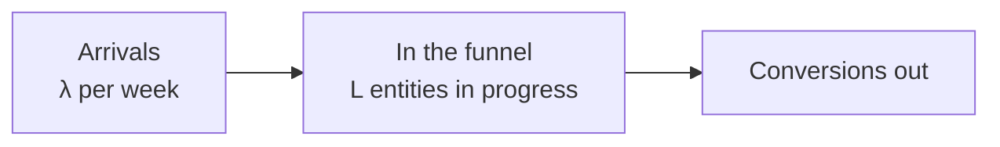
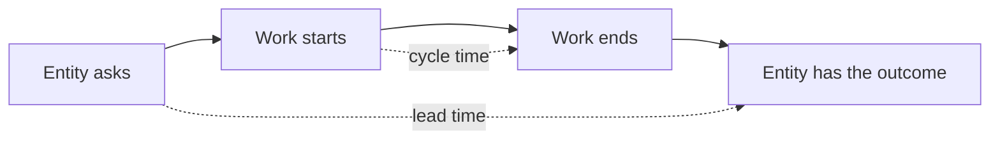
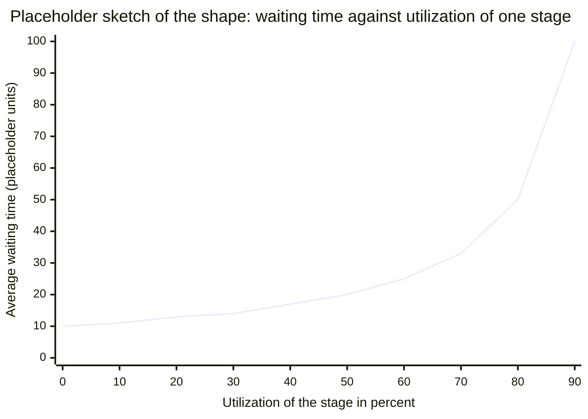
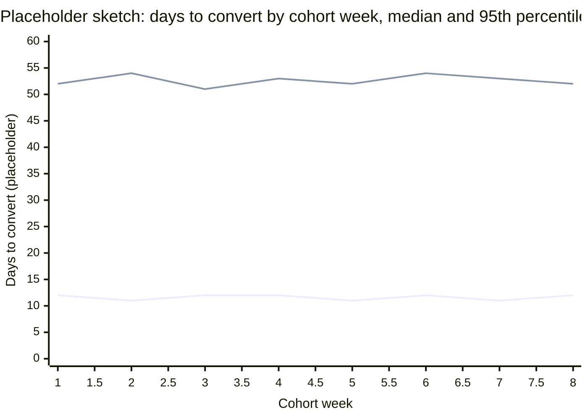

# Time to convert

[TODO(heqing): one-paragraph opening in your voice — what question time to convert answers, for a reader who has never had an analyst. Your framing to draw from: it is how fast a user, good, or entity moves through the pipeline, from top of funnel to end of funnel.]

Where to jump: [why speed is its own metric](#why-speed-is-its-own-metric) fixes the definition and separates the three clocks people confuse; [the pipeline as a queue](#the-pipeline-as-a-queue) is the industrial-engineering view and the heart of this page; [measuring it honestly](#measuring-it-honestly) is the part a team without an analyst should read first; [what it looks like in practice](#what-it-looks-like-in-practice) translates the business vocabulary and says which of it has no source; [when speed is the wrong goal](#when-speed-is-the-wrong-goal) carries the counterweight.

## Why speed is its own metric

[Conversion rate](conversion-rate.md) counts how many entities get through. This page measures how long they take. The two are not interchangeable: a pipeline can convert the same fraction of entities twice as fast, which changes cash timing, forecast accuracy, and how quickly a fix shows up in the numbers. Speed is also what makes the rate's window an honest choice rather than an arbitrary one, because a window can only close where the conversions have stopped arriving.

Like the rate, this is one number sitting on top of several choices, and it means nothing until they are written down and held fixed.

| Choice | The question | What goes wrong when it floats |
|---|---|---|
| Entity | Whose clock are you starting: a visit, a user, an account, a lead, a shipment? | It has to be the same entity the [conversion rate](conversion-rate.md) uses, or the two metrics do not compose into anything. |
| Start event | Does the clock start at first touch, at signup, or at entry into the stage? | Lean already made this distinction: lead time starts when the customer asks, cycle time starts when the work does [^lei-lexicon]. Picking one silently picks a number. |
| End event | What stops the clock? | The same numerator question the rate has, with one extra hazard: a clock has two ends to move, and both are easy to redefine under pressure. |
| Population | Converted entities only, or everyone who entered? | Measuring only the ones that finished biases the number downward, and the bias is not small [^davidsonpilon-2019]. |
| Statistic | Mean, median, or a percentile? | Durations are skewed and long-tailed. The mean is the one number that describes nobody [^kellogg-2023]. |

**Three clocks get called speed, and only one of them is this page.**

- **Latency** is how fast the system answers, measured in milliseconds. It has its own famous result: Google served 30 results instead of 10, page time went from 0.4 to 0.9 seconds, and traffic and revenue fell about 20 percent in the slower group even though those users had asked for more results. Amazon's own tests delayed pages in 100 millisecond increments and found that even very small delays cost revenue. The Google numbers are one engineer's write-up of a conference talk rather than a published study, and the Amazon numbers are his account of internal tests [^linden-2006b].
- **Response time** is how fast you answer the entity, measured in minutes or hours. This is the speed-to-lead literature; [what it looks like in practice](#what-it-looks-like-in-practice) covers it.
- **Cycle time** is how long the entity takes to cross the funnel, measured in days, weeks, or months. That is this page.

Improving one of the three says nothing about the other two. A page that renders instantly can sit inside a signup flow that takes eleven days.

## The pipeline as a queue

Read as a queueing system, a funnel has arrivals, stages, and entities in progress, and time to convert is its cycle time. That is an argument this page makes, not one it can cite.

**Little's Law.** The law relates three quantities: L, the average number of items in the system, λ, the average rate at which items arrive, and W, the average time an item spends in the system. L = λW. Little proved it in 1961, for a system where arrivals keep to a steady long-run rate and nothing piles up without bound [^little-1961].

Two of the three quantities are easy to count. Count how many entities arrive in a week, count how many are sitting in the funnel right now, and the law hands you the third. With 40 arriving a week and 200 in progress, the average time to convert is five weeks, and you never timed a single lead. Those numbers are round placeholders.

The reason the law travels is that its author said it travels. Writing on its fiftieth anniversary, Little noted that it "holds under remarkably general conditions", that it applies to individual queues and to networks and subnetworks, that it holds for subclasses of items as well as whole populations, and that it does not care what order the queue is served in. The same paper walks through applications in hospital emergency departments, manufacturing, retail, and computer systems [^little-2011].

**Work in progress, throughput, cycle time.** Operations management restates the same identity in factory vocabulary: work in progress, meaning items started but not finished, equals throughput, meaning items finished per unit of time, multiplied by cycle time [^choo-2016] [^vacanti-2023]. Rearranged, it is the sentence a founder can act on: cycle time equals work in progress divided by throughput. Read onto a funnel, which is this page's reading rather than a sourced one, that means the only way to make the funnel faster while throughput is fixed is to have fewer entities in it at once. Lean Six Sigma carries the same identity into process improvement [^george-2002].

Three Lean terms get borrowed loosely, and they are not synonyms. Cycle time is the time to complete a process, timed by actual measurement. Lead time is longer, because it starts when the customer asks and ends when the customer has the thing. Value-creating time is shorter than both: it counts only the work the customer would be willing to pay for [^lei-lexicon].

Value-creating time is the part of the cycle-time span that is actual work, and the sketch below shows how small a part that usually is.

**The four flow metrics.** Software delivery kept the most usable operational definitions of all of this, published free and dated [^kanban-2025]. The funnel translations in the third column are this page's, not the guide's.

| Flow metric | Definition | Funnel translation |
|---|---|---|
| Work in progress | Items started but not finished | Entities somewhere in the funnel right now |
| Throughput | Items finished per unit of time | Conversions per week |
| Cycle time | Elapsed time from when an item started to when it finished | Time to convert, measurable only on entities that already converted |
| Work item age | Elapsed time since an unfinished item started | How long an entity has been stuck, measurable today, on everyone still in the funnel |

Work item age is the transferable idea, and [measuring it honestly](#measuring-it-honestly) picks it up.

Elapsed time in a funnel is mostly waiting, not working. Lean calls the ratio of value-creating time to total elapsed time flow efficiency, and the argument that it is usually low is a book-length one [^modig-2012]. A sketch with round placeholder numbers:

| Stage | Working time | Waiting time |
|---|---|---|
| Application review | 1 day | 6 days |
| Verification | 1 day | 4 days |
| Approval | 1 day | 9 days |

Three days of work inside twenty-two days of elapsed time. Nobody in that picture is slow. No neutral source publishes a typical flow-efficiency number, so the ratio is worth computing and the benchmark is not worth quoting.

**Utilization is usually why a funnel is slow.** Utilization is how much of a stage's capacity is already committed. A reviewer who can clear five applications a day and gets four is at 80 percent. A standard queueing result says waiting time rises gently while a stage has slack and then goes near vertical as the stage approaches full capacity. One practitioner account puts it on a real customer pipeline: a mortgage lender's CTO models the process as a queue and reports that by 50 percent utilization the waiting time has already doubled, with a working rule of keeping urgent work under 50 percent average load [^bernhardsson-2018]. The funnel version: a stage staffed to exactly meet demand will be slow, and a little deliberate slack buys more speed than telling people to hurry. Reinertsen makes the same argument for knowledge work: you control cycle time by controlling queue size, not by scheduling harder [^reinertsen-2009].

The curve is a sketch of the shape, not measured values. What matters is that it is not a straight line: the step from 80 to 90 percent costs more waiting time than everything below 50.

**Nobody has written the mapping down.** No published treatment maps Little's Law onto the cycle time of a customer funnel. The closest is a first-party post that models a real pipeline as a queue and stops before naming the law [^bernhardsson-2018]. So this is the framework's own position, the same slot the [conversion rate page](conversion-rate.md) reserves for the theory of constraints. The warrant for extending the law is Little's own: he documented it holding far outside queues [^little-2011].

- [TODO(heqing): interview — as an industrial engineer, does the queue model hold for a customer funnel? Where does it break: entities that leave permanently rather than waiting, stages without fixed capacity, arrivals you cannot schedule?]
- [TODO(heqing): interview — what is work in progress in a customer funnel, and have you ever seen a team reduce it on purpose? In a factory the bottleneck has a capacity you can measure; what is the equivalent when the server is a landing page, an email nobody sent, or a review with one person in it?]

## Measuring it honestly

The average time to convert is usually the wrong statistic.

**The average is biased downward.** Entities that have not converted yet have no duration to average, so they fall out of the calculation. The ones that do have a duration are the ones that finished, and finishing early is exactly what makes an entity available to be counted. The statistical name for a duration you have observed only partly, because the clock is still running, is censoring. The practitioner treatment is blunt about the size of the problem: dropping the unfinished cases badly underestimates the true average, and the obvious patch of throwing in their elapsed-so-far time still underestimates it [^davidsonpilon-2019]. Your average time to convert is computed only from the people who already converted, so it can only ever tell you about the fast ones.

**Percentiles instead of the mean.** A percentile is the value a given share of cases falls under: the 85th percentile of time to convert is the number that 85 percent of converted entities came in below. Reporting the median and the 85th together says something a mean cannot, because it describes the tail as well as the middle. The forecasting argument from software delivery is to keep the whole distribution and forecast from it, rather than promising a single number nobody hits [^vacanti-2014] [^vacanti-2020]. A widely cited talk on measuring time distributions makes the general statistical point that averages, and percentiles computed casually, mislead about how long things take [^tene-2015].

A sales practitioner arrives at the same place with none of the machinery. Reporting a business with a roughly 60-day average sales cycle, he notes that around 90 percent of deals close somewhere between 30 and 120 days, that wins, losses, and slipped deals have three different average lengths with three different distributions, and that you usually lose faster than you win [^kellogg-2023]. One average over that spread is not a forecast, it is a shrug.

**The survival view.** The metric is really a curve. Kaplan-Meier, the 1958 product-limit estimator, estimates the curve while keeping the not-yet-finished cases in the denominator instead of discarding them [^kaplan-1958] [^bernhardsson-2019]. It is the same curve the [conversion rate page](conversion-rate.md) draws, read the other way round: not what fraction eventually converts, but how long until half of them have.

The lower line, starting near 12 days, is the median; the upper line, starting near 52 days, is the 95th percentile. Half the cohort converts inside two weeks while one in twenty takes nearly two months, and a mean would sit between them describing neither. The numbers are round placeholders. The canonical version of this picture is a scatterplot: one dot per converted entity, days to convert up the side, close date across the bottom, with horizontal lines at the median and the 85th percentile [^vacanti-2014]. The dots stranded above those lines are the deals that went sideways.

**Rate and speed are two different things, and teams argue about them without knowing it.** A model can fit both at once: a ceiling, meaning the share of a cohort that ever converts, and a speed, meaning how fast the cohort gets there. Fitted separately, they can move in opposite directions, so a cohort's conversion rate can fall while the people who do convert are converting faster than ever [^bernhardsson-2019]. That is the argument a growth team has every quarter and cannot settle from a single blended number. Free implementations of these models exist for a team that wants to actually run one [^convoys] [^davidsonpilon-2019], and the same delayed-conversion problem has its academic form in advertising, where conversions arrive weeks after the impression that caused them [^chapelle-2014].

**The window is the same decision, seen from the other side.** How long you let the clock run before you declare an entity converted or not is the window choice, and the [conversion rate page](conversion-rate.md) already works through when a fixed window is honest and when a curve is worth the effort [^bernhardsson-2017] [^kent-2021]. The link between the two: the window is only defensible once you know the shape of the time-to-convert curve, so you cannot pick the window before you have measured the speed.

**What a team with no analyst can watch on Monday.** Cycle time can only be computed on entities that finished, which is what makes it lagging. Work item age can be computed today on everything still in the funnel, and it is a subtraction: today's date minus the date the entity entered [^kanban-2025]. A list of the oldest entities still in progress needs no statistics, no tooling, and no analyst, and it points at the same stage a full survival analysis would. The chart that carries all of it at once is the cumulative flow diagram: entities entering, sitting in each stage, and finishing, stacked over time, where the vertical thickness of a band is work in progress and the horizontal distance across it is cycle time [^vacanti-2014].

- [TODO(heqing): interview — median, 85th percentile, or the whole curve: what would you actually put on a weekly dashboard for a team of eight, and why?]
- [TODO(heqing): interview — the draft explains the downward bias in one sentence above. Would you say it differently to a founder, and what is the second question you ask when someone reports a single average?]

## What it looks like in practice

The same idea has a different name in every function, and the quality of the source behind each name varies more than the names suggest.

| What the business calls it | What clock it names | What stands behind it |
|---|---|---|
| Sales cycle length | Opportunity created to deal closed | One practitioner treatment that takes the distribution seriously [^kellogg-2023]. Percentile guidance beyond that is vendor content. |
| Time to value, time to first value | Signup to the first moment the customer gets something worth having | No non-vendor source found. See the note below. |
| Lead response time, speed to lead | Inbound lead arriving to a human answering it | One vendor-funded 2007 study [^oldroyd-2011] [^insidesales-2007]. |
| Deal aging, stale pipeline | How long an open deal has sat where it is | Vendor content only. The concept has a free, dated, primary definition in another field as work item age [^kanban-2025]. |
| Change lead time | Code committed to code running in production | A published, maintained, benchmarked definition, with the research lineage in print [^dora-2026] [^forsgren-2018]. |

The bottom row is the one to notice. Software delivery took the same measurement the sales world describes in vendor blog posts, defined it precisely, benchmarked it publicly, and kept the definition free to read. Everything this page says about cycle time was worked out properly somewhere; it was just not worked out on funnels.

**Time to value has no literature.** Every treatment of the term found in this research round was a tool vendor's marketing content, including the rules of thumb about reaching first value within a set number of days. So the term gets a plain definition and nothing more: the elapsed time from signup to the first moment a customer gets something they would miss. The event at the end of that clock is activation, which the [conversion rate page](conversion-rate.md) covers with real sources.

**Speed to lead, without the multipliers.** The response-time multipliers repeated across the industry come from one 2007 study commissioned by a company selling response-time software, written up by three authors, one of whom was that company's chairman and chief executive [^oldroyd-2011] [^insidesales-2007]. The clock is worth keeping and the numbers are not, so the numbers are not here.

- [TODO(heqing): interview — in your own practice, which stage's duration was worth watching, and what did watching it change?]
- [TODO(heqing): interview — the draft's Monday answer is a list of the oldest entities still in the funnel. Is that what you would actually tell a five-person team with no analyst to do, and what would they change on Tuesday because of it?]

## When speed is the wrong goal

Reducing cycle time can lower the quality of what comes out the other end. The evidence cuts both ways, and neither slogan survives it.

**Longer can convert better.** A product leader describes expanding a checkout for weight-loss medication from 3 steps to 25 steps, after which conversion rose about 40 percent with per-step completion above 99 percent. His frame is that the length of a flow should match what the decision costs the person making it and how much they still do not know: high-stakes decisions with large information gaps need more steps, not fewer, because the extra steps build confidence rather than friction. He sets it against the obvious counterexamples, a dating app onboarding in 90 seconds against a competitor's 20 to 30 minutes, and a personalization algorithm that won blind tests and lost conversions [^mehta-2025]. So the number to aim at is the one that matches what the decision requires.

**A clock that becomes a target gets gamed at the clock, not at the work.** A peer-reviewed study of New Zealand's emergency department time target across four hospitals found clock-stopping and patients moved into short-stay units to avoid recording a breach, spikes in recorded admissions in the last few minutes before the target, and at one hospital 24 percent of patients recorded with a length of stay under 15 minutes. The authors attribute the behavior to opportunity, means, and management pressure rather than to frontline dishonesty [^tenbensel-2019]. The transfer to a funnel is direct, and it is the reason the [start event and end event choices](#why-speed-is-its-own-metric) matter so much: once time to convert is something people are scored on, the cheapest way to hit it is to redefine when the clock starts and stops. This is the cycle-time instance of the measurement-as-target problem the [attribution page](attribution.md) covers at length.

**Pushing throughput up is what makes cycle time explode.** The efficiency paradox, argued at book length, is that optimizing resource efficiency, meaning keeping every station busy, is precisely what destroys flow efficiency, meaning how much of an entity's elapsed time is spent receiving value [^modig-2012]. The queueing result in [the previous section](#the-pipeline-as-a-queue) is the same statement with a curve attached [^bernhardsson-2018]. A team that responds to a slow funnel by loading every stage to capacity will make it slower, and will experience that as people not trying hard enough.

**And then the trade did not show up where it was most expected.** Four economists compared financial-technology lenders to traditional lenders across US mortgage originations from 2010 to 2016. The technology-led lenders processed applications about 20 percent faster with detailed controls for loan, borrower, and geography, and the finding that matters here is that "faster processing does not come at the cost of higher defaults" [^fuster-2018]. Software delivery reports the same non-trade from a different direction: for top performers, speed and stability are not a tradeoff [^dora-2026] [^forsgren-2018].

So the position is narrower than either slogan. The trade is plausible and the mechanism is real, but the evidence for it inside conversion funnels is absent, and the one rigorous test of it in a real pipeline found no degradation. That makes the useful question not whether to go faster but how you got faster: removing waiting is nearly always free, and removing checks is the thing that costs you at the far end. No first-party account was found of a team speeding up a funnel and reporting that the converted cohort got worse, so the mechanism is attested only in adjacent form, through the target gaming and the efficiency paradox above.

- [TODO(heqing): interview — have you seen rushing a pipeline produce a worse cohort at the end of it? What was the mechanism: did quality drop, or did the definition of converted quietly loosen?]
- [TODO(heqing): interview — if time to convert became a target a team was scored on, how would you expect it to be gamed in a funnel specifically, and what would you put in place first to make that harder?]

## Patterns & case studies

No pattern page yet. Candidate case studies from the research round, each traced to a first-party or near-first-party account:

- **The 60-day mortgage.** A US mortgage takes roughly 60 days and produces a loan file hundreds of pages long, and the lender's CTO diagnosed the process as manufacturing done by hand. He went at it from both halves of this page at once: the operations half, modelling the pipeline as a queue and finding that running below full utilization bought large cycle-time improvements, and the measurement half, building models that separate how many convert from how fast they convert on data where the lag runs to months [^bernhardsson-2017b] [^bernhardsson-2018] [^bernhardsson-2019]. The company's own claims page reports a faster average close than the industry figure it cites, which is a marketing claim rather than an independent measurement [^better-2020].
- **Faster did not mean worse.** Technology-led mortgage lenders processed applications about 20 percent faster with no increase in defaults, across a national dataset with controls [^fuster-2018]. The counterweight to the assumption that speed must cost quality.
- **Twenty-five steps beat three.** A checkout lengthened from 3 steps to 25 and conversion rose about 40 percent [^mehta-2025]. The counterweight to the assumption that fewer steps are always better.
- **The six-hour clock.** An emergency-department time target, studied across four hospitals, gamed at the definition of the clock rather than at the speed of care [^tenbensel-2019]. The counterweight to making this metric a target without thinking about it.

One research finding belongs on the record, and it is the same one the [attribution page](attribution.md) and the [active users page](active-users.md) recorded. No first-party account exists of a team without dedicated analysts treating time to convert as its lever and reporting what happened. Every verified story above is a venture-funded lender with a CTO who blogs, a national health system, or economists with regulatory data. The literature over-samples organizations big enough to publish.

## Sources & Stories

Four threads run through this page.

The industrial-engineering thread is the spine. John Little's 1961 proof is the primary source for the law [^little-1961], and his own fiftieth-anniversary restatement is the source for the generality claim and for the applications outside queues that license extending it at all [^little-2011]; Daniel Vacanti's short history supplies the provenance chain from Cobham and Morse through to the operations-management restatement [^vacanti-2023], which is worked through on real projects by James Choo [^choo-2016] and carried into Six Sigma practice by Michael George, cited at thesis level because the formulations attributed to that book were not verified against a copy [^george-2002]. The Lean vocabulary of cycle, lead, and value-creating time is quoted from the Lean Enterprise Institute's lexicon [^lei-lexicon]. The utilization argument and its curve come from Erik Bernhardsson's first-party account of the mortgage pipeline at Better [^bernhardsson-2018], with Donald Reinertsen's queue-size argument for knowledge work cited at thesis level [^reinertsen-2009] and the resource-efficiency paradox cited the same way from Niklas Modig and Pär Åhlström [^modig-2012].

The flow-metrics thread is the transferable model. The Kanban Guide supplies free, dated, primary definitions of work in progress, throughput, cycle time, and work item age [^kanban-2025], the last of which this page transfers deliberately to fill a gap the business vocabulary leaves open. Daniel Vacanti's two books supply the scatterplot, the cumulative flow diagram, and the forecasting argument [^vacanti-2014] [^vacanti-2020]; he also sells an analytics tool, which is disclosed on the entries and is why the books rather than the tool are cited, and the percentile-versus-average argument commonly attributed to the first book is not on its verified topic list, so the page does not attribute it there. DORA's published change lead time definition and the research lineage behind it are the demonstration that this exact metric can be defined and benchmarked in the open [^dora-2026] [^forsgren-2018].

The statistics thread: Cameron Davidson-Pilon's survival-analysis library and its documentation carry the censoring argument in language a practitioner can use [^davidsonpilon-2019], though that documentation does not define the product-limit estimator itself, so Kaplan and Meier's 1958 paper is cited as provenance and not quoted [^kaplan-1958]. Erik Bernhardsson's modelling post is the source both for Kaplan-Meier operating on censored data and for separating conversion probability from conversion speed [^bernhardsson-2019], with his library as the working implementation [^convoys], his earlier cohort post and Brian Kent's tradeoff analysis reused from the [conversion rate page](conversion-rate.md) for the window question rather than re-derived [^bernhardsson-2017] [^kent-2021], and Olivier Chapelle's KDD paper as the academic anchor for delayed conversions, cited at bibliography level [^chapelle-2014]. Gil Tene's talk supplies the general point about averages and percentiles, cited at talk level and for statistics rather than domain [^tene-2015].

The business-vocabulary thread is the one where the sourcing is worst, and the page says so at each point. Dave Kellogg's post is the only non-vendor treatment of sales cycle length that survived verification [^kellogg-2023]. The speed-to-lead claim is reported with its funding attached: the write-up is in a reputable venue but paywalled, one of its three authors was the chairman and chief executive of the company that funded the underlying 2007 study, and the study itself could not be retrieved in readable form, so its multipliers appear nowhere on the page [^oldroyd-2011] [^insidesales-2007]. A national mortgage institution's closing cycle time benchmark study exists and would be exactly the neutral reference this topic lacks, but its document could not be read, so no figure from it is used [^freddiemac-2020], and the lender's own closing-time page is labelled a company claim wherever it appears [^better-2020]. The counterweight stories are Ravi Mehta's confidence-engineering essay with its first-party numbers [^mehta-2025], the open-access study of emergency-department target gaming by Tim Tenbensel and colleagues [^tenbensel-2019], and the NBER working paper by Andreas Fuster and colleagues on technology and mortgage lending [^fuster-2018]. Greg Linden's report of Marissa Mayer's conference talk supplies the latency figures, cited as a report of a talk rather than as a study [^linden-2006b].

The mapping from Little's Law to funnel cycle time is reserved as the author's own contribution. The search was run from four directions, including Little's Law against sales funnels and against marketing pipelines, and conversion funnels treated as queueing networks, and it turned up three partial precedents and no treatment. The closest is a first-party queueing post that never states the law [^bernhardsson-2018]; the only place the idea appears at all is one line in an undated personal reference repository calling a funnel "a queue-of-queues that tend to reduce the item count at each stage" [^henderson-queueing]. A measure of how little the two fields talk to each other: the Kanban Guide defines all four flow metrics and never mentions Little's Law [^kanban-2025]. The queue section states the gap where it stands and leaves the argument itself to the interview, the same way the [conversion rate page](conversion-rate.md) reserves the theory of constraints.

Held back for lack of a source: every speed-to-lead multiplier, because the evidence base is a single vendor-funded study with a paywalled write-up co-authored by that vendor's chief executive; any definition or benchmark for time to value, because every treatment found was vendor marketing; any flow-efficiency benchmark, for the same reason; every figure from the mortgage closing benchmark study, whose document could not be read; and any small-team story about working on this metric, which does not appear to exist in first-party form. Several strong sources are cited at thesis or book level only, because their bibliographic records were confirmed but their text was not read, and each entry says which. All figures on this page use round placeholder numbers and are not benchmarks. The interview TODOs are unanswered by design, per this repository's working method.

<!-- Footnote targets; full entries with links and caveats live in REFERENCES.md -->

[^lei-lexicon]: [[LEI-LEXICON]](../../REFERENCES.md)
[^davidsonpilon-2019]: [[DAVIDSONPILON-2019]](../../REFERENCES.md)
[^kellogg-2023]: [[KELLOGG-2023]](../../REFERENCES.md)
[^vacanti-2014]: [[VACANTI-2014]](../../REFERENCES.md)
[^linden-2006b]: [[LINDEN-2006B]](../../REFERENCES.md)
[^little-1961]: [[LITTLE-1961]](../../REFERENCES.md)
[^little-2011]: [[LITTLE-2011]](../../REFERENCES.md)
[^vacanti-2023]: [[VACANTI-2023]](../../REFERENCES.md)
[^choo-2016]: [[CHOO-2016]](../../REFERENCES.md)
[^george-2002]: [[GEORGE-2002]](../../REFERENCES.md)
[^kanban-2025]: [[KANBAN-2025]](../../REFERENCES.md)
[^bernhardsson-2018]: [[BERNHARDSSON-2018]](../../REFERENCES.md)
[^reinertsen-2009]: [[REINERTSEN-2009]](../../REFERENCES.md)
[^henderson-queueing]: [[HENDERSON-QUEUEING]](../../REFERENCES.md)
[^vacanti-2020]: [[VACANTI-2020]](../../REFERENCES.md)
[^tene-2015]: [[TENE-2015]](../../REFERENCES.md)
[^kaplan-1958]: [[KAPLAN-1958]](../../REFERENCES.md)
[^bernhardsson-2019]: [[BERNHARDSSON-2019]](../../REFERENCES.md)
[^convoys]: [[CONVOYS]](../../REFERENCES.md)
[^chapelle-2014]: [[CHAPELLE-2014]](../../REFERENCES.md)
[^bernhardsson-2017]: [[BERNHARDSSON-2017]](../../REFERENCES.md)
[^kent-2021]: [[KENT-2021]](../../REFERENCES.md)
[^oldroyd-2011]: [[OLDROYD-2011]](../../REFERENCES.md)
[^insidesales-2007]: [[INSIDESALES-2007]](../../REFERENCES.md)
[^dora-2026]: [[DORA-2026]](../../REFERENCES.md)
[^forsgren-2018]: [[FORSGREN-2018]](../../REFERENCES.md)
[^freddiemac-2020]: [[FREDDIEMAC-2020]](../../REFERENCES.md)
[^better-2020]: [[BETTER-2020]](../../REFERENCES.md)
[^mehta-2025]: [[MEHTA-2025]](../../REFERENCES.md)
[^tenbensel-2019]: [[TENBENSEL-2019]](../../REFERENCES.md)
[^modig-2012]: [[MODIG-2012]](../../REFERENCES.md)
[^fuster-2018]: [[FUSTER-2018]](../../REFERENCES.md)
[^bernhardsson-2017b]: [[BERNHARDSSON-2017B]](../../REFERENCES.md)
