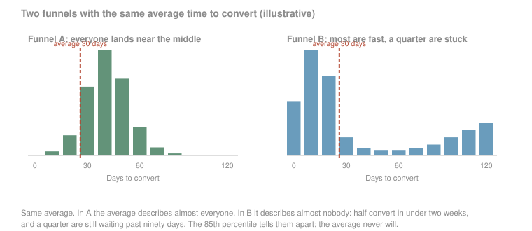
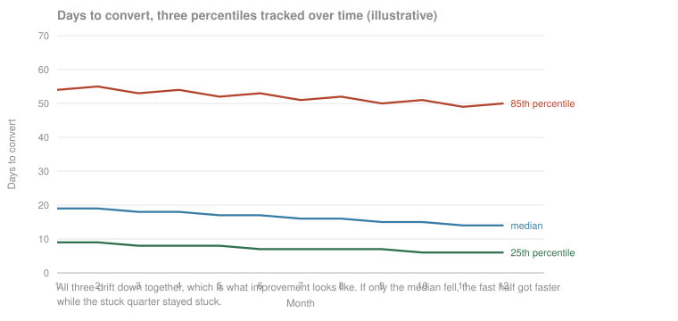
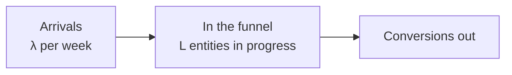
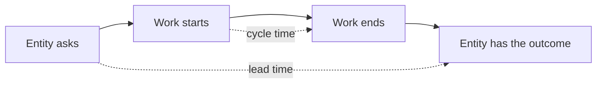
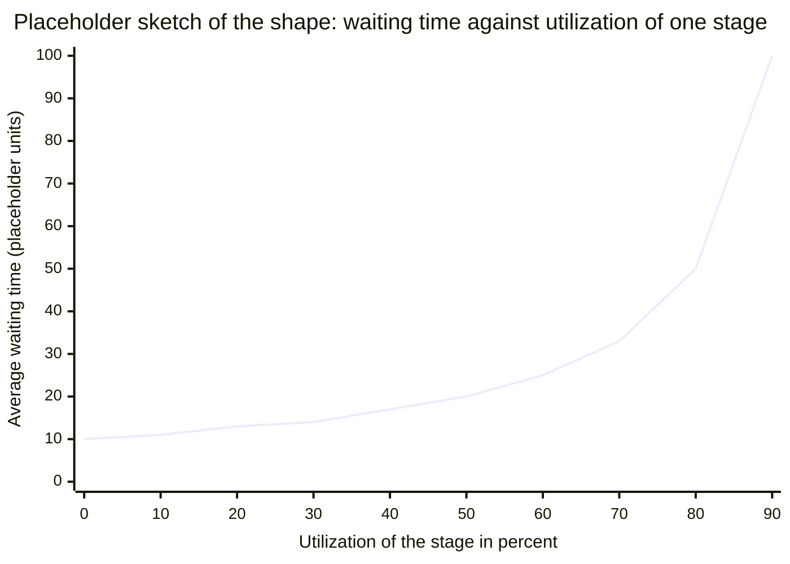

# Time to convert

When a company measures conversion, the most common thing measured is the conversion rate between funnel steps (see the [conversion rate page](conversion-rate.md)). Equally important is how fast a user moves from one step to the next. Measuring that gives you two things: it helps you predict and forecast your business, and it shows you where the friction is, where users get stuck or frustrated in a step.

Where to jump: [what it looks like in practice](#what-it-looks-like-in-practice) is this measurement under the names your business already uses; [why speed is its own metric](#why-speed-is-its-own-metric) fixes the definition and separates the three clocks people confuse; [measuring it honestly](#measuring-it-honestly) is the part to read first if you have no analyst; [the pipeline as a queue](#the-pipeline-as-a-queue) is the industrial-engineering lens on the same numbers, and a reader who only cares about user conversion can skip that section without losing the thread; [when speed is the wrong goal](#when-speed-is-the-wrong-goal) is the counterweight.

## What it looks like in practice

Every function has its own name for this measurement, and they are all the same idea: how long an entity takes to get from one point in the pipeline to another.

| What the business calls it | The clock it names | What it is good for |
|---|---|---|
| Sales cycle length | Opportunity created to deal closed | Forecasting, and knowing how much open pipeline you need to hit a number [^kellogg-2023] |
| Time to value, time to first value | Signup to the first moment the customer gets something they would miss | Onboarding design. The event at the end of this clock is activation, which the [conversion rate page](conversion-rate.md) covers |
| Lead response time, speed to lead | An inbound lead arriving to a human answering it | Staffing the first response. It is a different clock from the funnel's, and moving it does not move the funnel's [^oldroyd-2011] |
| Deal aging, stage age | How long an open deal has sat where it is | The version you can compute today, on entities that have not converted yet [^kanban-2025] |
| Change lead time | Code committed to code running in production | The same measurement in software delivery, where public benchmarks exist to compare against [^dora-2026] [^forsgren-2018] |

Two rows are worth separating from the rest. Deal aging is the only one you can compute on entities that are still in the funnel, which is why [measuring it honestly](#measuring-it-honestly) comes back to it. And change lead time is this measurement in a field that publishes its numbers, so it is the place to look when you want a benchmark instead of a guess.

## Why speed is its own metric

The [conversion rate](conversion-rate.md) counts how many entities get through. This page measures how long they take. A pipeline can convert the same fraction of entities twice as fast, which changes cash timing, forecast accuracy, and how quickly a fix shows up in the numbers. Speed is also what makes the rate's window an honest choice rather than an arbitrary one, because a window can only close where the conversions have stopped arriving.

Like the rate, this is one number sitting on top of several choices, and it means nothing until they are written down and held fixed.

| Choice | The question | What goes wrong when it floats |
|---|---|---|
| Entity | Whose clock are you starting: a visit, a user, an account, a lead, a shipment? | It has to be the same entity the [conversion rate](conversion-rate.md) uses, or the two metrics do not compose into anything. |
| Start event | Does the clock start at first touch, at signup, or at entry into the stage? | Lean already made this distinction: lead time starts when the customer asks, cycle time starts when the work does [^lei-lexicon]. Picking one silently picks a number. |
| End event | What stops the clock? | The same numerator question the rate has, with one extra hazard: a clock has two ends to move, and both are easy to redefine under pressure. |
| Population | Converted entities only, or everyone who entered? | Measuring only the ones that finished biases the number downward, and the bias is not small [^davidsonpilon-2019]. |
| Statistic | Mean, median, or a percentile? | Durations are skewed and long-tailed. The mean is the one number that describes nobody [^kellogg-2023]. |

**Three clocks get called speed, and only one of them is this page.**

- **Latency** is how fast the system answers, measured in milliseconds. It has its own famous result: Google served 30 results instead of 10, page time went from 0.4 to 0.9 seconds, and traffic and revenue fell about 20 percent in the slower group even though those users had asked for more results. Amazon's own tests delayed pages in 100 millisecond increments and found that even very small delays cost revenue [^linden-2006b].
- **Response time** is how fast you answer the entity, measured in minutes or hours. That is the speed-to-lead row in [what it looks like in practice](#what-it-looks-like-in-practice).
- **Cycle time** is how long the entity takes to cross the funnel, measured in days, weeks, or months. That is this page.

Improving one of the three says nothing about the other two. A page that renders instantly can sit inside a signup flow that takes eleven days.

## Measuring it honestly

A single average blurs all the stories. Here are two funnels with exactly the same average time to convert:

In the first funnel the average describes almost everyone. In the second it describes almost nobody, and the quarter of entities stuck past ninety days is the entire problem, invisible behind a number that looks identical. A percentile is the value a given share of cases falls under, so the 85th percentile is what 85 percent came in under. It separates these two funnels instantly. The average never will [^vacanti-2014] [^vacanti-2020] [^tene-2015].

The average has a second problem: it is computed only from entities that already converted. The ones still waiting have no duration yet, so they drop out of the calculation, and finishing early is exactly what makes an entity available to be counted. Your average time to convert can only ever tell you about the fast ones. The name for a duration whose clock is still running is censoring, and dropping those cases underestimates the truth badly [^davidsonpilon-2019]. Kaplan-Meier, the 1958 product-limit estimator, keeps them in the denominator instead of discarding them [^kaplan-1958] [^bernhardsson-2019].

**What to put on a dashboard.** Track the percentiles over time, the 25th, the median and the 85th together, so you see how the whole distribution moves rather than one point on it:

What you want to see is the majority moving in the right direction. Equally important, segment by your user dimensions, because the overall trend hides the detailed ones underneath it.

**Ask who is getting faster, not just how fast.** When someone reports a single average, the second question is about the users who matter most: are the high-value customers converting faster over time? That question has a wrinkle worth naming. You often do not know an entity is high-value until after it converts, so the honest move is retroactive. Once they convert, look back at their onboarding journey and ask whether the time to convert for that kind of customer is improving. Segmenting on an outcome you only learn later is legitimate, as long as you know that is what you are doing.

**Rate and speed are two different things, and teams argue about them without knowing it.** A model can fit both at once: a ceiling, meaning the share of a cohort that ever converts, and a speed, meaning how fast the cohort gets there. Fitted separately they can move in opposite directions, so a cohort's conversion rate can fall while the people who do convert are converting faster than ever [^bernhardsson-2019]. That is the argument a growth team has every quarter and cannot settle from one blended number.

**The window is the same decision from the other side.** How long you let the clock run before declaring an entity converted is the window choice, and the [conversion rate page](conversion-rate.md) works through when a fixed window is honest [^bernhardsson-2017] [^kent-2021]. The link: you cannot defend a window until you know the shape of the curve, so measure the speed first.

**What a team with no analyst can watch on Monday.** Time to convert is lagging, because it can only be computed on entities that finished. Work item age is not: it is today's date minus the date the entity entered, computable right now on everything still in the funnel [^kanban-2025]. A list of the oldest entities still in progress needs no statistics and no tooling, and it points at the same stage a full survival analysis would.

## The pipeline as a queue

This section is one lens on the same numbers, borrowed from industrial engineering. A reader who only cares about user conversion can skip to [when speed is the wrong goal](#when-speed-is-the-wrong-goal).

One of the core industrial engineering ideas worth carrying into analytics is Little's Law. It relates three quantities: L, the average number of items in the system, λ, the average rate at which they arrive, and W, the average time each one spends inside. L = λW [^little-1961].

Applied to a funnel, two of the three quantities are the easy ones. Count how many entities arrive in a week, count how many are sitting in the funnel right now, and the law hands you the third. With 40 arriving a week and 200 in progress, the average time to convert is five weeks, and you never timed a single lead. Those numbers are round placeholders.

Rearranged, the same identity is the sentence to act on: time to convert equals work in progress divided by throughput. Work in progress is the number of entities started but not finished; throughput is the number finished per unit of time [^choo-2016]. While throughput holds steady, the way to make the funnel faster is to have fewer entities in it at once.

The lens holds when you are debugging or accelerating a funnel. You want to find the longest path, and you want to know how long it takes an entity to get from the beginning of the funnel to the end. You can measure every step, but treating a high-volume funnel as a manufacturing process gives you another way of understanding how it works. Applying Little's Law to a customer funnel is this framework's own framing.

**The vocabulary.** Three terms get borrowed loosely, and they are not synonyms. Cycle time is the time to complete a process, timed by actual measurement. Lead time is longer, because it starts when the customer asks and ends when the customer has the thing. Value-creating time is shorter than both: it counts only the work the customer would be willing to pay for [^lei-lexicon].

**The four flow metrics.** Software delivery keeps the most usable operational definitions of all of this [^kanban-2025], and they carry over to a funnel.

| Flow metric | Definition | Funnel translation |
|---|---|---|
| Work in progress | Items started but not finished | Entities somewhere in the funnel right now |
| Throughput | Items finished per unit of time | Conversions per week |
| Cycle time | Elapsed time from when an item started to when it finished | Time to convert, measurable only on entities that already converted |
| Work item age | Elapsed time since an unfinished item started | How long an entity has been stuck, measurable today, on everyone still in the funnel |

**Where the time goes.** Elapsed time in a funnel is mostly waiting, not working. The ratio of value-creating time to total elapsed time is flow efficiency, and it is usually low [^modig-2012]. A sketch with round placeholder numbers:

| Stage | Working time | Waiting time |
|---|---|---|
| Application review | 1 day | 6 days |
| Verification | 1 day | 4 days |
| Approval | 1 day | 9 days |

Three days of work inside twenty-two days of elapsed time. Nobody in that picture is slow.

**Utilization.** Utilization is how much of a stage's capacity is already committed. A reviewer who can clear five applications a day and gets four is at 80 percent. Waiting time rises gently while a stage has slack and then goes near vertical as the stage approaches full capacity. One practitioner account puts it on a real customer pipeline and reports that by 50 percent utilization the waiting time has already doubled, with a working rule of keeping urgent work under 50 percent average load [^bernhardsson-2018].

The curve is a sketch of the shape, not measured values. What matters is that it is not a straight line: the step from 80 to 90 percent costs more waiting time than everything below 50. A stage staffed to exactly meet demand will be slow, and a little deliberate slack buys more speed than telling people to hurry. Reinertsen makes the same argument for knowledge work: you control cycle time by controlling queue size, not by scheduling harder [^reinertsen-2009]. The counterintuitive part is that keeping every station busy is what destroys flow efficiency, so a team that answers a slow funnel by loading every stage to capacity makes it slower [^modig-2012].

**Finding the bottleneck.** Understanding where the bottleneck is is the core thesis of the exercise. Once you know where it is, you can ask what the physical mechanism is: whether a page is loading slowly, or the friction is artificial. Most of the measurement work exists so that you can find that and improve it.

**Where this lens stops working.** The manufacturing view earns its keep when two things are true: the units moving through are relatively uniform, and there are a lot of them. Under those conditions a funnel behaves like a production system and the arithmetic above holds. Neither condition is guaranteed with customers. People are not uniform, and they can be segmented many different ways, each of which may have its own honest answer. When the units stop being interchangeable, the queue stops being the right model, and the question turns into a segmentation question instead. That is the boundary: use the flow lens on high-volume, uniform pipelines, and reach for segmentation when the entities differ more than the stages do.

## When speed is the wrong goal

Rushing a pipeline produces a worse cohort at the end of it, and this happens all the time. A team decides conversion is taking too long, removes steps to accelerate the pipeline, and lets too many bad users in, which pollutes the whole user cohort. Those users then have to go back through a more scrutinized funnel, which takes even longer than the original flow. Do it right the first time. The rework is very costly.

Speed should never be a metric on its own. Time to convert belongs on a team's goals as a subgoal, set alongside a quality metric. Think of it as a two-by-two of speed against quality, and balance the two for your business.

Longer is sometimes what converts. A product leader describes expanding a checkout for weight-loss medication from 3 steps to 25 steps, after which conversion rose about 40 percent, with per-step completion above 99 percent. His frame is that the length of a flow should match what the decision costs the person making it and how much they still do not know: high-stakes decisions with large information gaps need more steps, because the extra steps build confidence rather than friction [^mehta-2025]. So the number to aim at is the one that matches what the decision requires.

<!-- swap for modern story when research lands -->
Faster is not automatically worse either. Across US mortgage originations from 2010 to 2016, technology-led lenders processed applications about 20 percent faster than others, and "faster processing does not come at the cost of higher defaults" [^fuster-2018]. The trade is real but not automatic, which makes the useful question how you got faster: removing waiting is nearly always free, and removing checks is what costs you at the far end.

## Patterns & case studies

Two stories worth knowing.

**The 60-day mortgage.** Getting a mortgage in the United States takes about 60 days and produces a loan file hundreds of pages long. The lender's chief technology officer looked at that and diagnosed it as manufacturing done by hand: a pipeline with stages, queues between them, and files waiting on people rather than being worked on. He attacked it from two directions at once. First, he modeled the pipeline as a queueing system and found the result any factory would recognize, that running the stages below full capacity bought large improvements in how long a file took, because a stage loaded to its limit makes everything behind it wait [^bernhardsson-2017b] [^bernhardsson-2018]. Second, because the lag between applying and closing runs to months, he built models that separate two questions a single average confuses: what share of applicants ever close, and how fast the ones who close get there [^bernhardsson-2019]. The two answers can move in opposite directions, and a team that tracks only the blended number cannot tell which is happening. This is the clearest published example of a real customer pipeline being run as a flow problem rather than a conversion-rate problem. The company's own claims page reports a faster average close than the industry figure it cites, but that is a marketing claim rather than an independent measurement [^better-2020].

**Twenty-five steps beat three.** A checkout was lengthened from 3 steps to 25, and conversion rose about 40 percent, with almost nobody dropping out at any individual step [^mehta-2025]. The lesson is not that longer is better. It is that the number of steps is the wrong thing to count. Each of the 25 was small, obvious and quick to answer, so the path felt easier despite being longer, while three dense steps asked the customer to do more thinking at once. If you are cutting steps to make a funnel faster, you may be making each remaining step heavier, which is the trade this page's next section is about.

## Sources & Stories

The industrial-engineering material rests on Little's 1961 proof [^little-1961] and his own later account of how widely the law applies outside queues [^little-2011], with the operations restatement worked through on real projects by James Choo [^choo-2016], the Lean definitions of cycle, lead, and value-creating time from the Lean Enterprise Institute's lexicon [^lei-lexicon], and the four flow metrics from the Kanban Guide [^kanban-2025]. Applying the law to a customer funnel's time to convert is this framework's own framing rather than a borrowed one. The utilization curve and the queue model of a real customer pipeline come from Erik Bernhardsson's first-party account of mortgage lending [^bernhardsson-2018], with Donald Reinertsen on queue size [^reinertsen-2009] and Niklas Modig and Pär Åhlström on the efficiency paradox [^modig-2012], both cited at thesis level because their text was not read directly.

The statistics: Cameron Davidson-Pilon's survival-analysis documentation for censoring [^davidsonpilon-2019], Kaplan and Meier's 1958 paper as provenance for the product-limit estimator [^kaplan-1958], Erik Bernhardsson for Kaplan-Meier on censored conversion data and for separating conversion probability from conversion speed [^bernhardsson-2019] with his library as the working implementation [^convoys], Daniel Vacanti for the scatterplot, the cumulative flow diagram, and forecasting from a distribution [^vacanti-2014] [^vacanti-2020], Gil Tene on how averages mislead about time distributions [^tene-2015], Olivier Chapelle for the advertising form of delayed conversions [^chapelle-2014], and the window question reused from the [conversion rate page](conversion-rate.md) rather than re-derived [^bernhardsson-2017] [^kent-2021]. Vacanti also sells an analytics tool, which is why his books are cited and the tool is not.

The business vocabulary is where the sourcing is thinnest. Dave Kellogg's post is the one non-vendor treatment of sales cycle length that survived verification [^kellogg-2023]. Time to value has no non-vendor source at all, so the page defines the term and claims nothing about it. The speed-to-lead multipliers everyone repeats trace to a single 2007 study funded by a company selling response-time software, written up by three authors, one of whom was that company's chief executive, so no number from it appears here [^oldroyd-2011] [^insidesales-2007]. DORA's change lead time definition and the research behind it are the published counterexample [^dora-2026] [^forsgren-2018]. The stories are Ravi Mehta's onboarding essay [^mehta-2025], the queue-and-statistics work at a mortgage lender [^bernhardsson-2017b] [^bernhardsson-2018] [^bernhardsson-2019] whose own closing-time page is a company claim rather than a measurement [^better-2020], and the NBER paper on technology in mortgage lending [^fuster-2018]. Greg Linden's latency figures are his write-up of a conference talk and his account of internal tests, not a published study [^linden-2006b].

Held back for lack of a source: every speed-to-lead multiplier, any benchmark for time to value or for flow efficiency, and the figures from a mortgage closing-time benchmark study whose document could not be read [^freddiemac-2020]. No first-party account of a small team working on this metric surfaced, the same gap the [attribution page](attribution.md) and the [active users page](active-users.md) recorded. Several sources are cited at thesis or book level only, and each entry in [REFERENCES.md](../../REFERENCES.md) says which. All figures on this page use round placeholder numbers. The two mortgage examples are placeholders for internet-era stories from a research round now running, and the interview TODOs are unanswered by design, per this repository's working method.

<!-- Footnote targets; full entries with links and caveats live in REFERENCES.md -->

[^lei-lexicon]: [[LEI-LEXICON]](../../REFERENCES.md)
[^davidsonpilon-2019]: [[DAVIDSONPILON-2019]](../../REFERENCES.md)
[^kellogg-2023]: [[KELLOGG-2023]](../../REFERENCES.md)
[^vacanti-2014]: [[VACANTI-2014]](../../REFERENCES.md)
[^linden-2006b]: [[LINDEN-2006B]](../../REFERENCES.md)
[^little-1961]: [[LITTLE-1961]](../../REFERENCES.md)
[^little-2011]: [[LITTLE-2011]](../../REFERENCES.md)
[^choo-2016]: [[CHOO-2016]](../../REFERENCES.md)
[^kanban-2025]: [[KANBAN-2025]](../../REFERENCES.md)
[^bernhardsson-2018]: [[BERNHARDSSON-2018]](../../REFERENCES.md)
[^reinertsen-2009]: [[REINERTSEN-2009]](../../REFERENCES.md)
[^vacanti-2020]: [[VACANTI-2020]](../../REFERENCES.md)
[^tene-2015]: [[TENE-2015]](../../REFERENCES.md)
[^kaplan-1958]: [[KAPLAN-1958]](../../REFERENCES.md)
[^bernhardsson-2019]: [[BERNHARDSSON-2019]](../../REFERENCES.md)
[^convoys]: [[CONVOYS]](../../REFERENCES.md)
[^chapelle-2014]: [[CHAPELLE-2014]](../../REFERENCES.md)
[^bernhardsson-2017]: [[BERNHARDSSON-2017]](../../REFERENCES.md)
[^kent-2021]: [[KENT-2021]](../../REFERENCES.md)
[^oldroyd-2011]: [[OLDROYD-2011]](../../REFERENCES.md)
[^insidesales-2007]: [[INSIDESALES-2007]](../../REFERENCES.md)
[^dora-2026]: [[DORA-2026]](../../REFERENCES.md)
[^forsgren-2018]: [[FORSGREN-2018]](../../REFERENCES.md)
[^freddiemac-2020]: [[FREDDIEMAC-2020]](../../REFERENCES.md)
[^better-2020]: [[BETTER-2020]](../../REFERENCES.md)
[^mehta-2025]: [[MEHTA-2025]](../../REFERENCES.md)
[^modig-2012]: [[MODIG-2012]](../../REFERENCES.md)
[^fuster-2018]: [[FUSTER-2018]](../../REFERENCES.md)
[^bernhardsson-2017b]: [[BERNHARDSSON-2017B]](../../REFERENCES.md)
