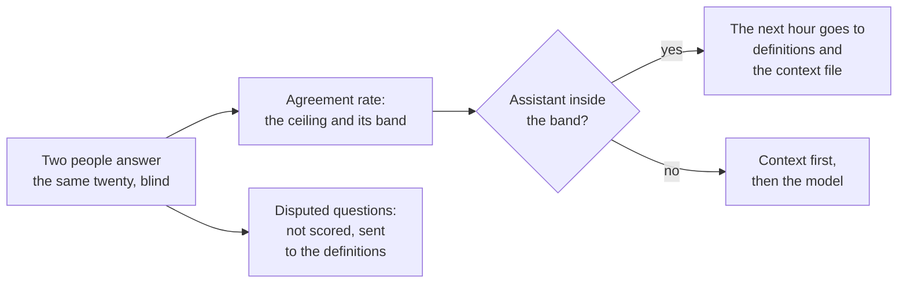

# Agreement measurement for analytics QA

## Problem

Two competent people asked the same business question return different numbers more often than anyone expects. When 29 research teams were handed one dataset and one question, twenty found the effect and nine did not, and neither expertise nor peer ratings explained who landed where.[^silberzahn-2018] Seven economists re-deriving one published result from the same raw data did not produce the same sample size twice.[^huntington-klein-2021]

Company data behaves the same way. At Airbnb, data science and finance would give the chief executive different answers to which city had the most bookings last week, from slightly different tables and definitions.[^chang-2021] Nobody was careless. Each person got a number that was right by their reading.

An AI assistant scored against one person's answers inherits every one of those open choices as its own error, and the team reads a 70 percent score as a model problem and spends the week on prompts. I read the failure as a gauge that was never checked, and the rest of this page is how my field checks one.

In my experience this is where most executive escalations start. Two departments are in a fast discussion, nobody has time to spell out how their number was made, and the numbers do not match. Laid side by side afterwards, the cause is nearly always one of three things. One side excluded records the other side counted. The two sides used different calendars, fiscal week against calendar week, or fiscal year against calendar year. Or one number was pulled two hours before the meeting and the live dashboard had moved by the time the meeting started. None of those is a wrong query, and an assistant fails in exactly the same three ways. People have to agree on the conditions first.

## When this applies

Reach for this pattern when a hand-checked answer is about to be used as the truth. The problems that bring teams here look like these:

- The assistant scored 70 percent on the golden set, and the team cannot agree on whether that is bad.
- Two people gave the board two numbers for the same quarter, both queries look right, and the meeting is about which person to believe.
- The golden set has one owner, and somebody on the team quietly doubts a few of the reference answers.
- A model upgrade moved the score by five points, and nobody knows whether five points on twenty questions is a change or a coin toss.
- A week of prompt work is about to start because the score is low, and nobody has asked whether the score could be higher.

It needs a second person who can answer the twenty questions from the data without help, and one afternoon. It needs no analyst and no purchase.

Building the set and comparing answers as values live on the [golden question sets](golden-question-sets.md) page. Whether one number is right before it leaves the room lives on [detecting plausible-but-wrong outputs](plausible-but-wrong.md). Whether the rate moved or only wiggled between two runs is the question [statistical process control](statistical-process-control-for-pipelines.md) answers, and the rate can go on a control chart once it exists.

Whenever another page in this library asks how repeatable a hand-checked answer is, this is the page it points to.

## The pattern

Before the assistant is scored, a second person answers the same twenty questions the owner already answered, without seeing the key or the owner's work. Each answer carries a short list of the conditions behind it: what was excluded, which calendar, and when the data was pulled. Agreement is checked in that order. Two answers agree when their conditions match and their values land within a tolerance a person set for that metric before the study. Two values that match by coincidence under different conditions do not count. Two that differ inside the tolerance under the same conditions do. The share of questions that agree is the agreement rate. That rate is the ceiling for the assistant, with a band, because twenty questions is a small sample. The assistant is then scored against each person's answers and read against the ceiling rather than against 100. A question the two people disagree on is not scored at all. It goes to the definitions and comes back once the definition is written down.

In industrial engineering this is measurement system analysis. Repeatability is how close one person lands answering the same question twice, and reproducibility is how close two people land on it. The international standard states the rule this page rests on: a difference between two results is not a real difference when the measurement procedure's own variation can explain it.[^iso-2023] Gauge studies are the textbook form for measured values,[^montgomery-2019] and attribute agreement analysis, with Cohen's kappa as its two-judge arithmetic, is the form for pass-or-fail judgements.[^aust-pons-2022]

A single person is not a fixed reference either. Fifty aircraft inspectors judging the same 26 blade photographs twice agreed with their own earlier decision 82.5 percent of the time and with the ground truth 67.7 percent of the time.[^aust-pons-2022]

## Position

Before you score the assistant, measure how often two of your own people agree on the same twenty questions, and hold the assistant to that rate as its ceiling, not to one person's answers with the model tuned until the score rises.

The common practice is the single owner. One person writes the reference answers, the assistant is scored against them, and a low score is read as a model problem. The appeal is real, and the golden question set page installs exactly this owner. A test has one expected value,[^husain-2024] the owner usually knows the data best, and a second person costs an afternoon a ten-person company does not have.

What I take from the evidence is that the owner's answers are a gauge whose error nobody has measured. A second competent person disagrees with the first more often than a score's precision assumes, and neither expertise nor peer-rated quality predicts who is right.[^silberzahn-2018] [^gould-2025] Inside a company the disagreement is about definitions, and definitions are what move an assistant.[^rumiantsau-2026] So when the assistant's agreement with the reference sits inside the human-to-human band, the next hour goes into the definitions and the context file, not into the model.

The ceiling excuses nothing below it. The assistant's misses on the settled questions are its own, and they go through the usual order of context first and model second. The ceiling rises with every disagreement that resolves into a written definition.

The quality manuals I trained on grade kappa against fixed bands, with 0.75 the usual line for good agreement. I do not use the bands here. A difference between two answers can be a delay, an exclusion, a calendar, or two different metrics that happened to land near each other, and no band tells those apart. Check the logic first. The tolerance comes after, and a person sets it for each metric as the reporting difference the operation can live with.

## Implementation

The [control plan template](../../../templates/01-ai-data-quality/agreement-measurement-control-plan.md) carries the answer sheets, the arithmetic in spreadsheet-ready form, what each rate means, a machine-readable core, and the prompts. The study is one afternoon and an hour of adding up.

1. **Pick the second person and keep them blind.** Nobody is the better judge here. The point is that both people end up informed and aligned, so pick for independence: someone who can answer from the data without the owner's help, from outside the team that wrote the key. They see neither the key nor the owner's queries, and nobody discusses the questions until the second sheet is in.[^aczel-2021]
2. **Answer the twenty, and write the conditions under each answer.** The second person gets the question text exactly as the assistant would, and records the value, the query, and three bullets: what was excluded, which calendar, and when the data was pulled. An assistant writes those three bullets from its own query in a second, and a person verifies them in a few more. In the crowdsourced studies, operationalization explained more of the spread than statistics did.[^schweinsberg-2021]
3. **Check the logic, then compute the rate and its band.** Compare the conditions first. Two answers whose conditions differ are a disputed row whatever the values say. Two answers whose conditions match agree when the values land within the tolerance a person set for that metric, and the rate is agreements divided by twenty. The band is the rate plus and minus the square root of p(1−p)/n, about two questions either way at twenty, the framework's own rule of thumb.
4. **Score the assistant three ways.** Against each person, and on the settled questions. Percent agreement is the number for values. Kappa is for pass-or-fail verdicts, where chance agreement is large, and it is read beside the raw rate, because it falls when most answers pass.[^quarfoot-levine-2016] [^delgado-tibau-2019] [^zhao-2022]
5. **Read the result and route it.** An assistant inside the band gets no model work. Each disputed question becomes one line in the [context file](../03-ai-agent-integration/context-file.md) and a dated new row in the key, never an edit in place, as the companies running their own sets do.[^chen-2024] [^huang-2024] An assistant below the band is worked on the settled questions, context first and then the model.
6. **Repeat when the key changes, and chart the rate.** Put the rate on a control chart like the pipeline signals, and re-run the study after every change to the key.

The rows below are illustrative.

| Question | Two people agree | Assistant matches A | Assistant matches B | Reading |
|---|---|---|---|---|
| 1 | yes | yes | yes | settled, assistant right |
| 2 | yes | yes | yes | settled, assistant right |
| 3 | yes | yes | yes | settled, assistant right |
| 4 | no | yes | no | disputed: the day the quarter closes |
| 5 | yes | yes | yes | settled, assistant right |
| 6 | yes | no | no | settled, assistant wrong |
| 7 | yes | yes | yes | settled, assistant right |
| 8 | yes | yes | yes | settled, assistant right |
| 9 | no | yes | no | disputed: refunds netted or not |
| 10 | yes | yes | yes | settled, assistant right |
| 11 | yes | no | no | settled, assistant wrong |
| 12 | yes | yes | yes | settled, assistant right |
| 13 | no | no | yes | disputed: trial accounts counted as customers |
| 14 | yes | yes | yes | settled, assistant right |
| 15 | yes | no | no | settled, assistant wrong |
| 16 | yes | yes | yes | settled, assistant right |
| 17 | no | yes | no | disputed: the date of the currency conversion |
| 18 | yes | yes | yes | settled, assistant right |
| 19 | yes | no | no | settled, assistant wrong |
| 20 | no | no | yes | disputed: the time zone of the day boundary |
| **Total** | **15 of 20** | **14 of 20** | **13 of 20** | 4 wrong, 5 disputed |

The two people agree on 15 of 20, a rate of 75 percent, and the band runs from about 13 to 17. The assistant matches A on 14 and B on 13, inside the band either way, and a team scoring against A alone would report 70 percent and start on the model. On the 15 settled questions the assistant is right on 11 and wrong on 4, and those four are its own errors; the other five the two people read differently. Had the two judges marked the assistant's answers pass or fail instead, their verdicts would agree on 15 of 20, an observed agreement of 0.75. With A passing 14 and B passing 13, chance alone gives 0.70 × 0.65 + 0.30 × 0.35 = 0.56, and kappa is (0.75 − 0.56) / (1 − 0.56) = 0.43. The figure reads as moderate for judges who agree three times in four, because the disputed questions are exactly where their verdicts part. Every one of the five disputed rows is a condition, not arithmetic: an exclusion, a calendar, or an as-of time.

Run it more than once and it becomes a habit with less friction each time. The important calls then spend their time on actions, and less of it on aligning the numbers.

## How you know it is working

- The agreement rate is a number the team knows, with a date and two names beside it.
- The assistant's score is never reported without the human rate.
- The important calls spend their time on what to do, and the question of whose number is right has stopped coming up in them.
- Model work waits until the assistant is below the band on the settled questions.
- Every disputed question turns into a context-file line within the week, and the human rate rises on the next run.
- **Anti-signal:** two people agree on all twenty the first time. Either the second person saw the key, or the questions are too easy to catch anything.

## Failure modes

- **The second person is briefed by the first.** A walk-through of how the owner reads the questions turns two judges into one, and the study passes by construction.[^aczel-2021]
- **Scoring the disputed questions anyway.** Whichever reading the owner wrote wins by default. Benchmarks assume one correct query per question,[^bhaskar-2023] and models struggle even to notice a question with two readings,[^saparina-lapata-2024] so it is the one the assistant answers confidently either way.
- **Agreeing on the number and not on the conditions.** Two values can match by coincidence, one on the fiscal calendar and one on the calendar year, and split next quarter. Agreement is recorded on the conditions, and a matching value under different conditions is a disputed row.
- **Kappa alone on a skewed set.** When eighteen of twenty answers pass, chance agreement is high and kappa collapses between judges who agree on nearly everything.[^quarfoot-levine-2016] [^zhao-2022]
- **The assistant as the second judge.** Model judges agree with people about as often as people agree with each other, and they lean toward the first answer shown and the longer one.[^zheng-2023] Their agreement varies by task, and the advice is to validate them against people first.[^bavaresco-2025] A model can be the third rater once two people exist, never the second.
- **Copying a public benchmark's answers as your reference.** Two audits found errors in roughly half the reference answers they checked,[^jin-2026] [^wretblad-2024] and a reference nobody at your company verified has an error rate of its own.
- **Treating one answer from one person as that person's answer.** The inspectors disagreed with themselves one time in six,[^aust-pons-2022] and a model used as an analyst returned considerably different results across ten runs of one setup.[^cui-alexander-2026] Where a question matters, have each person answer it twice, a week apart.

## Sources & Stories

The many-analysts evidence is five studies in which independent teams analysed one dataset to answer one question: the referee study [^silberzahn-2018], the immigration study [^breznau-2022], the neuroimaging study [^botvinik-nezer-2020], the finance study that named the phenomenon nonstandard errors [^menkveld-2024], and the ecology study, the largest [^gould-2025]. The sample-size finding is from an economics replication with seven replicators per result [^huntington-klein-2021], the operationalization finding from an organizational-behaviour study [^schweinsberg-2021], and the blinding rule from the consensus guidance for multi-analyst studies [^aczel-2021]. Several of these publishers refuse automated fetching, so abstracts were verified through indexed copies and journal records through Crossref; the reference entries say which.

The measurement-system lens is the author's own field, cited through the current international standard for measurement precision, read from the publisher's preview pages [^iso-2023], and the standard quality-control textbook, cited at book level for its measurement-system chapter [^montgomery-2019]. The inspector study is a peer-reviewed application of attribute agreement analysis, verified at abstract level [^aust-pons-2022]. The three critiques of kappa are peer-reviewed and cited for the direction of the problem [^quarfoot-levine-2016] [^delgado-tibau-2019] [^zhao-2022].

The Airbnb story is a first-party account, cited for the disagreement and never for the platform [^chang-2021]. The dated-row practice is first-party from LinkedIn [^chen-2024] and vendor material from Snowflake, cited only for the evaluation design [^huang-2024]. The two annotation audits are the ones the golden question set page cites [^jin-2026] [^wretblad-2024]. The ambiguity benchmarks [^bhaskar-2023] [^saparina-lapata-2024], the model-judge studies [^zheng-2023] [^bavaresco-2025] and the model-as-analyst preprint [^cui-alexander-2026] are verified at abstract level. The context-before-model ordering is the paired benchmark by authors at a semantic-layer vendor [^rumiantsau-2026], and the single-expected-value practice the Position argues with is Husain's [^husain-2024].

The three causes of a mismatch, the conditions summary under every answer, the rule to check the logic before any statistic, and the tolerance set by a person are the author's own, from his practice. The blind two-person study as the first step before scoring, the band of two questions at twenty, the rule that disputed questions are not scored, and the three-way score are the framework's own. No published account applies measurement system analysis to the reference answers of an AI evaluation set; the closest is the quarterly expert review of accepted answers at LinkedIn [^chen-2024]. The prior-art row for this pattern is pending in [prior-art.md](../../prior-art.md).

<!-- Footnote targets; full entries with links and caveats live in REFERENCES.md -->

[^aczel-2021]: [[ACZEL-2021]](../../../REFERENCES.md)
[^aust-pons-2022]: [[AUST-PONS-2022]](../../../REFERENCES.md)
[^bavaresco-2025]: [[BAVARESCO-2025]](../../../REFERENCES.md)
[^bhaskar-2023]: [[BHASKAR-2023]](../../../REFERENCES.md)
[^botvinik-nezer-2020]: [[BOTVINIK-NEZER-2020]](../../../REFERENCES.md)
[^breznau-2022]: [[BREZNAU-2022]](../../../REFERENCES.md)
[^chang-2021]: [[CHANG-2021]](../../../REFERENCES.md)
[^chen-2024]: [[CHEN-2024]](../../../REFERENCES.md)
[^cui-alexander-2026]: [[CUI-ALEXANDER-2026]](../../../REFERENCES.md)
[^delgado-tibau-2019]: [[DELGADO-TIBAU-2019]](../../../REFERENCES.md)
[^gould-2025]: [[GOULD-2025]](../../../REFERENCES.md)
[^huang-2024]: [[HUANG-2024]](../../../REFERENCES.md)
[^huntington-klein-2021]: [[HUNTINGTON-KLEIN-2021]](../../../REFERENCES.md)
[^husain-2024]: [[HUSAIN-2024]](../../../REFERENCES.md)
[^iso-2023]: [[ISO-2023]](../../../REFERENCES.md)
[^jin-2026]: [[JIN-2026]](../../../REFERENCES.md)
[^menkveld-2024]: [[MENKVELD-2024]](../../../REFERENCES.md)
[^montgomery-2019]: [[MONTGOMERY-2019]](../../../REFERENCES.md)
[^quarfoot-levine-2016]: [[QUARFOOT-LEVINE-2016]](../../../REFERENCES.md)
[^rumiantsau-2026]: [[RUMIANTSAU-2026]](../../../REFERENCES.md)
[^saparina-lapata-2024]: [[SAPARINA-LAPATA-2024]](../../../REFERENCES.md)
[^schweinsberg-2021]: [[SCHWEINSBERG-2021]](../../../REFERENCES.md)
[^silberzahn-2018]: [[SILBERZAHN-2018]](../../../REFERENCES.md)
[^wretblad-2024]: [[WRETBLAD-2024]](../../../REFERENCES.md)
[^zhao-2022]: [[ZHAO-2022]](../../../REFERENCES.md)
[^zheng-2023]: [[ZHENG-2023]](../../../REFERENCES.md)
