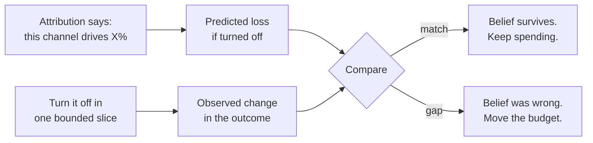

# Check attribution by turning it off

## Problem

An attribution model does not measure what caused an outcome. It applies a credit rule — last touch, first touch, time decay — and every rule produces a different answer from the same journey, with nothing measured in between. That would be a tolerable approximation if the output stayed in a report. It does not: the credit split decides which channel gets next quarter's budget and which team made its number.

So a belief with no measurement behind it is steering money, and it is steering it in a predictable direction. Credit rules reward the channel that harvests intent and starve the channels that create it. A podcast creates demand, the listener searches, search takes the credit, the budget moves to search, and the channel that was actually working gets cut [^fishkin-2020]. The harder a channel is to measure, the less competitive and higher-return it usually is, which means the rule starves exactly what was quietly working.

The dashboards cannot detect this, because the dashboards are the thing being questioned.

## When this applies

Apply this when a channel or team-credit number is large enough that being wrong about it costs more than the test does. In practice that means a channel carrying a meaningful share of spend, a credit rule that is about to move a budget, or any number that has never once been checked against an outcome.

Do not apply it to a channel you could simply cancel and not miss, and do not apply it as a permanent regime. This is a periodic audit, not a way of running marketing. It also has a floor: below roughly $100K of yearly marketing spend, the attribution machinery being audited should not exist in the first place — the [attribution topic page](../../metrics/attribution.md) routes that case to one channel test at a time, and the audit collapses into ordinary channel testing.

## The pattern

Remove the spend in a bounded slice, keep it everywhere else, and compare the outcome against what your attribution model predicted would happen. The model's own claim is the hypothesis; the slice is the test.

The slice is whatever unit you can hold out without breaking the business: a set of geographic markets, a customer segment, a product line, or a period of the calendar. What makes it a test rather than an anecdote is that the rest of the business keeps spending and acts as the comparison.

**The size that changed the answer most.** eBay's attribution-based belief was that paid search drove about 5 percent of sales and returned roughly $1.50 per dollar spent. When the economists turned all paid search off in a third of US media markets and compared against the rest, sales fell about 0.5 percent — not statistically distinguishable from zero. The company was losing more than 60 cents on every dollar, and the president cut the paid-search budget by $100 million a year [^freakonomics-2020] [^blake-2015]. Nothing in the dashboards had been capable of saying this, because brand-keyword clicks that stopped being paid for simply came back for free through the organic results.

**The test can find fraud, not just error.** Uber's former head of performance marketing describes pausing a large share of the paid budget and finding installs essentially unchanged, with installs the dashboards had credited to paid channels reappearing as organic. The attribution was not merely imprecise; ad networks were claiming credit through click spamming for installs that were always going to happen. His summary position is to start by assuming half of what is on the display channels is fraud [^frisch-2020].

| | What attribution claimed | What turning it off showed |
|---|---|---|
| eBay, paid search | ~5% of sales, ~$1.50 returned per dollar | ~0.5% sales change, not distinguishable from zero [^freakonomics-2020] [^blake-2015] |
| Uber, paid display | Installs credited to paid channels | Installs essentially unchanged; credited installs reappeared as organic [^frisch-2020] |

## Position

**Turn the spend off in a bounded slice and watch the outcome — do not reconcile the dashboards against each other.** Two attribution reports agreeing tells you the credit rules are consistent, not that either is true; both can be confidently wrong in the same direction, and the last-touch family systematically is.

And when the test contradicts the belief, **move the budget rather than re-tuning the model.** The customization knobs on a multi-touch model are an invitation to encode a bias and call the output data. A team that responds to a failed holdout by adjusting the decay curve until the dashboard agrees with the old belief has learned nothing and spent the test.

One counterweight, which the sources do not supply and you should hear anyway: at small scale not everything can be measured scientifically, and a test whose answer you could not act on is not worth running. This is a periodic conviction check on your largest line of spend, not a way to decide everything.

## Implementation

**Step 1 — Write down the prediction first.** Before anything is turned off, state what the current attribution model claims: this channel drives X percent of outcomes, so removing it in this slice should cost roughly Y. A test without a pre-committed prediction becomes an argument about what the result means.

**Step 2 — Pick the slice you can afford to lose.** Geography if you buy media regionally, a customer segment if you do not, a product line if neither. The slice needs to be large enough to see a change and small enough that being wrong is survivable.

**Step 3 — Turn it off completely, not partially.** A half-reduction produces a result nobody can interpret. eBay's test was all paid search off in the held-out markets [^freakonomics-2020].

**Step 4 — Wait longer than feels necessary.** The outcome you care about may lag the touch by weeks. Ending the test when the first week looks flat measures the lag, not the channel.

**Step 5 — Compare against the rest of the business, not against last year.** The unheld part of the business is the comparison; a year-over-year read absorbs every other thing that changed.

**Step 6 — Decide before you re-tune.** Move the budget, keep it, or declare the test inconclusive and say why. Only then consider whether the model deserves adjusting.

**At a team of ten.** You do not have media markets, and you almost certainly cannot detect a small effect. What you can do is the version the topic page already recommends: turn one channel off during a slow season, or in one segment, and watch the obvious outcomes — demos, signups, qualified conversations. Two things make this work at small scale. Pick your largest spend line, because it is the only one where the effect will be big enough to see. And accept a coarse answer: "nothing happened when we stopped" is a usable finding even when it is not a statistically clean one. What does not scale down is step 1 — writing the prediction down first is free, and without it the test resolves into whatever people already believed.

## How you know it is working

- Somebody can state what the last off-test predicted and what it found, without looking it up.
- A budget has actually moved because of a test result at least once. If no test has ever changed a decision, the tests are ceremony.
- The channels nobody can measure are still being funded on purpose, with the reason written down, rather than defunded by default.
- When a credit number and an outcome number disagree, the conversation starts with the outcome.

The counter-signal is a quarterly attribution review in which the model is refined and no spend changes.

## Failure modes

**Reconciling instead of testing.** Two dashboards are compared, made to agree, and the agreement is reported as validation. Nothing was measured.

**Re-tuning to the old answer.** The holdout contradicts the belief, so the model is adjusted until it does not. This is the most common failure and the hardest to see from inside, because every individual adjustment is defensible.

**Testing the channel nobody defends.** The test lands on a small, unloved line of spend where the result changes nothing, while the largest line goes unaudited. Politically comfortable, analytically worthless.

**Stopping the test at the first bad week.** Related to the lag problem: a test cancelled early because the number dipped measures nerve, not incrementality.

**Believing the result will be believed.** The eBay account carries a warning that is not about statistics at all: a senior director told the economist that results that bad would simply not be credited [^freakonomics-2020]. If the number pays people, the finding threatens them, which is why the ledger should not be kept by the team being scored [^kellogg-2024].

**Auditing channels while ignoring team credit.** The same defect appears one level up, where credit is assigned to teams instead of channels: marketing hit 105 percent of its pipeline-generation target for six straight quarters while sales attainment slid to 82 percent of plan [^kellogg-2024]. Nobody lied; the credit metric had simply detached from the outcome it existed to serve. An off-test has a team-level analogue — check whether the credited activity moves the closed outcome — and it is skipped far more often.

## Sources & Stories

The two holdout stories are first-person accounts. Steven Tadelis describes the eBay experiment in a Freakonomics interview, including the accidental pause that started it, the geographic design, the gap between the 5 percent belief and the roughly zero measured effect, and the $100 million budget cut that followed [^freakonomics-2020]; the underlying academic paper is cited through that account [^blake-2015]. The same reported piece carries Procter & Gamble cutting roughly $200 million of digital spend over bot and brand-safety concerns with no noticeable effect on the bottom line, which is a second data point for the same shape [^freakonomics-2020]. Kevin Frisch's Uber account comes from a podcast interview; the exact budget figures exist only in the audio and are deliberately left out here, since the shape of the story does not depend on them [^frisch-2020].

The distortion this pattern is defending against is Rand Fishkin's budget-distortion loop: demand created by an unmeasurable channel, harvested by a measurable one, credited to the harvester, and defunded at the source [^fishkin-2020]. The team-credit analogue and the warning about who keeps the ledger are Dave Kellogg's, including the pipeline-coverage worked example where marketing's proxy and sales' outcome moved in opposite directions for six quarters [^kellogg-2024].

Every verified holdout story is a company big enough to afford an experimentation budget, and nothing was found from a small team auditing its own attribution this way and reporting the result. The team-of-ten version above is an adaptation of the large-company discipline to a scale where the statistics stop holding, not something anyone has published doing.

[Attribution](../../metrics/attribution.md) is the topic page behind this one, with the size guide, the model catalogue these tests audit, and the incentive argument underneath all of it.

<!-- Footnote targets; full entries with links and caveats live in REFERENCES.md -->

[^freakonomics-2020]: [[FREAKONOMICS-2020]](../../../REFERENCES.md)
[^blake-2015]: [[BLAKE-2015]](../../../REFERENCES.md)
[^frisch-2020]: [[FRISCH-2020]](../../../REFERENCES.md)
[^fishkin-2020]: [[FISHKIN-2020]](../../../REFERENCES.md)
[^kellogg-2024]: [[KELLOGG-2024]](../../../REFERENCES.md)
