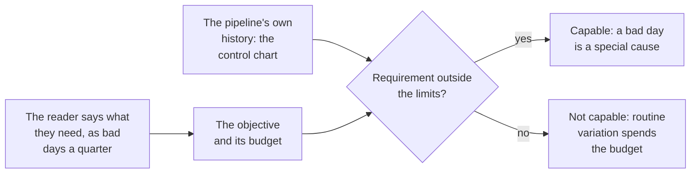

# Data quality SLOs and error budgets

## Problem

Most alert thresholds on a data pipeline are neither of the two numbers that matter. They are not what the pipeline does, because nobody computed that from its history, and they are not what the reader needs, because nobody asked. The threshold pages for lateness the reader would never notice and sleeps through the morning that cost them a decision.

My field has kept the two numbers apart since the 1930s. A control limit is what the process does, computed from its own history, and it belongs to nobody's requirement. A specification limit is what the customer needs, and the customer sets it. Comparing them is process capability: a stable process's output is held against the specification, and the question is whether almost all of it falls inside.[^nist-handbook]

Data teams collapse the two. Some call the pipeline's usual landing time its objective, or type in a threshold that is neither. Others copy the nines from site reliability practice, where 99.99 percent suits a service answering millions of requests,[^treynor-2017] onto a table that lands once a day. None of these asked the person who reads the number.

At a company with no analyst, nobody sits between the person who runs the pipeline and the person who reads it, so the requirement is never written down and every late morning is renegotiated on the spot. In my own practice this loses more trust than a wrong number does. No citable figure for what a bad day costs survived checking.[^gartner-2021] [^redman-2016] [^montecarlo-2023]

<!-- TODO(heqing): class level, from your own practice: a number whose objective was set from what the pipeline usually did, and what happened the first quarter the pipeline slowed. Who noticed first, the reader or the owner, and what did the conversation that morning sound like? -->

## When this applies

Reach for this pattern when somebody reads a number on a schedule and nobody has written down what late, short or wrong would cost them. The problems that bring teams here look like these:

- The Monday number was late again, and nobody can say whether late means once a month or once a week.
- A freshness alert fires most mornings, and nobody on call opens it.
- The team calls a table's usual landing time its SLA, and the dashboard went red the first week the load slowed.
- Somebody proposed 99.9 percent for a daily table, and nobody could say what a tenth of a percent of a morning is.
- A table has not missed its target in a year, and nobody is sure anyone still reads the number.

It needs one reader per number, one owner who can say when the load lands, and a control chart on the landing time from [statistical process control](statistical-process-control-for-pipelines.md). It needs no analyst and no purchase.

Whether the landing time moved or only wiggled is that page's question. Whether an input changed shape or meaning belongs to [schema drift](schema-drift-and-data-contracts.md). Whether one number is right before it leaves the room lives on [detecting plausible-but-wrong outputs](plausible-but-wrong.md). A number has one owner to hold an objective once [single point of metric computation](single-point-of-metric-computation.md) has given it one computation.

Whenever another page in this library asks how fresh, how complete or how close to right a number has to be, and how many bad days a quarter its reader will live with, this is the page it points to.

## The pattern

A service-level objective for a number is the requirement of the person who reads it, in their words: how fresh it has to be, how complete, how close to right, and how many bad periods a quarter they will live with. That count is the error budget. The objective is set with the reader and kept apart from the control limits on the pipeline, and comparing the two says whether the pipeline can meet the requirement at all.

The vocabulary is site reliability engineering's: an indicator is the measured thing, an objective is its target, and the budget is the gap between the objective and perfection.[^beyer-2016] The books ask of the target what I ask here. The product manager has to agree the threshold is good enough for users,[^beyer-2018] and a target picked from current performance is warned against in so many words.[^beyer-2016]

The three dimensions are the ones the survey literature finds most common, and its definitions of two of them end in the words "for the task at hand".[^cichy-rass-2019] The task is the reader's, and quality cannot be assessed until the user's needs are known.[^veiga-2017]

| Dimension | The reader's question | What is measured | Published form |
|---|---|---|---|
| Fresh | Is it here when I look? | Landing time of the feeding load, against the reader's deadline | Timeliness, the extent to which the age of the data suits the task;[^cichy-rass-2019] the share of data updated more recently than a threshold[^beyer-2018] |
| Complete | Is all of it here? | Share of expected sources present, and the row count on its chart | Completeness, sufficient breadth, depth and scope for the task;[^cichy-rass-2019] the fraction of non-missing values in a column[^schelter-2018] |
| Right | Is the number correct? | Reconciliation to an independent total, within a tolerance the reader set | Accuracy, data that are correct, reliable and certified;[^cichy-rass-2019] the share of records that produced the correct value[^beyer-2018] |

Process capability sits underneath: the specification comes from the customer, the control limits from the process's own data,[^benkova-2024] and Wheeler's conditions for shipping conforming product are a capability above one, predictable operation, and a way to detect when the process strays.[^wheeler-2019] For a pipeline: a requirement it can meet with margin, a control chart, and a reaction plan.[^montgomery-2019]

## Position

Set the objective with the person who reads the number, as the number of bad days a quarter they will live with, and keep it apart from the control limits, which describe the pipeline and belong to nobody's requirement.

The practice this argues with is the site-reliability objective as data teams import it: the engineer sets the target from what the system achieves and expresses it in nines. I understand why it travels: the books are good, the nines are familiar, and the workbook allows that current performance is a fair place to start with nothing else to go on.[^beyer-2018] The data platforms took the same route, with default objectives by tier,[^ying-2021] a platform-wide eight hours for freshness,[^ahmed-2020] and a score that credits a table for setting a more realistic objective.[^wright-2023]

My objection is that the import drops the one thing the books insist on. The first book says not to pick a target from current performance, because it locks you into whatever the system does now,[^beyer-2016] and Hidalgo's test is whether users are happy above the target and unhappy below it.[^hidalgo-2020] A team that sets the target from the pipeline has dropped the customer from the method. Nor do the nines survive the change of scale. A service answers millions of requests a month, so 99.9 percent is a budget of thousands of failures,[^beyer-2018] and where a nine appears in a platform's freshness check it counts rows.[^srinivas-2021] A daily table has about sixty-five readings a quarter, and a tenth of a percent of that is not a morning. A reader can say three bad mornings, and that is the number to write down.

Two takeaways follow. A budget nobody ever spends is a requirement set too loose or a number nobody reads. A budget spent by the second week is a capability problem, and the chart shows whether the pipeline can meet the requirement at all.

## Implementation

The [SLO register](../../../templates/01-ai-data-quality/slo-register.md) carries one row per number that leaves the room, the arithmetic, what happens when a budget is spent, a machine-readable core, and the prompts. I would fill the first row before buying or building anything.

1. **Start with the number your most senior reader looks at.** One row: the number, the reader, and when they read it.
2. **Ask the reader three questions, and write the third down as a count.** When do you look at it? What do you do differently if it is late, short or wrong? How many such days a quarter could you live with? The count is the budget; the percentage derived from it is never what the reader agreed to.
3. **Translate the requirement into an indicator per dimension.** Fresh is the landing time of the feeding load, against the reader's deadline rather than a tool's default age.[^dbt-freshness] Complete is the share of expected sources present, plus the row count on the [SPC control plan](../../../templates/01-ai-data-quality/spc-control-plan.md). Right is the reconciliation from the [plausibility checks](plausible-but-wrong.md), and running it on a schedule is its own pattern. <!-- link to M1-08, the reconciliation protocol, once it lands -->
4. **Put the control chart beside the requirement.** From the chart's mean and average moving range, read the gap between the nearest natural limit and the requirement. The register turns it into the one-sided capability index.[^nist-handbook] [^wheeler-2019] Above about one and a half, a bad day is news. Below one, routine variation will spend the budget.
5. **Decide the reaction before the first bad day.** A bad day with a chart signal goes to the SPC reaction plan, and the reader hears from the owner first. A spent budget with a quiet chart is a capability problem, fixed in the process or the requirement, never in the limits. Repeated special causes are root-cause work. <!-- link to M1-10, data incident root cause analysis, once it lands -->
6. **Review each row with its reader once a quarter.** A budget untouched for two quarters gets one question: would you notice a bad day?

The table is illustrative: one requirement, two pipelines, an average moving range of 22 minutes.

| | The requirement (the reader's) | Pipeline A (the chart's) | Pipeline B (the chart's) |
|---|---|---|---|
| Landed by | 09:00 every weekday, with data through yesterday | | |
| Bad mornings the reader will live with | 3 of about 65 a quarter, or 95.4 percent on time | | |
| Average landing time | | 06:40 | 08:50 |
| Natural process limits | | 05:41 to 07:39 | 07:51 to 09:49 |
| Upper limit against the deadline | | 81 minutes early | 49 minutes late |
| Capability margin | | 2.4 | 0.2 |
| Late mornings expected from routine variation | | none | about 20 a quarter |
| Reading | | Capable. A late morning is a special cause, and the chart will show it. | Not capable. The third late morning arrives in the second week, and the chart shows nothing, because nothing changed. |

The limits sit 2.66 times the average moving range either side of the mean, 59 minutes. B's late share is the bell-curve tail past 09:00 with a sigma of 22 divided by 1.128, about 19.5 minutes: three mornings in ten. B's alert would be muted, B's chart would show nothing, and neither would say that the pipeline cannot meet the requirement. The fix is the schedule, the source or the scope, or a 10:00 deadline agreed with the reader. Widening the limits changes nothing.

<!-- TODO(heqing): the count you have actually heard a reader give. When a finance or operations reader is asked plainly how many bad mornings a quarter they would live with, do they land near three, or do they say zero first and only give a count after the question about what they would do differently? -->

## How you know it is working

- Every number that leaves the room has a row with a reader's name, a count of bad days, and the date they agreed to it.
- The reader hears about a bad day from the owner first, as the count spent against the count agreed.
- Budgets get spent, a little.
- **Anti-signal:** a table's objective equals its average landing time, or a nine. The pipeline set its own requirement.

## Failure modes

- **The objective is the pipeline's habit.** The table lands at 06:40, so the objective becomes 07:00, and a target copied from the process locks the team into supporting it.[^beyer-2016] Ask the reader.
- **Nines on a daily table.** A tenth of a percent of sixty-five mornings is a fraction of a morning. Count the bad days.
- **The threshold that is neither.** An alert age typed in to feel safe is not the reader's requirement and not the pipeline's limit, and one platform found such alerts too noisy for everyday use.[^shanmugam-2020]
- **A budget the reader never agreed to.** An objective set by the owner alone is the practice this page argues with, in the register's format. Airbnb has consumers review the design spec before the pipeline is built;[^quoss-2020] at ten people that is one conversation.
- **Objectives on every table.** The reliability rule is as few objectives as possible,[^beyer-2016] and Airbnb's tracker launched with none set.[^williams-2021] Fifty rows is a register nobody reads.
- **Treating a right row like a fresh row.** A late number can leave the room with a note. A wrong number does not leave until it reconciles.

## Sources & Stories

The objective and budget vocabulary is Google's: the site-reliability book's chapters on embracing risk and on objectives [^beyer-2016], the workbook's chapters on implementing objectives and on pipelines [^beyer-2018], and the availability paper in ACM Queue [^treynor-2017]. Hidalgo is cited for his chapter on choosing objectives; his book's guest-written data chapter is paywalled and was not read [^hidalgo-2020].

The capability lens is the author's field: the government statistics handbook for the definition and indices [^nist-handbook], a 2024 open-access article for the customer origin of specifications and the control-first rule [^benkova-2024], Wheeler's column for the three conditions [^wheeler-2019], and the textbook at chapter level [^montgomery-2019].

The platform stories are first-party. Airbnb's certification posts [^parks-2020] [^quoss-2020], landing-time tracker [^williams-2021] and quality score [^wright-2023], and Lyft's checks platform [^mcphillips-2023], were read in a browser because Medium refuses fetching; Uber's quality platform [^ying-2021], data-culture post [^srinivas-2021] and monitoring account [^shanmugam-2020], and Shopify's platform post [^ahmed-2020], were read in full. None states an objective as a count of allowed misses. The dimension definitions are from the peer-reviewed survey of twelve frameworks [^cichy-rass-2019], completeness as a fraction is Amazon's [^schelter-2018], the user's-standpoint rule is from a biodiversity-data paper and the transfer is the framework's [^veiga-2017], and the freshness check is a transformation vendor's documentation [^dbt-freshness].

No figure for the cost of a bad day survived checking: the consultancy's average is a self-estimate by vendor-nominated reference customers [^gartner-2021], the trillion-dollar figure ends at an undated infographic with no method [^redman-2016], and the incident counts are a vendor-commissioned survey of 200 people [^montecarlo-2023].

The count of bad days as the unit, the three reader questions, the one-sided margin, and the two takeaways on unspent and early-spent budgets are the framework's own. The prior-art row is pending in [prior-art.md](../../prior-art.md).

<!-- Footnote targets; full entries with links and caveats live in REFERENCES.md -->

[^ahmed-2020]: [[AHMED-2020]](../../../REFERENCES.md)
[^benkova-2024]: [[BENKOVA-2024]](../../../REFERENCES.md)
[^beyer-2016]: [[BEYER-2016]](../../../REFERENCES.md)
[^beyer-2018]: [[BEYER-2018]](../../../REFERENCES.md)
[^cichy-rass-2019]: [[CICHY-RASS-2019]](../../../REFERENCES.md)
[^dbt-freshness]: [[DBT-FRESHNESS]](../../../REFERENCES.md)
[^gartner-2021]: [[GARTNER-2021]](../../../REFERENCES.md)
[^hidalgo-2020]: [[HIDALGO-2020]](../../../REFERENCES.md)
[^mcphillips-2023]: [[MCPHILLIPS-2023]](../../../REFERENCES.md)
[^montecarlo-2023]: [[MONTECARLO-2023]](../../../REFERENCES.md)
[^montgomery-2019]: [[MONTGOMERY-2019]](../../../REFERENCES.md)
[^nist-handbook]: [[NIST-HANDBOOK]](../../../REFERENCES.md)
[^parks-2020]: [[PARKS-2020]](../../../REFERENCES.md)
[^quoss-2020]: [[QUOSS-2020]](../../../REFERENCES.md)
[^redman-2016]: [[REDMAN-2016]](../../../REFERENCES.md)
[^schelter-2018]: [[SCHELTER-2018]](../../../REFERENCES.md)
[^shanmugam-2020]: [[SHANMUGAM-2020]](../../../REFERENCES.md)
[^srinivas-2021]: [[SRINIVAS-2021]](../../../REFERENCES.md)
[^treynor-2017]: [[TREYNOR-2017]](../../../REFERENCES.md)
[^veiga-2017]: [[VEIGA-2017]](../../../REFERENCES.md)
[^wheeler-2019]: [[WHEELER-2019]](../../../REFERENCES.md)
[^williams-2021]: [[WILLIAMS-2021]](../../../REFERENCES.md)
[^wright-2023]: [[WRIGHT-2023]](../../../REFERENCES.md)
[^ying-2021]: [[YING-2021]](../../../REFERENCES.md)
