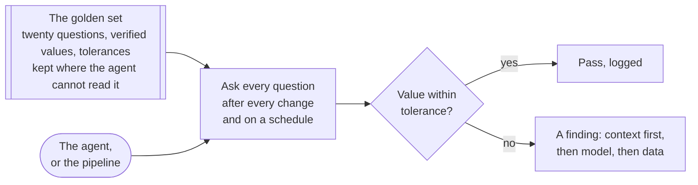

# Golden question sets for AI analytics validation

## Problem

An AI agent answers a question about your data with a number and a query, and nothing in the room can say whether the number is right. The person who asked does not write SQL, the query ran without error, and the number is the right order of magnitude. So the answer is trusted on its fluency, and the first wrong number to reach a board deck is found by whoever it embarrasses.

Fluent and right are far apart. On the best-known public benchmark of questions over real databases, the strongest model answered 55 percent correctly, with written business knowledge supplied, where people answered 93 percent.[^li-2023] The companies that built their own assistants found there is not always one correct answer, that the same evaluation comes back different on two runs with nothing changed,[^khune-2024] and that a question set built from their own logs was the only way to tell whether a change had helped.[^chen-2024]

I think the failure underneath is that nobody wrote down what right looks like before the agent arrived. A pipeline gets a row-count test on its first day, and the agent answering questions from the same tables gets nothing, because its answers feel like judgment rather than data. A company with no analyst sits in this failure by default.

<!-- TODO(heqing): a class-level story from your own work of an agent's confident wrong number reaching a meeting: what the question was, what was wrong with the answer, and who caught it. -->

## When this applies

Reach for this pattern when an agent, a rebuilt pipeline, or a new tool is about to answer questions you used to answer yourself. The problems that bring teams here look like these:

- An AI assistant is connected to the warehouse, people quote its numbers, and nobody has checked one against a number they already trust.
- The same question asked twice returned two numbers, and the team split on which one to believe.
- A model upgrade, a prompt change, or an edit to the context file went out last week, and the only way to know whether it broke anything is to wait for a complaint.
- A warehouse migration or a rebuilt data model is due, and the plan for checking it is to look at a few dashboards afterwards.
- A vendor quotes a benchmark score, and nobody in the company can say what it means for their own tables.

It needs a handful of questions whose answers you can verify by hand from a source you trust, such as a closed quarter's revenue against the billing system, and one person willing to own a file. It needs no analyst and no purchase.

It does **not** apply to questions with no checkable answer. A forecast, a ranking with ties, or a "why did revenue drop" question has no value to compare against. It does not replace tests on the pipeline itself, since a null check is cheaper than asking an agent. And it is not the check on a single answer as it is given; that is the job of spotting a plausible-but-wrong output. <!-- link to plausible-but-wrong.md once M1-03 lands -->

Whenever another page in this library says to keep questions whose answers you already know and re-run them after a change, this is the set it means.

## The pattern

A golden question set is a small fixed list of questions about your own data whose answers you already know, have verified by hand, and have written down with a tolerance. It lives outside anything the agent reads. After every change to the agent, the model, the context file, or the tables, and on a schedule in between, every question is asked again and the answers are compared as values against the key. It is the unit test for answers.[^husain-2024] Twenty questions a founder can verify beat a thousand nobody can.

Four kinds of question belong in the set, and in the framework's judgment a set missing any of them is incomplete. The first is the numbers that leave the room, each pinned to a closed period so the answer never moves. The second is the known traps: the lookalike table nobody should sum, the standing filter everyone forgets, the fiscal quarter that starts in a month the calendar does not, and the currency nobody converted. The third is at least one question the agent should refuse, because the data was never collected. The fourth is every question that has already produced a wrong answer in production, with the right answer recorded.

The comparison is on values. A scalar passes within its stated tolerance, a small result set passes when the rows match in any order, and a refusal question passes when the agent declines. What the SQL looks like is not scored, and two different queries returning the same right number both pass.[^databricks-2026] [^khune-2024]

## Position

Score the agent on twenty questions whose answers you checked by hand, compared as values, not on whether its SQL reads right and not on a benchmark score nobody in the company can check.

The common practice has two forms, and both are reasonable. The first is to show the generated query and have someone read it, on the argument that a wrong join is visible in seconds to a person who knows the schema and that a matching number can be right by accident.[^pethes-2026] The second is to pick a tool by its published benchmark score, on the argument that thousands of questions written by researchers are more evidence than twenty written at a kitchen table. Both put the judgment where expertise already is.

My takeaways from the evidence run against both. What a query "reads like" is a judgment even experts split on: LinkedIn found that about 60 percent of its benchmark questions had more than one acceptable answer, and that not admitting them under-reported recall by 10 to 15 points.[^chen-2024] Handing the judgment to a model does not help, because models asked whether two queries are equivalent lean toward saying yes and miss exactly the wrong ones.[^singh-bedathur-2025] The query should still be shown, since an audit needs it, but reading it does not tell you whether the number is right. A value compared against a key needs no expert to read it.

A benchmark score says nothing about your tables. The public benchmarks are noisy themselves: two audits found annotation errors in roughly half the examples they checked, and correcting them moved agents by up to nine places in the rankings.[^jin-2026] [^wretblad-2024] A model that scored above 90 percent on public leaderboards measured 51 percent on one vendor's own 150 business questions,[^huang-2024] and the leaderboards now carry self-submitted scores with no paper behind them.[^lei-2025] None of that says whether the agent knows your fiscal calendar. Twenty questions do.

<!-- TODO(heqing): what is the first question you would write for your own set, and what trap would it guard? -->

## Implementation

The [template](../../../templates/01-ai-data-quality/golden-question-set.md) carries the question table, the machine-readable core a run harness can consume, the run log, and the prompts. The first version is one afternoon for one person.

1. **Write the first five from the numbers that leave the room.** Take the metrics on the last board deck or invoice run, pin each to a closed period, and look the value up in the system of record. A number you cannot verify by hand is not a golden question yet.
2. **Add the traps.** For each place the team has already been burned, write a question that only comes out right if the trap is avoided. I would write the first one about whichever table has two near-identical copies.
3. **Add at least one refusal.** Ask for a number the data cannot supply, and record that the right answer is a refusal. In the framework's judgment this is the question a company with no analyst needs most, because a confident answer about data that was never collected is the failure nobody else catches.
4. **Fix the comparison rule per row.** A scalar gets a written tolerance, and rounding to four significant digits is a reasonable published default;[^databricks-2026] a result set is compared in any order.
5. **Keep the set out of the agent's reach.** The file lives in your repository, and the run sends the agent the question and nothing else. It goes neither in the context file nor in any example or verified-query store the tool consults.
6. **Run it three times, and log the run.** The same question can come back different with nothing changed,[^he-2025] [^khune-2024] so a question that passes two runs of three is flaky, and the flake rate is worth watching. Log every run with what triggered it and what it found.
7. **Treat a failure as a finding, in order.** A wrong answer is first a finding about the context the agent was given, second about the model, and third about the data, because a written document of business context moved three frontier models by the same large margin while the models themselves were indistinguishable.[^rumiantsau-2026] When the key turns out to be wrong, the fix is a dated new row, never an edit in place.

Here is the shape of the file. The rows are illustrative and the values are made up.

| Question | Expected value | Verified how | Tolerance | Trap it guards | Last run | Result |
|---|---|---|---|---|---|---|
| Revenue recognized in the last closed quarter | 1,284,310 | Billing system quarter-close report | 0.1 percent | Lookalike invoices table with test rows | 2026-09-01 | pass |
| Paying customers at quarter end | 412 | Finance's month-end customer list | exact | Signups counted as customers | 2026-09-01 | pass |
| Net revenue retention, last closed quarter | 108 percent | Recomputed by hand from two closed months | 1 point | Fiscal quarter starts in February | 2026-09-01 | fail |
| Support tickets opened last quarter, by tier | 3 rows | Ticket system export | rows match, any order | Deleted tickets still in the raw table | 2026-09-01 | pass |
| Daily active users in 2021 | refuse | The event table starts in 2023 | must decline | Confident answer about missing data | 2026-09-01 | pass |

The failing row is the finding: the context file did not say the fiscal quarter starts in February, and the fix is one line in that file and a re-run.

<!-- TODO(heqing): from your own practice, class level: which kind of question fails most often, the trap or the plain number, and what did the failures turn out to be about? -->

## How you know it is working

- Every change to the agent, the model, or the context file is followed by a run, and the log shows it.
- Failures end with a found cause, and most of them are a line in the context file.
- The flake rate is known and small, and a flaky question gets rewritten rather than ignored.
- Every wrong answer that reaches production becomes a row, and the same wrong answer does not reach it twice.
- **Anti-signal:** every run passes, forever. A set that never fails is either too easy or has leaked into the agent's context.

## Failure modes

- **The set in the context file.** The agent reads the questions with their answers, and the test passes by construction. The public benchmarks are the analogue: models scored on a fresh copy of a well-known arithmetic test dropped by up to 8 percent, with several model families overfitting to the version they had seen.[^zhang-2024] Some analytics products feed a store of verified question-and-query pairs to the model to improve generation,[^snowflake-vqr] and a pair in that store has stopped being a test.
- **A key over a moving window.** "Revenue in the last 30 days" is wrong tomorrow, the suite fails daily, and someone widens the tolerance until it passes wrong answers too. Pin every value to a closed period.
- **Scoring the SQL.** Queries that mean the same thing differ in text, so strict text matching marks correct queries wrong,[^zhong-2020] and a checker that reads them, human or model, is biased in the direction of the errors you care about.[^singh-bedathur-2025] Compare the value.
- **Loosening the tolerance instead of registering the alternative.** When two answers are both defensible, record the second as accepted for that row. A loosened tolerance looks the same on the dashboard and blinds the test.
- **Reading one run as the truth.** Identical requests at temperature zero produced 80 different completions in 1,000 tries on one measured model,[^he-2025] and accuracy varied by up to 15 percent across repeated runs at settings meant to be deterministic.[^atil-2024] A single pass or fail is a sample.
- **A hundred questions on day one.** We often see this. The set becomes a project, the owner stops verifying, and unverified expected values are the public benchmarks' annotation errors reproduced at home.[^jin-2026]

## Sources & Stories

The benchmark ceiling and the human comparison are Table 2 of the BIRD paper [^li-2023]. The two annotation audits are a 2026 preprint by Jin, Choi, Zhu and Kang, whose conference version prints different figures, as the reference entry records [^jin-2026], and a 2024 short paper by Wretblad and colleagues on one BIRD domain [^wretblad-2024]. The exact-match false-negative rates are Zhong, Yu and Klein's [^zhong-2020], and the equivalence-checker bias is Singh and Bedathur's [^singh-bedathur-2025]. The two first-party accounts of internal assistants are LinkedIn's [^chen-2024] and Uber's [^khune-2024], both by the engineers who built them; neither company sells the tool it describes. The Spider 2.0 figures and leaderboard are read from the benchmark's own site on the fetch date [^lei-2025]. The non-determinism measurements are Horace He's post for Thinking Machines Lab, whose fix requires owning the inference stack [^he-2025], and a multi-model study by Atil and colleagues [^atil-2024]. The context-before-model ordering follows the paired benchmark by Rumiantsau and Fokeev, verified at abstract level [^rumiantsau-2026], and the unit-test framing and the habit of growing the set from observed failures are Hamel Husain's [^husain-2024].

Four sources are vendor material, cited for what the category does and never for how well it works: the SQL-transparency argument [^pethes-2026], the four-significant-digit convention and the separation of benchmark questions from example queries [^databricks-2026], the verified-query store that feeds the model [^snowflake-vqr], and the 51 percent figure, one vendor measuring a competitor's model on its own question set [^huang-2024]. The contamination analogue is the GSM1k audit by an evaluation vendor [^zhang-2024].

The twenty-question floor, the four kinds of question, the refusal requirement, the three-run rule, and the context-then-model-then-data ordering are the framework's own. No published account states a floor, tests that an agent declines, or says what to do with the key when a definition legitimately changes; the closest is LinkedIn's quarterly expert review of accepted answers [^chen-2024]. The prior-art row is pending in [prior-art.md](../../prior-art.md).

<!-- Footnote targets; full entries with links and caveats live in REFERENCES.md -->

[^atil-2024]: [[ATIL-2024]](../../../REFERENCES.md)
[^chen-2024]: [[CHEN-2024]](../../../REFERENCES.md)
[^databricks-2026]: [[DATABRICKS-2026]](../../../REFERENCES.md)
[^he-2025]: [[HE-2025]](../../../REFERENCES.md)
[^huang-2024]: [[HUANG-2024]](../../../REFERENCES.md)
[^husain-2024]: [[HUSAIN-2024]](../../../REFERENCES.md)
[^jin-2026]: [[JIN-2026]](../../../REFERENCES.md)
[^khune-2024]: [[KHUNE-2024]](../../../REFERENCES.md)
[^lei-2025]: [[LEI-2025]](../../../REFERENCES.md)
[^li-2023]: [[LI-2023]](../../../REFERENCES.md)
[^pethes-2026]: [[PETHES-2026]](../../../REFERENCES.md)
[^rumiantsau-2026]: [[RUMIANTSAU-2026]](../../../REFERENCES.md)
[^singh-bedathur-2025]: [[SINGH-BEDATHUR-2025]](../../../REFERENCES.md)
[^snowflake-vqr]: [[SNOWFLAKE-VQR]](../../../REFERENCES.md)
[^wretblad-2024]: [[WRETBLAD-2024]](../../../REFERENCES.md)
[^zhang-2024]: [[ZHANG-2024]](../../../REFERENCES.md)
[^zhong-2020]: [[ZHONG-2020]](../../../REFERENCES.md)
