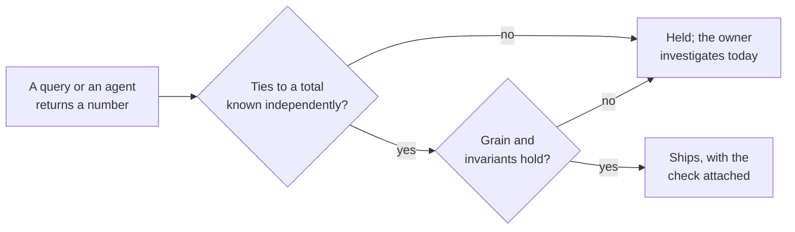

# Detecting plausible-but-wrong outputs

## Problem

The dangerous wrong number runs without error and looks right. A join that fans out doubles revenue, and the total still looks like revenue. A missing filter counts test accounts, and the chart still slopes the way everyone expected. An AI agent picks the plausible table instead of the right one and returns a confident figure. Each of these passes a syntax check and a schema test.

The published cases stood for years. Twitter counted every linked account as a separate active user for three years, up to 1.9 million users a quarter, before it recast the series.[^twitter-2022] Facebook overstated average video watch time by an estimated 60 to 80 percent for two years, because the computed denominator dropped views shorter than three seconds while the published definition did not.[^coldewey-2016] Public Health England left 15,841 positive test results out of eight days of national totals when files exceeded a size limit in the load process.[^phe-2020] Uber took its commission on the gross fare instead of the net for two and a half years, and found the error only when it built a second way of showing drivers their earnings.[^dickey-2017]

I think the failure underneath all four is the same. Nothing outside the query was asked whether the number was right, and a number that runs with the right column names travels as far as a correct one.

<!-- TODO(heqing): the class-level story only you have: a number that reached a decision or a customer before anyone noticed it was wrong. What made it look right, how long it stood, and what finally exposed it? -->

## When this applies

Reach for this pattern when a number is about to leave the room and the only evidence that it is right is that the query ran. The problems that bring teams here look like these:

- A revenue or usage figure in a board deck that nobody has tied to the billing system.
- A dashboard total that jumped after a model change, and the change added a join.
- A metric that has been quietly counting test accounts or refunded orders, and nobody knows since when.
- An AI agent that returns a fluent answer and a query, and nobody on the team can say whether the join is right.
- Two tools that return different totals for the same metric, and no third figure to settle which one is wrong.

It needs almost nothing. One total known independently of the warehouse, such as the billing system's monthly statement, is enough to start, and every check here fits in a spreadsheet.

It does **not** apply to whether a number moved. A daily count that dipped is a question about variation, and statistical process control owns it. <!-- link statistical-process-control-for-pipelines.md#when-this-applies once #35 lands --> It also does not apply to exploratory numbers that stay in the room; the checks bind numbers that travel.

Whenever another page in this library asks whether a number is right, rather than whether it changed, this is the page it points to.

## The pattern

Before a number leaves the room, tie it to something the query did not produce. Five checks cover most of the ground, in the order I reach for them:

1. **Control total.** Compare the output to a total known independently, such as the billing system's statement. Auditors call this a control total, a field summed over a set of records and compared after processing to the same sum before it,[^gao-2024] and the framework imports the check from audit whole.
2. **Grain.** Count the rows in the output, then count the distinct values of the key the output claims to be at, such as one row per order. A gap between the two is a fan-out, the most common way a join doubles a number.
3. **Invariants.** The parts sum to the topline and the shares add to one, and nothing is negative that the definition forbids.
4. **Bounds.** Ratios the business cannot produce unless something is wrong, such as revenue per order, bounded from the last closed period. A value outside the bound is a defect to explain, not a finding to present.
5. **A second path.** For the three to five numbers that carry money, compute the figure again from a different table with a different join, preferably by a different author. A golden question set is one such path, <!-- link golden-question-sets.md once #36 lands --> because its answers were fixed by hand for closed periods.

The checks read the output and never the query, so a pipeline's output and an AI agent's answer get the same treatment.

Twyman's law is the rule behind the ordering: any figure that looks interesting or different is usually wrong.[^kohavi-2017] Practitioners who run thousands of experiments a year report that almost all of their surprises trace back to errors nobody was looking for.[^kohavi-2010] [^kohavi-2020] The checks above are that investigation written down in advance, so it also runs on the wrong numbers that never looked surprising.

## Position

Check a number that leaves the room against something the query did not produce, not against the query itself, because a test on the query cannot tell a plausible join from a right one.

The common practice is a green test suite. Data tests assert that a column is unique, never null, drawn from an accepted list, or present in another table; each test selects the rows that would disprove the assertion and passes when none come back.[^dbt-data-tests] Unit tests run a model's logic against a small fixed input to confirm the output the author expected.[^dbt-unit-tests] I understand the appeal. The tests are cheap and catch real defects, so a green suite reads as a right number.

My takeaway from the evidence is that the suite tests the wrong object. The tests describe inputs and logic the author already understood, and the plausible wrong number comes from what the author did not, such as a duplicate key upstream or a filter that was never written. When researchers classified 4,602 wrong queries from AI text-to-SQL systems, only syntax and schema errors reliably stopped a query from running. The wrong table, a dropped condition, a join on the wrong columns, and a missing distinct all executed and returned rows; where a compiler reports a syntax error, the authors note, a semantic error is likely to escape.[^shen-2025] A practitioner running these systems in production says the queries that fail his users "execute without errors, return rows with the correct schema, and are completely wrong."[^pan-2026]

The strongest evidence for checking against something independent comes from experimentation. A sample ratio mismatch test compares the observed split of users between variants to the split the experiment was configured with, a number known before any data arrived. About six percent of experiments at Microsoft fail it, and the authors call the failure a symptom of many different data quality problems that would otherwise pass as results.[^fabijan-2019] One cheap comparison to an independently known value catches a whole class of wrong outputs. A control total does the same job for a business number.

The honest limit is independence itself. A second computation helps only if it cannot share the first one's mistake, and the classic software experiment on this point found that independently written programs failed together far more often than chance predicts.[^knight-leveson-1986] Two queries against the same fanned-out table agree with each other and are both wrong. The second path has to start from different material, and the billing system's statement is worth more than any query because it was never in the warehouse.

<!-- TODO(heqing): which control total do you reach for first in practice, class level: a finance system, a payment processor, a source system's own record count? And have you watched a second path share the first path's join? -->

## Implementation

The [control plan template](../../../templates/01-ai-data-quality/plausibility-check-control-plan.md) carries the checks table, the arithmetic for each check, the reaction plan, and a machine-readable core an AI agent can work from. The sequence below assumes no analyst and no tool purchase; steps 1 to 3 are one afternoon.

1. **List the numbers that leave the room.** Three to ten, the ones a board deck or a customer sees, each with the one thing outside the warehouse it can be tied to. If nothing exists, that is the first finding.
2. **Write the control-total check.** Same period and same definition, output total against the independent total, with a tolerance in the table; zero is a valid tolerance for money. Anything outside it holds the number until the owner explains the difference.
3. **Write the grain check on the output.** Rows against distinct keys, expected difference zero, on the output table and not on the inputs, because the inputs were unique before the join.
4. **Add the invariants and the bounds.** Parts to topline, shares to one, and two or three ratios with bounds from the last closed period. These catch the unsurprising wrong number.
5. **Compute the money numbers a second way.** A different source with a different join, no shared intermediate table, and where possible a different author. An agent's answer gets the same second path and shows the tie-out with its number.
6. **Attach the check to the number and log the misses.** A figure in a deck carries one line saying what it was tied to and how close it came. Every hold goes in a log with its found cause; the log tells you which checks earn their place.

Here is the whole method on one output. The numbers are illustrative: a revenue-by-plan figure for a closed month, produced by a query that joined orders to payments.

| Check | Computed from the output | Checked against | Verdict |
|---|---|---|---|
| Control total | Output sums to 104,640 | Billing statement, 98,400; tolerance 0.5 percent | 6.3 percent over; hold |
| Grain | 1,318 rows | 1,240 distinct order ids | 78 extra rows; hold |
| Sum to topline | 42,900 + 36,624 + 25,116 = 104,640 | The output's own total | Passes, and says nothing about the join |
| Shares add to one | 0.41 + 0.35 + 0.24 | 1.00 | Passes |
| Ratio bound | 104,640 / 1,240 = 84.4 per order | 76 to 82, the last three closed months | Outside; hold |
| Second path | Captured payments summed with no join: 98,400 | The control total | Agrees; the defect is in the join |

The output sums to 104,640 against a billing statement of 98,400, a gap of 6,240 or 6.3 percent; the grain check finds 78 rows beyond the 1,240 distinct orders, and 78 rows at the month's average order of 80 is exactly 6,240, so the fan-out accounts for the whole gap. The two internal checks passed, and would have passed on a number twice as wrong.

<!-- TODO(heqing): from your own practice, class level: which check has caught the most, and which one have you dropped because it never fired? -->

## How you know it is working

- Every number in the deck arrives with the line saying what it was tied to and how close it came.
- Holds end with a found cause more often than with a widened tolerance.
- The grain check has fired at least once on a model change, and the change did not ship.
- An agent's answer without a tie-out is treated as unfinished.
- **Anti-signal:** every check passes on every run. Either the reference was computed from the same view as the output, or the checks are decorating numbers nobody quotes.

## Failure modes

- **A reference from the same query.** The second path reads the blessed view, or the control total is the output summed a different way. It passes by construction, and the reference has to come from material the query never touched.
- **Widening the tolerance.** A check that fails for a week gets its tolerance moved until it passes. A tolerance is an edit to the plan with a date and a reason, never a knob.
- **Mistaking an invariant for independence.** Parts that sum to the topline were computed by the same query as the topline, so the invariant catches a broken partition and cannot catch a doubled total. Uniqueness on the source keys has the same limit.
- **Checking only the surprising numbers.** Twyman's law is right about the interesting figure, but the video watch time that stood for two years looked ordinary.[^coldewey-2016] The checks run on every number that travels.
- **Asking the agent to check its own work.** A model reviewing its own query shares its own mistake. Give it the control total and the second path as inputs and require the tie-out.
- **A check with no owner.** A hold nobody is named to investigate becomes a warning everyone scrolls past, and the number ships anyway.

## Sources & Stories

Twyman's law reaches this page through Ron Kohavi, who traces the earliest scholarly statement to a 1975 statistics-teaching article and attributes the law to a British audience-measurement researcher who never published it himself [^kohavi-2017]; his paper with Roger Longbotham carries the paraphrase and ten cases of surprising experiment results that turned out to be instrumentation or logging errors [^kohavi-2010], and the experimentation book gives the law a chapter and the sample ratio mismatch guardrail another [^kohavi-2020]. The sample ratio mismatch base rate and the fever analogy are from the taxonomy paper by practitioners at Microsoft, Booking.com, and Outreach; the six percent figure is stated for Microsoft's experiments only [^fabijan-2019]. The text-to-SQL error taxonomy is a peer-reviewed study of four in-context-learning systems on two academic benchmarks, so its shares describe those systems on those benchmarks and not a company warehouse [^shen-2025]; the production description is a practitioner's blog post whose headline percentage is arithmetic over benchmark scores rather than a measurement, and only the quoted sentence is used [^pan-2026]. The test definitions are the dbt documentation pages for data tests and unit tests, product documentation for the dominant open-source tool in its category, cited for what the tests check and not for a judgment about the tool [^dbt-data-tests] [^dbt-unit-tests].

The four incidents are cited at the level the record allows. Twitter's recast is first-party, from its shareholder letter [^twitter-2022]. Public Health England's is first-party, from its own statement; the statement names a file-size limit and not the spreadsheet format widely reported alongside it [^phe-2020]. Facebook's statement was a post to an advertiser help page and Uber's was given to the press, and neither primary is retrievable, so both are cited through the contemporaneous TechCrunch reports that reproduce the companies' words, with the first reporting credited to the Wall Street Journal in both cases [^coldewey-2016] [^dickey-2017]. The control-total definition is quoted from the federal audit manual, the audit lineage the framework imports the check from [^gao-2024]. The independence caveat is the 1986 multi-version programming experiment, cited at abstract level [^knight-leveson-1986].

The five-check set and its ordering, the rule that the second path start from material the query never touched, and the checks table are the framework's own. The prior-art row for this pattern is pending in [prior-art.md](../../prior-art.md).

<!-- Footnote targets; full entries with links and caveats live in REFERENCES.md -->

[^coldewey-2016]: [[COLDEWEY-2016]](../../../REFERENCES.md)
[^dbt-data-tests]: [[DBT-DATA-TESTS]](../../../REFERENCES.md)
[^dbt-unit-tests]: [[DBT-UNIT-TESTS]](../../../REFERENCES.md)
[^dickey-2017]: [[DICKEY-2017]](../../../REFERENCES.md)
[^fabijan-2019]: [[FABIJAN-2019]](../../../REFERENCES.md)
[^gao-2024]: [[GAO-2024]](../../../REFERENCES.md)
[^knight-leveson-1986]: [[KNIGHT-LEVESON-1986]](../../../REFERENCES.md)
[^kohavi-2010]: [[KOHAVI-2010]](../../../REFERENCES.md)
[^kohavi-2017]: [[KOHAVI-2017]](../../../REFERENCES.md)
[^kohavi-2020]: [[KOHAVI-2020]](../../../REFERENCES.md)
[^pan-2026]: [[PAN-2026]](../../../REFERENCES.md)
[^phe-2020]: [[PHE-2020]](../../../REFERENCES.md)
[^shen-2025]: [[SHEN-2025]](../../../REFERENCES.md)
[^twitter-2022]: [[TWITTER-2022]](../../../REFERENCES.md)
