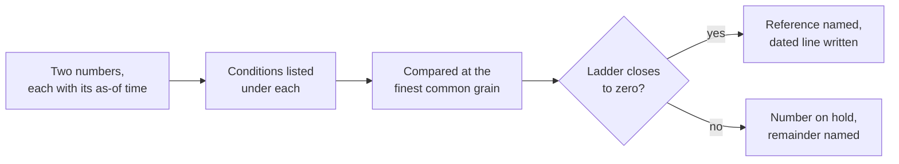

# The reconciliation protocol

## Problem

Two numbers for the same thing are on the table and they do not match. The warehouse says one revenue figure and the billing system says another. From that moment the meeting is about whose number to believe, and the decision it was called for waits.

At Airbnb the chief executive could ask which city had the most bookings last week and get diverging answers from data science and finance, built from slightly different tables and definitions.[^chang-2021] At Uber one rider metric read 6.53 million in one tool and 6.20 million in another for the same city and window, because of a stale filter in one tool's private query.[^yu-2021] Zoom's blog said the company had passed 300 million daily users, changed the word to participants the next day, and its progress report for that week carried the one figure under three different words.[^zoom-2020b] [^miller-2020]

Most of the executive escalations I have watched begin this way. Two departments are moving fast, and nobody has time to say how their number was made. When I put the two side by side afterwards, the cause is nearly always one of three things. One side left out records the other side counted. The two sides ran on different calendars, a fiscal week against a calendar week or a fiscal year against a calendar year. Or one side pulled its number hours before the meeting and the live source had moved by the time the meeting started. The library names three more elsewhere: a join that changed the grain, two meanings of one word such as customer, and a unit or currency converted on one side only. Every one of these is a condition somebody left unstated, and arithmetic never finds a condition.

<!-- TODO(heqing): class level, from your own practice: of the three causes, which one has come back after it was settled once, and what was missing from the record that let it come back? -->

## When this applies

Reach for this page when the disagreement already exists. The problems that bring teams here look like these:

- Finance and the warehouse give two figures for last month's revenue, and the board deck is due on Thursday.
- This quarter's deck does not match the version of the same number that went out last quarter.
- The assistant's answer and the analyst's query are a few percent apart, and both look right.
- Two dashboards show two totals for one metric, and each owner is sure of theirs.
- The last meeting ended with an agreement to look into it, and this is the third time for this number.

It needs the two numbers, the queries or exports behind them, and one hour with both owners in the room. No analyst, no purchase.

[Detecting plausible-but-wrong outputs](plausible-but-wrong.md) checks one number against something outside its query before it leaves the room. [Agreement measurement](agreement-measurement.md) measures how often two people agree on twenty questions. [Single point of metric computation](single-point-of-metric-computation.md) names the reference, and [schema drift and data contracts](schema-drift-and-data-contracts.md) explains an input that changed shape or meaning. Whether a settled number is a restatement that has to be disclosed belongs to [Module 4](../04-governance-and-financial-reporting/README.md). The deeper fix once the number is settled is data incident root cause analysis.<!-- link target: data-incident-root-cause-analysis.md (M1-10), drafted separately -->

Whenever another page in this library has two numbers already in the room and disagreeing, this is the page it points to.

## The pattern

Two numbers that disagree are reconciled in a fixed order, and the order is the pattern. Write both numbers down, each with the time it was pulled. Under each, list the conditions that produced it: what was excluded, which calendar, the as-of time, the grain, the unit and currency, and the definition of the word being counted. Bring both to the finest grain they share and compare them there, because the segment that carries the gap is where the cause lives. Then build the difference ladder. Start at one number, apply one condition at a time, write the amount each explains, and arrive at the other number. The ladder ends at zero. A remainder that is not zero is named as unexplained and the number is on hold. Before the meeting ends, one person writes which number stands and why, with name and date. The settled condition becomes a dated line in the metric definition and in the [context file](../03-ai-agent-integration/context-file.md), so the assistant stops reproducing the disagreement.

Accounting has run this procedure for a long time, and I import it whole. A reconciliation compares transactions from two sets of records, sorts them into recorded properly, not yet recorded, and recorded improperly, and explains the differences.[^gao-2025] A state auditor's guide for small governments adds the working rules: reconcile at least monthly, investigate each reconciling item to its source, and allow a fixed period, such as two weeks, to resolve a discrepancy.[^sao-2020] Payment systems run the same shape at scale, Airbnb across its own records, the processors' settlement files and bank statements,[^khisti-2018] and Uber across about 1.2 billion settlements a month, with every failed match queued to be resolved.[^grandhi-2024] The ladder on this page is the reconciling-items schedule from a bank reconciliation, applied to a metric.

## Position

When two numbers disagree, reconcile the conditions before the values and settle in writing which number is the reference before the meeting ends, rather than averaging them, taking the friendlier one, or agreeing to look into it.

The practice this argues with is competent and nearly universal. The disagreement goes to the most senior person in the room, who picks, or to whoever has time to dig, and the meeting moves on. I see why it appeals. It is fast, and the meeting has other business. The experimentation literature calls this the highest paid person's opinion, and built its case on informing that opinion rather than relying on it.[^kohavi-2020]

My reading of the evidence is that a room under time pressure picks badly. Numerate people use the skill to land on the figure that fits what they already believe, and the most numerate subjects were the most polarized.[^kahan-2017] In pairs the more confident opinion carries more weight, and people match each other's confidence even when their expertise differs.[^bang-2017] Across fifty-four studies of nearly fourteen thousand teams, hierarchy's net effect on performance was negative, small, and ran through conflict.[^greer-2018]

I would still let the senior person choose the reference, after the conditions are on the table. A choice made before then is a choice between two unstated definitions, and it comes back next quarter under a new name.

Three things follow. A ladder that ends at zero is the only proof that the cause is known. The reference is the blessed computation from [single point of metric computation](single-point-of-metric-computation.md), and where none exists, the reconciliation names one. The settled condition is a dated line in the definitions and the context file, so the assistant stops reproducing the disagreement.

## Implementation

The [reconciliation record](../../../templates/01-ai-data-quality/reconciliation-record.md) carries the two numbers with their as-of times, the conditions table, the ladder, the reference decision, a machine-readable core, and the agent prompts. One disagreement takes an hour with both owners present.

1. **Freeze both numbers with the time each was pulled.** The record of a value at 9:00 and the record of it at 11:30 are two facts, and systems that must answer what they believed at a past time keep both.[^fowler-2021]
2. **List the conditions under each number.** Excluded records, calendar, as-of time, grain, unit and currency, the definition of the word counted, and the join path. An assistant can draft the list from its own query.
3. **Compare at the finest common grain.** Bring both sides to the same grain and compute the difference by segment. A gap spread evenly across segments usually means a definition or a unit. A gap in one week points at the calendar, and one in a handful of rows at the join or an exclusion.
4. **Build the ladder.** One line per cause. Start at the first number, apply the condition, write the amount, and carry the running total. The last line is the second number and the remainder is zero. When it is not, the remainder is named as unexplained, and nobody signs.
5. **Decide the reference in writing.** Which number stands, why, who decided, and the date. A blessed computation stands by default, unless the ladder shows it holds the defect. Then the corrected version stands. Where none exists, one gets named now, and the losing copy gets a retirement date or a drift check. <!-- TODO(heqing): class level, from your own practice: when the ladder showed the blessed computation was the wrong one, who signed the decision, and did the corrected number go back out to the people who had already seen the old one? -->
6. **Write the dated line.** The settled condition goes into the metric definition and into the [context file](../03-ai-agent-integration/context-file.md) the assistant reads, as a new dated line and never an edit in place.
7. **Keep the record.** File it where the next person can find it. A second disagreement of the same pair for the same cause is evidence that the fix did not hold, and it goes to root cause analysis.<!-- link target: data-incident-root-cause-analysis.md (M1-10) --> How long a number may sit on hold is a question for data quality SLOs.<!-- link target: data-quality-slos.md (M1-06), drafted separately -->

The rows below are illustrative: revenue for a closed month, the warehouse's blessed view against the billing system's statement.

| Step | Cause | Amount | Running total |
|---|---|---|---|
| Start | Warehouse view, pulled 09:00 | | 412,380 |
| 1 | Refunds issued in the month; billing nets them and the view did not | −5,940 | 406,440 |
| 2 | Calendar; the view used a fiscal period that ran two days into the next month | −7,180 | 399,260 |
| 3 | Join to payments fanned out; 41 orders counted twice | −3,690 | 395,570 |
| 4 | As-of; three payments captured between 09:00 and 11:30, in billing only | +580 | 396,150 |
| End | Billing statement, pulled 11:30 | | 396,150 |
| | Remainder | | 0 |

The gap of 16,230 closes in four lines. Three of the four are defects in the view: the definition says revenue is net of refunds on the calendar month, and the join added rows, so the view is corrected and stands as the reference. The fourth is timing, recorded with its size. The billing statement keeps its job as the control total that [detecting plausible-but-wrong outputs](plausible-but-wrong.md) checks the view against. Stopped after line 2 with 3,110 open, the ladder would have named the two largest causes and proved nothing.

## How you know it is working

- Every disagreement that reaches a meeting leaves it with a record: two numbers, two as-of times, a ladder, a name and a date.
- The remainder is zero more often than it is unexplained.
- The same pair of numbers does not disagree twice for the same cause.
- The assistant cites the dated line on the question that used to split the room.
- Whose number is right has stopped being an item in the leadership meeting.
- **Anti-signal:** every reconciliation ends with timing as the cause and no ladder. Timing is a cause with a size, and one that is never measured is a shrug.

## Failure modes

- **Averaging the two.** The midpoint satisfies neither set of conditions, and nobody can reproduce it.
- **Taking the friendlier number.** The figure that fits the story wins, and the numerate people in the room are the ones best able to justify it.[^kahan-2017]
- **Escalating before the conditions are listed.** The senior or the confident person picks between two unstated definitions.[^bang-2017] [^greer-2018] The pick may be right, and nothing was written that stops the recurrence.
- **Reconciling values and not conditions.** Two numbers that match this month under different calendars split next month, and [agreement measurement](agreement-measurement.md) treats such a match as a coincidence for the same reason.
- **Stopping at the first cause.** One cause explains most of the gap and the team calls the rest timing. Twitter's overstated user count ran for three years and Facebook's overstated watch time for two, and a gap that is mostly explained is still a gap.[^twitter-2022] [^coldewey-2016]
- **Settling without writing.** The room agrees and nothing is dated, so the assistant keeps answering the old way. When Twitter corrected its count in 2017, its retention rules meant it could not reconcile any period before the fourth quarter of 2016.[^twitter-2017]
- **Reconciling once and never again.** For the three to five money numbers the reconciliation is a monthly habit, as in accounting.[^sao-2020] Uber's commission error stood for two and a half years until a second way of showing drivers their pay was built.[^dickey-2017] For everything else, run it when a disagreement appears.

## Sources & Stories

The three internal disagreements are first-party: Airbnb's metric-platform post [^chang-2021], Uber's metric-standardization post [^yu-2021], and Zoom's progress report of April 22, 2020, whose title, body and closing paragraph describe one figure as daily users, meeting participants and people [^zoom-2020b]; the correction is cited through the TechCrunch report that reproduces the company's statement [^miller-2020]. The Twitter recasts are from its shareholder letters [^twitter-2017] [^twitter-2022], and the Facebook and Uber cases reach this page through the same contemporaneous reports the plausible-but-wrong page uses [^coldewey-2016] [^dickey-2017].

The accounting lineage is the 2025 revision of the federal internal-control standards [^gao-2025], the federal audit manual's line that control totals are agreed between source and target systems [^gao-2024], the Treasury's cash-reconciliation chapter, undated, so the fetch date carries the record [^treasury-tfm], and a state auditor's guide for small governments, read in full [^sao-2020]. The two payment-system accounts are first-party engineering posts from Airbnb [^khisti-2018] and Uber [^grandhi-2024], cited for the shape of the procedure and never for the platforms. The two-times distinction is Martin Fowler's essay on bitemporal history [^fowler-2021].

The evidence on how rooms pick is peer-reviewed and comes from laboratory and survey settings, so the transfer to a metrics meeting is the framework's: motivated numeracy, measured on a politically charged question [^kahan-2017], confidence matching in pairs [^bang-2017], and the hierarchy meta-analysis [^greer-2018]. The highest-paid-person's-opinion framing is quoted from the experimentation book's preface, read from the publisher-hosted sample [^kohavi-2020].

No peer-reviewed account of reconciliation testing in data migration surfaced inside the ten-year window, so the audit sources carry that lineage. The three causes, the ladder applied to a metric, the reference decision before the meeting ends, and the dated line are the author's own. The prior-art row is pending in [prior-art.md](../../prior-art.md).

<!-- Footnote targets; full entries with links and caveats live in REFERENCES.md -->

[^bang-2017]: [[BANG-2017]](../../../REFERENCES.md)
[^chang-2021]: [[CHANG-2021]](../../../REFERENCES.md)
[^coldewey-2016]: [[COLDEWEY-2016]](../../../REFERENCES.md)
[^dickey-2017]: [[DICKEY-2017]](../../../REFERENCES.md)
[^fowler-2021]: [[FOWLER-2021]](../../../REFERENCES.md)
[^gao-2024]: [[GAO-2024]](../../../REFERENCES.md)
[^gao-2025]: [[GAO-2025]](../../../REFERENCES.md)
[^grandhi-2024]: [[GRANDHI-2024]](../../../REFERENCES.md)
[^greer-2018]: [[GREER-2018]](../../../REFERENCES.md)
[^kahan-2017]: [[KAHAN-2017]](../../../REFERENCES.md)
[^khisti-2018]: [[KHISTI-2018]](../../../REFERENCES.md)
[^kohavi-2020]: [[KOHAVI-2020]](../../../REFERENCES.md)
[^miller-2020]: [[MILLER-2020]](../../../REFERENCES.md)
[^sao-2020]: [[SAO-2020]](../../../REFERENCES.md)
[^treasury-tfm]: [[TREASURY-TFM]](../../../REFERENCES.md)
[^twitter-2017]: [[TWITTER-2017]](../../../REFERENCES.md)
[^twitter-2022]: [[TWITTER-2022]](../../../REFERENCES.md)
[^yu-2021]: [[YU-2021]](../../../REFERENCES.md)
[^zoom-2020b]: [[ZOOM-2020B]](../../../REFERENCES.md)
