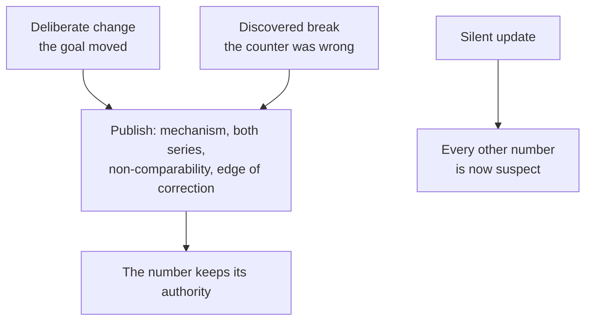

# Redefining a metric in the open

## Problem

A metric definition is not permanent. The business changes, so the definition that was honest at pre-revenue stops being honest once you are selling; and definitions break on their own, quietly, when something upstream starts feeding the counter without a person behind it. Either way the number in this quarter's deck no longer means what the number in last quarter's deck meant.

The damage is not the change. It is the silent change. A trend line that spans a redefinition looks like a business result and is really a measurement artifact, and once people notice — and they do notice, usually at the worst moment — the doubt spreads to every other number the team reports.

## When this applies

Apply this when a metric that leaves your team is about to change meaning: the definition is being deliberately narrowed or widened, the entity is changing, the window is changing, or you have discovered that the number has been wrong for some time.

Do not apply it to a metric nobody outside the team has seen. An internal exploratory number can be changed freely, and building ceremony around it wastes the ceremony. The trigger is circulation, not importance.

## The pattern

Treat a definition change as a publication event, not a code change. Whichever direction the change comes from, four things ship together:

1. **The mechanism.** What the definition was, what it now is, and what specifically caused the difference.
2. **Both series.** The old number and the new number for the same period, run together through at least one full reporting cycle.
3. **The non-comparability statement.** Said plainly, in the same document, without hedging.
4. **The edge of the correction.** Where the recomputation stops, and why — usually because retention policy means the underlying data no longer exists.

The two directions look different and behave identically.

The clearest public example of the deliberate direction is Twitter's 2019 move from monthly active users to monetizable daily active users — a narrower metric on two axes at once, a daily window instead of a 30-day one and only surfaces able to show ads instead of every access path. The release states the reasoning, admits the new number is not comparable to other companies' more expansive metrics, announces the old metric's retirement one quarter ahead, and shows both numbers through the transition moving in opposite directions [^twitter-2019]:

| Metric | Q4 2017 | Q4 2018 | Direction |
|---|---|---|---|
| MAU (broad surface, 30-day window) | 330M | 321M | down |
| mDAU (ad-capable surface, daily window) | 115M | 126M | up |

A company willing to publish a smaller number, alongside the bigger one it was entitled to keep using, is the whole pattern in one table. The release says it directly: the goal was not to disclose the largest daily active user number available [^twitter-2019].

## Position

**Publish both numbers through the transition and say they are not comparable — do not silently update the dashboard and let the trend line carry the change.** A footnote on a chart is not a disclosure; by the time a reader reaches it they have already read the trend. And when a definition turns out to have been broken, publish the recast series with its magnitude rather than quietly repairing history, because a corrected past that nobody was told about is indistinguishable from a number that was never wrong.

The common objection is that publishing a correction advertises a failure. The record says the opposite: the failures that damaged trust were the ones that ran for years unnoticed, not the ones that were disclosed with a mechanism attached.

## Implementation

**Step 1 — Write down what the definition is now, before you change it.** The four choices for any counted metric are entity, action, window, and population. Facebook's S-1 is the reference for how much detail this takes: a registered user who logged in and visited within the window, with the edge cases documented in the same filing — duplicate accounts, and devices that contact servers without user action [^facebook-2012].

**Step 2 — Name the reason in business terms.** "The goal moved from getting people signed up to getting people to the thing they pay for" is a reason. "We are aligning our metrics" is not.

**Step 3 — Compute both numbers for the same periods.** As far back as your data allows. This is the step that costs real work, and it is the step that makes the disclosure credible.

**Step 4 — Find where the recomputation stops.** Data retention ends most corrections before they reach the beginning. Twitter's 2017 disclosure could not reconcile periods before late 2016 at all, and said so [^twitter-2017]. Saying where the series ends is part of the disclosure, not an admission of sloppiness.

**Step 5 — Publish all four elements together,** and keep the old metric alive for one more full cycle.

**Step 6 — Put one name on the new definition.** Definitions decay when no one owns them: formulas scatter across tools and dashboards, and in the best case they drift apart over time, in the worst case they never matched at all [^stancil-2021].

**At a team of ten.** You have no filing and no earnings call, and you do not need them. The whole thing fits in one message to the channel where the number normally appears: what it was, what it is, both numbers for the last two months, the sentence "these are not comparable," and how far back you could recompute. The discipline is the artifact, not the format. The one step that does not scale down is step 3 — if you cannot produce both numbers for at least one period, you are not ready to change the definition.

## How you know it is working

The observable signal is that nobody re-derives the number. Specifically:

- A reader can state, without asking, which periods use which definition.
- When the trend changes direction across the transition, the conversation is about the business, not about whether the change is real.
- Somebody outside the team can name the owner of the definition.

The counter-signal is a meeting that opens with two people quoting different values for the same metric and the same period.

## Failure modes

**The footnote.** All four elements are technically present, but the non-comparability statement is a superscript on a chart while the trend line runs unbroken through the change. The reader sees the shape before the caveat.

**Retroactive tidiness.** The historical series is quietly recomputed on the new definition so everything matches, which destroys the evidence that a change happened and makes the old decks wrong without explanation.

**Change as cover.** A definition narrowed or widened at exactly the moment the old one turned unflattering. Even done honestly this reads badly, which is why the reason has to be stated in business terms that were true before the number moved.

**Prefix sprawl instead of a decision.** Rather than change the definition, teams append qualifiers — high-value active user, paid active user, high-value active user excluding fraud — until a dozen definitions exist and none is agreed. The tell is in the code: `WHERE` clauses accreting on the same query [^stancil-2021].

**Fixing the break without finding the mechanism.** The 2022 Twitter correction traced a three-year overstatement to one specific 2019 feature that counted a single person's action on every linked account [^twitter-2022]. A repair that cannot name the mechanism cannot promise it will not recur.

## Sources & Stories

Both directions of this pattern come from the same company's public filings, which is what makes them comparable. The deliberate redefinition is Twitter's Q4 2018 earnings release, where monetizable daily active users replaced monthly active users with the reasoning, the non-comparability admission and the both-numbers transition all in one document [^twitter-2019]. The two forced corrections are the Q3 2017 letter, which disclosed that third-party SMS authentication traffic had been counted as activity for roughly three years and that retention policy made earlier periods unreconcilable [^twitter-2017], and the Q1 2022 letter, which disclosed the linked-accounts overstatement and published a recast series with magnitudes [^twitter-2022]. Facebook's S-1 supplies the reference definition and the practice of documenting edge cases in the same document as the number [^facebook-2012]; notably, the 2017 Twitter failure is the lived version of a caveat that S-1 had already written down in 2012.

That regulators ask these questions is on the record in SEC staff comment letters: one caught a daily-active-user figure labeled a quarterly average that was computed from the last month of the quarter alone, and asked separately when the company had switched analytics providers, because the pipeline change broke comparability under the trend [^sec-2016]; another asked a company to clarify that its headline daily-active-user figure included both paying and non-paying users [^sec-2019]. The definition-drift mechanism and the prefix-sprawl failure mode are Benn Stancil's [^stancil-2021].

Every story here is a public company with a filing obligation, which is the limit of what could be verified. Nothing was found from a small team changing its own active-user definition and writing up what happened, so the team-of-ten version in Implementation is this framework's adaptation of the filings' discipline rather than something anyone has reported doing.

[Active users](../../metrics/active-users.md) is the topic page behind this one, with the definition choices, the windows and ratios, and the longer versions of these stories.

<!-- Footnote targets; full entries with links and caveats live in REFERENCES.md -->

[^twitter-2019]: [[TWITTER-2019]](../../../REFERENCES.md)
[^twitter-2017]: [[TWITTER-2017]](../../../REFERENCES.md)
[^twitter-2022]: [[TWITTER-2022]](../../../REFERENCES.md)
[^facebook-2012]: [[FACEBOOK-2012]](../../../REFERENCES.md)
[^sec-2016]: [[SEC-2016]](../../../REFERENCES.md)
[^sec-2019]: [[SEC-2019]](../../../REFERENCES.md)
[^stancil-2021]: [[STANCIL-2021]](../../../REFERENCES.md)
