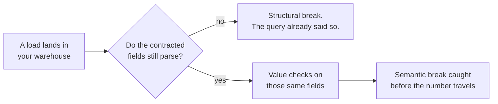

# Schema drift detection and data contracts

## Problem

You hear about the upstream changes that break your query. The changes that move your number without breaking anything go unreported.

Google published the ratio. Its production data-validation system recorded which anomalies fired across more than 700 machine-learning pipelines in thirty days. A wrong physical data type fired on under 1 percent of pipelines. A new column missing from the schema fired on 10 percent, and an unexpected value in a categorical field on 6 percent.[^breck-2019]

The same paper opens on a Google outage. A refactor pinned one integer field to -1 for part of the traffic. Nothing threw an error, and the pipeline trained on the damaged slice.[^breck-2019]

A ten-person company gets that failure without the machinery for catching it. The person who renames the column is often the person who owns the metric, and at that moment they are thinking about the application rather than Monday's number. The same group's survey names why the damage hides: a field can change its unit, from days to hours say, or stop being populated, and the consumer does not crash. It keeps running and gets worse.[^polyzotis-2018]

<!-- TODO(heqing): the class-level story only you have. An input that changed meaning rather than shape and moved a number you were reporting: what changed, how long it ran before anyone noticed, and what finally surfaced it. -->

## When this applies

Reach for this pattern when a number your business reads depends on fields somebody else can change. The problems that bring teams here look like these:

- The number moved last week and nobody touched the query.
- A dashboard went blank on Monday because a column it reads had been renamed.
- A status field grew a new value, and the `CASE` expression files it under "other".
- A field the metric filters on started arriving empty for some rows, and the total drifted down.
- Somebody backfilled a table, and last quarter no longer matches the deck that already went out.

It needs two things: data landing somewhere you can query on a schedule, and at least one metric that names specific fields. It does not need a producer team, a registry, or anybody's agreement.

Whether a number moved more than it usually moves is a different question, and [statistical process control](statistical-process-control-for-pipelines.md) owns it. This page owns whether the input changed shape or meaning.

Whenever another page in this library asks whether an input changed shape or meaning, this is the page it points to.

## The pattern

Write down the short list of facts that must stay true about the fields your metrics read, and check that list against the data where it lands in your warehouse, on every load. The list is the contract, and checking it at the landing point is the detection. I keep that list deliberately short.

The two halves of that list are not the same size. Names, types and presence are nearly free to check, because the query fails without them anyway. Values are where the work is, and Avro's schema-resolution rules show why: a field the writer adds that the reader does not know about is simply ignored.[^avro-spec]

| What changed upstream | What your query does | When you find out |
|---|---|---|
| A column is dropped, renamed, or retyped past what the reader can parse | Fails | Same day, from the failure[^martin-bellemare-2021] |
| A column is added | Ignores it | Only if you look[^avro-spec] |
| A new value appears in a categorical field | Runs, and the value misses your mapping | Only if you look[^polyzotis-2018] |
| A unit or a timezone changes | Runs, and returns a different number | Only if you look[^polyzotis-2018] |
| A field starts arriving empty or padded | Runs, and the total drops | Only if you look[^bhadauria-2026] |
| A backfill rewrites history | Runs, and last quarter changes | Only if you look[^segner-2026] |

## Position

Check the contract where the data lands in your warehouse, on the handful of fields your metrics actually read, not in the producer's pipeline and not across every table.

The practice this argues with is the data-contract programme, and it is what a competent engineer will tell you to do. The producer owns a versioned schema, enforcement runs in the producer's CI, and a registry refuses an incompatible version. The engineers who ran these programmes put it flatly: a contract has to be enforced at the producer level, and anything short of that is a handshake agreement.[^sanderson-kreuziger-2022] The engineer who introduced the practice at a payments company wrote that catalogs and anomaly detection do nothing to improve your data.[^jones-2021] I understand the appeal. A check in the producer's pipeline stops the number from ever being wrong, where a check at the landing point only tells you that it is. At a company with a platform team I would take it.

What the programme costs is coordination, and coordination is what a ten-person company has least of. That same payments company published an honest six-month report. Contracts were by then carrying around half of the asynchronous communication between its services, but adoption had not followed for data produced mainly for the data teams, and the plan became a decommissioning deadline.[^jones-2022] The practitioner who wrote the producer-level rule later conceded that starting in the warehouse needs no help from application engineers and asks for a smaller culture shift.[^sanderson-2024] He still recommends both, and at ten people both is a choice about which one gets built this year. I would build the warehouse half first, since the schema that constrains a pipeline may be no part of the process that generates the data.[^polyzotis-2017]

My second rule is scope. Contract the fields your metrics read, and let the rest of the table move. Large companies build column-level lineage to answer who is downstream before they change something.[^lin-2019] You do not need that graph, because [single point of metric computation](single-point-of-metric-computation.md) already produces the list.

## Implementation

The [control plan template](../../../templates/01-ai-data-quality/schema-contract-control-plan.md) carries the field inventory, the check table, a machine-readable core, and the agent prompts. Steps 1 to 3 cost an afternoon and then a few minutes a week.

1. **List the fields, not the tables.** Open the one computation behind each metric that leaves the room and write down every field it selects, filters on, joins on or groups by. For most small teams that is ten to thirty fields.
2. **Write down what must stay true about each one.** The structural line is short: present, type readable, arrives on every load. The semantic line is the one I would spend the afternoon on. It holds the allowed values, the allowed range, the tolerated share of nulls, and the unit and timezone in words. The published vocabulary calls these completeness and consistency.[^schelter-2018] A field that changes from days to hours is undetectable unless somebody recorded which it was.[^polyzotis-2018]
3. **Run the checks where the data lands, on every load.** One file per source holding a dozen assertions is a complete first implementation, and it belongs in version control beside the query it protects, the way Google keeps its inferred schema.[^breck-2019] The open standard separates logical type from physical type, and the semantic half rests on that distinction.[^bitol-odcs]
4. **Let your tooling carry the structural half.** Transformation tooling can enforce declared column names and types and fail the build when the shape does not match.[^dbt-contracts] Spend your own attention on values.
5. **Chart the value checks that are really counts.** Null share and the daily sum of a money column move a little every day, so a fixed tolerance will nag or sleep. Put them on a control chart, as [statistical process control](statistical-process-control-for-pipelines.md) sets out.
6. **Keep twenty hand-checked answers and re-run them.** A semantic change that survives every field-level check still shows up as a known-correct answer that stopped being correct. The library has a page on building that set, and another on catching a plausible number that already left the room. <!-- link to golden-question-sets.md (M1-04) and plausible-but-wrong.md (M1-03) once both are on main -->

Decide the reaction before the first violation: who looks, within how long, and whether the load is quarantined or flagged.

## How you know it is working

- Violations are found by the check, not by somebody in a meeting noticing that a number looks odd.
- The contracted field list is much shorter than the tables it sits in, and someone can say why each field is on it.
- Every violation ends either with a fixed input or with an edited contract carrying a date and a reason.
- **Anti-signal:** the checks have passed for months and nobody has looked at what they cover. A contract on fields your metrics stopped reading is decoration.

## Failure modes

- **Contracting every column.** Checks on every field of every table produce alerts nobody reads. The fields your metrics read are the ones whose change costs money.
- **Checking structure only.** This is the common version, because structure is the easy half to automate. It buys a same-day warning about failures that already warned you.
- **Buying the registry first.** Compatibility modes impose an upgrade order: under the default backward mode every consumer is upgraded before new events are produced.[^confluent-compat] A team with one repository pays that coordination cost for nothing.
- **Treating every violation as a defect.** Some changes are the data telling the truth. The Google survey's example is a country field known to hold four values that gains "SS", which could be South Sudan, so the constraint should widen.[^polyzotis-2018] A contract nobody edits becomes an alert people dismiss.
- **Trusting `NOT NULL`.** A field arriving as `-1`, `0` or `"Unknown"` passes every structural check while meaning nothing. The database literature calls these disguised missing values, and they are hard to detect because they sit inside the declared domain.[^bhadauria-2026]
- **Forgetting that a backfill is a change.** Re-running history rewrites numbers you already reported and breaks no check that looks only at today's load. One vendor puts intentional changes such as backfilling at 14.2 percent of the incidents it resolves, against 7.8 percent for schema drift.[^segner-2026] Contract your closed periods too.

## Sources & Stories

The empirical backbone is Google's: the anomaly frequencies, the -1 outage, and keeping an inferred schema beside the pipeline's code, from the peer-reviewed account of the data-validation system inside its machine-learning platform [^breck-2019]; the unit change, the South Sudan constraint, and the finding that a consumer degrades rather than crashing, from the same group's SIGMOD Record survey [^polyzotis-2018]; and the split between a pipeline's schema and the process generating the data, from their SIGMOD tutorial [^polyzotis-2017]. All three describe machine-learning pipelines, so the transfer to a warehouse metric is mine, and it is the weakest joint on the page. The constraint vocabulary is Amazon's [^schelter-2018].

The practice this page argues with is documented by the people who built it: a Convoy principal engineer's implementation guide [^sanderson-kreuziger-2022], two first-party GoCardless posts [^jones-2021] [^jones-2022], and that same Convoy practitioner's later concession, hosted by a vendor selling the category it endorses [^sanderson-2024]. The mechanics come from standards and vendor documentation: the Linux Foundation contract format grown from PayPal's template [^bitol-odcs], a schema-registry vendor's compatibility modes [^confluent-compat], the Apache Avro specification [^avro-spec], and a transformation vendor's model contracts [^dbt-contracts]. Shopify's integer-to-string break [^martin-bellemare-2021] and Netflix on the engineer about to change something [^lin-2019] are first-party engineering posts. The 14.2 and 7.8 percent split is one observability vendor's classification of incidents its own product resolved, so cite it for direction and never as a rate [^segner-2026]. The disguised-missing-value definition is a 2026 catalog of data errors, read at preprint stage [^bhadauria-2026].

Contracting a metric's own fields, the weight on the semantic half, and the reaction plan at ten people are mine. No published first-party account applies data contracts at that size. The prior-art row is pending in [prior-art.md](../../prior-art.md).

<!-- Footnote targets; full entries with links and caveats live in REFERENCES.md -->

[^avro-spec]: [[AVRO-SPEC]](../../../REFERENCES.md)
[^bhadauria-2026]: [[BHADAURIA-2026]](../../../REFERENCES.md)
[^bitol-odcs]: [[BITOL-ODCS]](../../../REFERENCES.md)
[^breck-2019]: [[BRECK-2019]](../../../REFERENCES.md)
[^confluent-compat]: [[CONFLUENT-COMPAT]](../../../REFERENCES.md)
[^dbt-contracts]: [[DBT-CONTRACTS]](../../../REFERENCES.md)
[^jones-2021]: [[JONES-2021]](../../../REFERENCES.md)
[^jones-2022]: [[JONES-2022]](../../../REFERENCES.md)
[^lin-2019]: [[LIN-2019]](../../../REFERENCES.md)
[^martin-bellemare-2021]: [[MARTIN-BELLEMARE-2021]](../../../REFERENCES.md)
[^polyzotis-2017]: [[POLYZOTIS-2017]](../../../REFERENCES.md)
[^polyzotis-2018]: [[POLYZOTIS-2018]](../../../REFERENCES.md)
[^sanderson-2024]: [[SANDERSON-2024]](../../../REFERENCES.md)
[^sanderson-kreuziger-2022]: [[SANDERSON-KREUZIGER-2022]](../../../REFERENCES.md)
[^schelter-2018]: [[SCHELTER-2018]](../../../REFERENCES.md)
[^segner-2026]: [[SEGNER-2026]](../../../REFERENCES.md)
