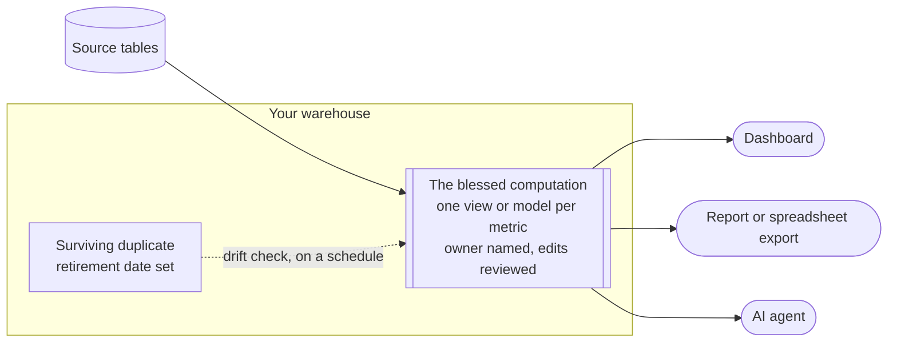

# Single point of metric computation

## Problem

The same metric computed in three tools returns three numbers, and every disagreement burns trust that a correct dashboard cannot buy back. At Airbnb, the CEO could ask which city had the most bookings last week and get diverging answers from Data Science and Finance, because each side used slightly different tables and slightly different definitions; over time even the data scientists began second-guessing their own numbers.[^chang-2021] At Uber, one rider-activity metric read 6.53 million sessions in one internal tool and 6.20 million in another for the same city and the same window, and the cause was a stale filter in one tool's private query.[^yu-2021] LinkedIn describes its reporting before centralization as fragmented and ad hoc, with different stakeholders calculating the same metric in different ways and arriving at slightly different results.[^linkedin-ump] Spotify found the same inconsistency in how its experiments were analyzed.[^rydberg-2020]

Nobody in these meetings can say which number is wrong, because each copy faithfully implements its own private variant of the definition, so every number is defensible. A wrong number cannot even be investigated, because with three computations there are three definitions and three pipelines, and there is no single place to ask whether the definition is wrong or the pipeline is broken. A team with no analyst sits in this failure by default, because every tool ships with its own place to write a formula, and metric formulas end up scattered across tools and rewritten without oversight.[^stancil-2021]

<!-- TODO(heqing): a class-level story from your own work of the same metric returning two numbers in two tools: who noticed first, and how long the reconciliation took. -->

## When this applies

- You quote a metric outside the team that produces it, or it appears on more than one surface. A number on a dashboard and in a board deck qualifies, and so does a number an AI agent answers questions about.
- You have no analyst. The pattern costs one warehouse view per metric and removes the reconciliation work an analyst would otherwise absorb.
- When it does **not** apply: exploratory analysis and one-off questions. The rule binds numbers that recur and travel, not the investigation that produced them. A metric with a single consumer on a single surface can also wait, until the day it gets a second one.

## The pattern

A metric that matters is computed in exactly one place, and every consumer reads that computation instead of re-deriving it. One named view or modeled table in your warehouse owns the formula, including the aggregation, the standing filters, and the exclusions. Dashboards select from it. Recurring reports and spreadsheet exports pull from it. An AI agent reads it as the metric's source of truth, named in the [context file](../03-ai-agent-integration/context-file.md) the agent already carries. Consumers may still filter and group the output; what no consumer may do is re-implement the aggregation. Every duplicate that already exists gets a retirement date, and every blessed computation gets one named owner.

Airbnb states the same rule as its metric platform's vision: define metrics once, use them everywhere.[^chang-2021]

## Position

Compute each metric that matters in one place from the day it first leaves the room, and do not wait until you are big enough for a metric platform.

The competent advice runs the other way. The product manager who ran Airbnb's metric platform advises smaller companies to standardize core tables first and expect metric standardization later, as the organization matures, and he is careful to say Airbnb's success may not transfer.[^chang-2021b] The market seems to agree with the caution: of at least six companies building a standalone metrics-layer product by the end of 2021, two pivoted, one was acquired, one stalled, and none became a standard. The idea's best-known advocate now reads that failure as economic rather than technical.[^stancil-2025] So the advice a small team actually hears is to let each tool compute its own copy for now and centralize later.

The evidence says the companies that waited spent years buying the rule back. Each one published the failure that forced it and the rule it converged on.

| Company | What waiting produced | The rule they converged on |
|---|---|---|
| Airbnb | Diverging answers to the CEO's simplest question; analysts second-guessing their own data[^chang-2021] | "Define metrics once, use them everywhere"[^chang-2021] |
| Uber | The same metric 0.33 million apart in two tools; popular metrics spun off "10X or 100X" named copies[^yu-2021] | A metric and its business logic map "strictly ONE to ONE"[^yu-2021] |
| LinkedIn | Fragmented, siloed reporting; one metric calculated differently by different stakeholders[^linkedin-ump] | One pipeline as "the single source of truth for all business metrics"[^linkedin-ump] |

Unwinding the duplicates at that scale was the expensive part. Uber had to build an algorithm that proves two SQL queries mean the same thing, then convene standing committees of domain experts to decide which copy of each business-critical metric survives, a process its own account calls time-consuming.[^yu-2021] But the rule those platforms enforce is not scale technology. It is one sentence, and a ten-person team can adopt the sentence for the price of one view per metric. The advice to wait saves one afternoon now, and the duplicates it tolerates are what took those companies years to unwind.

The honest counter is that duplication plus a test is cheaper than any central anything. That holds right up until two copies disagree. A test can tell you a copy changed; it cannot tell you which copy is right, because right means matches the reference, and a reference is exactly what a team with three copies does not have. Designating the reference is this pattern, and in the framework's judgment it is the whole of it: once a reference exists, the second copy has no remaining job.

## Implementation

The [template](../../../templates/01-ai-data-quality/metric-computation-control-plan.md) carries the metric registry, the machine-readable core, the drift check, and the agent prompts. The first two steps are one afternoon; the retirements take as long as they take.

1. **Inventory the computations.** For each of the three to ten metrics you actually quote, find every place a formula for it lives: dashboard queries and saved spreadsheets, plus any script or prompt that re-derives it. Each metric gets a registry row listing its duplicates.
2. **Bless one computation per metric.** Create one view or modeled table in the warehouse that owns the formula, named so it can be found. Where two existing copies disagree, picking the winner is a definition decision for the metric's owner; the view then enforces whatever was decided.
3. **Point every consumer at it.** Dashboards select from the view and carry no formulas of their own. Recurring reports and exports pull from it. The agent's [context file](../03-ai-agent-integration/context-file.md) names the view as the metric's source of truth, so the agent stops guessing at raw tables.
4. **Retire the duplicates, or check them.** Every duplicate gets a retirement date. A duplicate that cannot retire yet, such as a formula inside a tool that cannot read the warehouse, gets the drift check instead: on a schedule, compare its output to the blessed view over the same window, and alert past a tolerance. The check and its reaction plan are in the template; this mechanism is the framework's own method for teams below platform size. A rule alone cannot enforce the single starting point, especially once AI agents write models too, so the enforcement is a custom check in your CI: a new model that re-derives ground a blessed metric covers ships with a reconciliation against the blessed computation, the comparison runs on every change, and a derivation that cannot reconcile does not merge.
5. **Write the why into the comments.** Inline comments in the blessed computation carry the reasons, fully and in plain language: why these filters, why this grain, why each edge case lands where it does. That puts context at the most important place, because an AI agent reading the foundation reads the reasons with it. And when two definitions diverge, an agent that knows why the blessed one is written this way has what it needs to say which side is wrong, instead of treating the disagreement as a tie.
6. **Route changes through the one place.** When a definition changes, the blessed view changes in one reviewed edit, and every consumer picks the change up without being touched. This is the payoff the platform companies describe, down to definition changes triggering their own backfills.[^chang-2021]
7. **Name the owner.** One person owns the registry and reviews edits to blessed views.

<!-- TODO(heqing): have you kept a "temporary" duplicate past its retirement date, and what finally forced the retirement? -->

## How you know it is working

- Any two surfaces asked for the same metric over the same window return the same number.
- When a number looks wrong, there is one query to open, and one place to ask whether the definition or the pipeline is at fault.
- The duplicate column in the registry shrinks month over month.
- **Anti-signal:** the blessed views exist and the number in the meeting still comes from a spreadsheet with its own formula. The views are decoration until the meetings read from them.

## Failure modes

- **Blessed but unread.** The view exists and consumers keep their private formulas. Uber watched popular metrics spin off ten to a hundred named copies even alongside a platform.[^yu-2021] The registry is what makes this visible: every copy is retired, dated for retirement, or drift-checked, and a copy that is none of the three is a finding.
- **The single point becomes a queue.** Every small variation request lands on one owner, and people route around the bottleneck back into private copies. Uber's answer was to keep each definition lean and let consumers supply dimensions and filters at run time.[^yu-2021] The small-team version is the same rule: the view owns the aggregation, and consumers slice its output freely. <!-- TODO(heqing): has a single owned computation ever become the bottleneck on your team, and what did you loosen to fix it? -->
- **Centralizing the display instead of the computation.** Moving every chart into one dashboard tool changes nothing when each chart still carries its own formula.
- **Reading the pattern as a build or a purchase.** Airbnb's platform took four years, and the product category built to sell the idea struggled to survive.[^chang-2021b] [^stancil-2025] The ten-person version is a registry and a review rule, not a system.
- **A blessed view with no owner.** It breaks silently and stays blessed, and the formula everyone trusts most becomes the one nobody is watching. Review edits like code; an edit here changes every consumer's number at once.
- **The temporary duplicate.** A duplicate with no retirement date and no drift check is not temporary; it is the third number in next quarter's meeting.
- **Blocking exploration.** Forcing every query through blessed views turns the rule into an obstacle, and people route around obstacles. The rule binds numbers that leave the room; exploration keeps its freedom, and a new metric earns a view when it starts to travel.

## Sources & Stories

The three platform accounts are first-party: Airbnb's story is the opening post of its Minerva series, written by the platform team [^chang-2021], Uber's is the uMetric engineering post by the engineers who built it [^yu-2021], and LinkedIn's is its Unified Metrics Platform page, which is undated, so the fetch date carries the record [^linkedin-ump]. Airbnb's small-company advice is Robert Chang speaking on a podcast run by a transformation-tool vendor, quoted from the published show notes [^chang-2021b]. Spotify's account sits inside its experimentation-platform series and speaks to experiment analysis, not company reporting [^rydberg-2020]. The definition-drift mechanism and the category retrospective are Benn Stancil's essays, written four years apart; he co-founded a BI vendor, discloses his stakes, and his retrospective borrows its economic diagnosis from another data vendor's chief executive [^stancil-2021] [^stancil-2025]. The enforcement mechanics at ten people, from the registry table down to the drift check, are the framework's own; no published first-party account applies the single computation at that size. The CI reconciliation rule and the write-the-why comment practice come from the author's review of this draft. The prior-art row is pending in [prior-art.md](../../prior-art.md).

<!-- Footnote targets; full entries with links and caveats live in REFERENCES.md -->

[^chang-2021]: [[CHANG-2021]](../../../REFERENCES.md)
[^chang-2021b]: [[CHANG-2021B]](../../../REFERENCES.md)
[^linkedin-ump]: [[LINKEDIN-UMP]](../../../REFERENCES.md)
[^rydberg-2020]: [[RYDBERG-2020]](../../../REFERENCES.md)
[^stancil-2021]: [[STANCIL-2021]](../../../REFERENCES.md)
[^stancil-2025]: [[STANCIL-2025]](../../../REFERENCES.md)
[^yu-2021]: [[YU-2021]](../../../REFERENCES.md)
