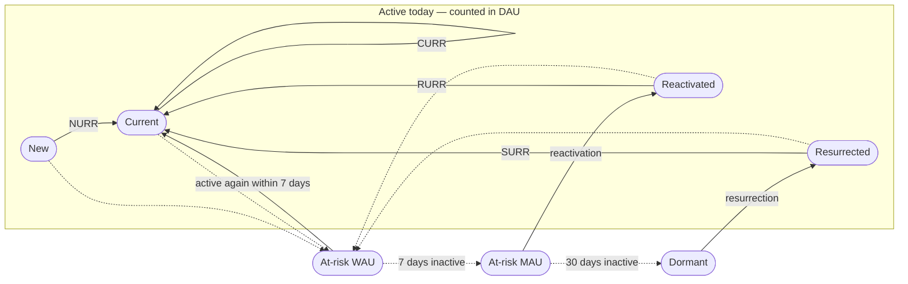
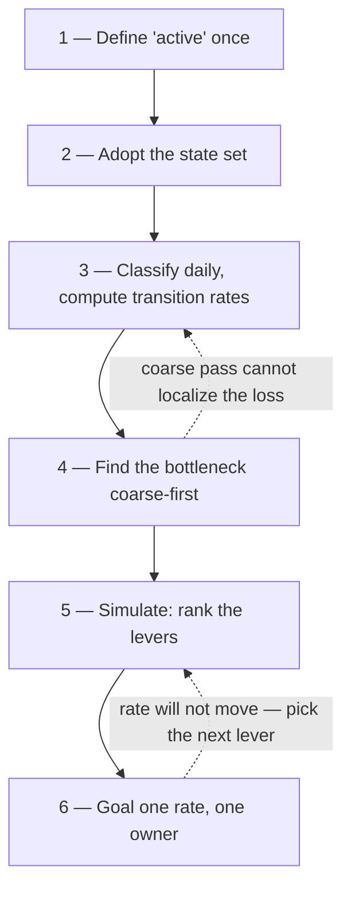

# State-based retention measurement

## Problem

In 2018, Duolingo's growth team tried what most product teams try first: copying features that worked elsewhere. A moves-counter mechanic borrowed from the game Gardenscapes cost months of engineering and produced neutral results — no retention gain, no DAU gain. A referral program modeled on ride-sharing incentives lifted new users by roughly 3%, largely because the most engaged users were already subscribers and had no use for the reward [MAZAL-2023]. What turned the trajectory around was not a better borrowed feature. It was a measurement change: modeling the user base as a set of explicit activity states with measurable transition rates, then using that model to find the one rate worth a team's full attention [GUSTAFSON-2023] [MAZAL-2023].

The underlying failure is general. Aggregate activity metrics — DAU, MAU, a topline retention curve — are sums of flows, not levers. No single intervention visibly moves them, so teams goal on numbers they cannot causally reach, experiments read out as noise, and feature-copying substitutes for diagnosis. An organization without dedicated analytics staff sits in this failure mode by default: the aggregates are what the off-the-shelf dashboard shows.

## When this applies

- Products with a recurring engagement loop, where a user being active this week tells you something about next week. The entity does not have to be a consumer: weekly-active accounts or workspaces in a B2B product decompose the same way.
- Organizations with enough active entities that transition rates are signal rather than noise. If a daily rate swings several points from randomness alone at your volume, the pattern still applies — widen the windows and run the same model weekly.
- When it does **not** apply: pre-launch products with no user base to classify; one-shot transactional products with no engagement loop to retain; and situations where the binding constraint is acquisition volume rather than retention — though the model itself is the cheapest way to prove which of the two it is.

## The pattern

Assign every user — past or present — exactly one activity state per day, from a set of states that is mutually exclusive and collectively exhaustive. Duolingo's published model uses seven [GUSTAFSON-2023] [MAZAL-2023]:

| State | Operational definition (paraphrased from the sources) | Counted in |
|---|---|---|
| New | first-ever day of activity | DAU |
| Current | active today, and active at least once in the prior 6 days | DAU |
| Reactivated | active today, last active 7–29 days ago | DAU |
| Resurrected | active today, last active 30+ days ago | DAU |
| At-risk WAU | not active today, but active in the prior 6 days | WAU |
| At-risk MAU | not active in the prior 7 days, but active in the prior 30 | MAU |
| Dormant | not active in 30+ days | — |

Topline aggregates stop being primitive numbers and become sums of states: DAU is new + current + reactivated + resurrected; WAU adds at-risk WAU; MAU adds at-risk MAU. The system is nearly closed — new users are the only external inflow [MAZAL-2023] — so the user base behaves as a state-transition (Markov-style) system: measure the rate at which users move between each pair of states, and you can reproduce and forecast the topline from the flows.

The states and the flows between them, per the published model [GUSTAFSON-2023] [MAZAL-2023] — solid arrows are the named retention and return rates, dashed arrows are decay through inactivity:



The named rates are the working metrics: CURR (current-user retention rate), NURR (new-user retention rate), RURR (reactivated), SURR (resurrected), plus reactivation and resurrection inflows from the at-risk and dormant pools [GUSTAFSON-2023]. The two source accounts state the window conventions slightly differently; what matters is fixing one convention in your control plan and keeping it stable.

Then simulate. Duolingo increased each rate by the same small increment (2%) in turn, holding the others constant, and projected the effect on DAU. Current-user retention — CURR — had roughly five times the impact of the second-best rate, because retained current users recycle into the same state and compound [GUSTAFSON-2023] [MAZAL-2023]. That one simulated finding redirected the team from intuition-led new-user work to a single focus metric, and the interventions that followed (leaderboards, notification tuning, streak mechanics) produced a 21% CURR increase and 4.5x DAU growth over four years [MAZAL-2023].

## Position

Goal a team on one movable transition rate, not on the topline aggregate. The topline is a readout; the rate is the lever.

This pattern rejects three common practices:

- **Managing the aggregate.** DAU and topline retention curves are sums of flows. A team goaled on them cannot tell which of its actions did anything. Decompose first; goal second.
- **Copying growth features without a loss model.** Duolingo's borrowed gamification and referral mechanics failed until the team could say where users were actually being lost and why a mechanic would work in their context, not just in the source product's [MAZAL-2023].
- **Choosing the focus metric by intuition.** New-user work felt like the obvious priority; the simulation showed current-user retention had several times the leverage [MAZAL-2023]. Run the sensitivity analysis before assigning a north star — the highest-leverage rate is frequently not the intuitive one.

A framing this framework adds: treat retention as an acquisition funnel run in reverse. Lay out each step of drop-off, understand why each drop-off happens, and fix the bottleneck — the same logic industrial engineering applies to a production line. The state model is the instrument that makes the bottleneck visible.

## Implementation

Steps 1–3 are the Measure work; 4–6 are Analyze and Improve; the control plan is the Control artifact. Copyable artifact: [retention-state control plan](../../../templates/01-ai-data-quality/retention-state-control-plan.md), which carries the full machine-readable state spec, a classification query skeleton, and agent prompt templates.



1. **Define "active" once.** One canonical event counts as activity, written down and versioned. If "active" means different things in different queries, every downstream rate is unreliable.
2. **Adopt the state set.** Start from the seven states above; they are published, MECE, and battle-tested. Adjust only the windows (daily → weekly) if your volume demands it. A machine-readable version:

   ```json
   {
     "spec": "retention-state-model/v1",
     "entity": "[TODO: user | account | workspace]",
     "activity_event": "[TODO: the one canonical event that counts as active]",
     "cadence": "daily",
     "states": [
       { "id": "new", "definition": "first-ever day of activity", "in_dau": true },
       { "id": "current", "definition": "active today; also active in prior 6 days", "in_dau": true },
       { "id": "reactivated", "definition": "active today; last active 7-29 days ago", "in_dau": true },
       { "id": "resurrected", "definition": "active today; last active 30+ days ago", "in_dau": true },
       { "id": "at_risk_wau", "definition": "not active today; active in prior 6 days", "in_dau": false },
       { "id": "at_risk_mau", "definition": "not active in prior 7 days; active in prior 30", "in_dau": false },
       { "id": "dormant", "definition": "not active in 30+ days", "in_dau": false }
     ],
     "aggregates": {
       "dau": ["new", "current", "reactivated", "resurrected"],
       "wau": "dau + at_risk_wau",
       "mau": "wau + at_risk_mau"
     },
     "sources": ["GUSTAFSON-2023", "MAZAL-2023"]
   }
   ```

3. **Build the daily classification job** and compute transition rates from consecutive snapshots. This is one query over an events table, not a platform build; the template has the skeleton.
4. **Find the bottleneck coarse-first.** Before building finer instrumentation, make a rough estimate of where the largest loss is, pull a quick qualitative anecdote for why that drop-off happens, attempt a fix, and see if the rate responds. Only where the coarse pass cannot localize the loss do you instrument more detailed steps. Instrumentation is bought with time you may not need to spend.
5. **Run the sensitivity analysis.** Bump each rate by the same small increment in a copy of the model, hold the others constant, and project the topline forward. Spreadsheet-grade simulation is sufficient; the point is the ranking of levers, not forecast precision.
6. **Pick one focus rate and goal a team (or the team) on it.** Verify both halves the way Duolingo did: that the rate is movable by experiment, and that moving it moves the topline [GUSTAFSON-2023]. Record the metric, owner, cadence, and reaction plan in the control plan.

For an AI analytics agent or LLM workflow, the frontmatter above and the JSON spec are the interface: give the agent the spec plus the prompt templates in the control plan, and it can classify users, compute the rates, run the sensitivity ranking, and draft the weekly readout — with the human owner checking the MECE audit (below) rather than re-deriving the numbers.

## How you know it is working

- **The MECE audit passes.** Every user is in exactly one state per day, and the states sum exactly to the toplines (DAU equals new + current + reactivated + resurrected, every day). Any residual means the definitions leak.
- **One named rate has an owner and a goal**, and experiment readouts cite that rate — not the aggregate — as the primary outcome.
- **The topline follows the rate.** Over quarters, sustained movement in the focus rate shows up in the aggregate, which is the model's own prediction being confirmed. At Duolingo, the 21% CURR gain over four years — equivalent to cutting daily churn by more than 40% — accompanied 4.5x DAU growth, and roughly 90% of DAU came to sit in the current-user state [GUSTAFSON-2023] [MAZAL-2023].
- **Anti-signal:** the state dashboard exists but decisions still reference DAU. That is decoration, not measurement.

## Failure modes

- **States that are not MECE.** Overlapping windows double-count users, the sums stop matching the toplines, and trust in the whole model collapses on first audit. Test exhaustiveness and exclusivity on day one, mechanically.
- **Windows copied without thought.** A daily model on a product whose natural cadence is weekly (or whose volume is low) produces rates that are mostly noise. Widen the windows; the structure survives.
- **Goal-ing an unmovable rate.** The simulation ranks leverage, not tractability. Duolingo's team explicitly A/B-tested whether CURR could be moved at all before committing to it [GUSTAFSON-2023]. Do both checks.
- **Skipping the simulation.** Picking the intuitive rate re-imports the exact failure the model exists to prevent; the highest-leverage rate was not the intuitive one at Duolingo [MAZAL-2023].
- **Too many focus metrics.** Four "north stars" is the aggregate problem wearing a costume. One rate, one owner.
- **Burning the reactivation channels.** Interventions on at-risk and dormant states run through notifications and email; Mazal's rule was to "protect the channel" — aggressive volume testing produces opt-outs that persist after the test ends [MAZAL-2023].
- **False precision at small volume.** Rates computed on a few hundred entities move for no reason. Report them with widths, review weekly rather than daily, and resist reacting to single-day moves — this is what the control plan's expected-range column is for.

## Sources & Stories

This draws heavily from the Duolingo growth model as described publicly by the practitioners who built and ran it [GUSTAFSON-2023] [MAZAL-2023]. The core idea of decomposing aggregates into states and focusing on the highest-leverage transition rate comes directly from their work; Mazal records that Duolingo's model was itself adapted from state-model approaches at Zynga and MyFitnessPal, moved from weekly to daily cadence [MAZAL-2023]. The prior-art search for this pattern is recorded in [prior-art.md](../../prior-art.md).

The emphasis on making the approach usable for small teams without dedicated analysts, the reverse-funnel bottleneck framing, the coarse-first instrumentation loop, and the machine-readable specs plus agent prompts are syntheses aimed at the audience this framework targets, drawing on the author's industrial-engineering practice.
