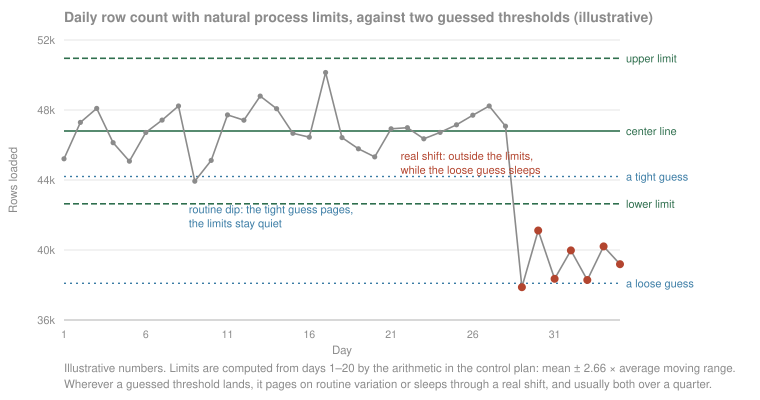
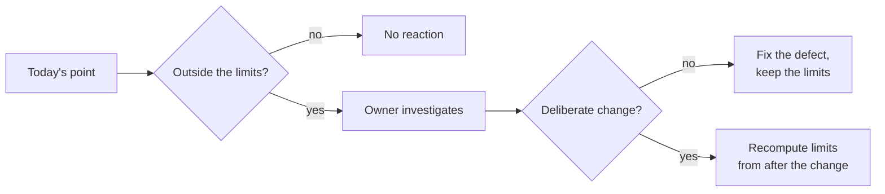

# Statistical process control for data pipelines

## Problem

A hand-picked alert threshold on a pipeline fails in both directions at once. Set tight, it pages somebody for variation the pipeline produces every ordinary week, and after a month of false pages the alert gets muted. Set loose, a real change sits inside the slack for weeks, because nobody ever measured how much the signal moves on a day when nothing is wrong. One large ride-hailing company's data platform team recorded both halves: metric-level alerts were "too noisy for everyday use", and static thresholds could not follow tables whose normal level moves with the day of the week.[^shanmugam-2020]

I think the failure underneath both is the same. Nobody separated the variation the pipeline always produces from the variation that means something changed. Without that line every wiggle is a judgment call, and a real shift arrives with no more authority than Tuesday's noise. A company with no analyst sits in this failure by default, because a guessed number is what every alert-threshold form invites you to type.

<!-- TODO(heqing): the class-level story only you have: a fixed threshold in production that paged until people muted it, or slept through a real drop. What was the signal, how was the threshold picked, and who eventually noticed? -->

## When this applies

- Your pipeline emits at least one number per day that you care about. The daily row count of the most important table is the usual first chart, with freshness lag and null share behind it, and a spreadsheet is enough.
- You have some history. Twenty to twenty-five daily values make the limits firm,[^mohammed-2008] and provisional limits can be computed from as few as six to ten,[^wheeler-2012] so a three-week-old pipeline qualifies.
- When it does **not** apply: invariants. A rule that a key is never null, or that states must sum to the topline, has no routine variation to respect. A violation is a defect at any size, and checking it is a test, not a chart.

## The pattern

Statistical process control is the industrial-engineering idea I lean on most in analytics, and this is its smallest useful form. Put a control chart on each signal a pipeline emits, and react to a point only when it crosses limits computed from that signal's own recent history. Variation inside the limits is what the pipeline does when nothing is wrong, so it earns no reaction. A point outside the limits is evidence the process changed, so it earns an investigation the same day. The line being drawn has a name in the quality literature: common-cause variation, the routine noise a stable process always produces, against special-cause variation, a specific change that can be found and dealt with.[^mohammed-2008]

The chart I use for pipeline signals is the individuals chart, XmR, because it needs only one value per period and its arithmetic fits in three spreadsheet columns.[^wheeler-2010] Take the average of the daily values, take the average of the absolute differences between consecutive days (the moving ranges), and place the limits at the average plus and minus 2.66 times the average moving range.[^mohammed-2008] [^wheeler-2010] The constant converts the average moving range into three standard deviations of day-to-day variation, and that width earns its keep: a stable process crosses correct limits about once in 370 points, and a real shift crosses them within days.[^mohammed-2008]

The limits come from the process because nothing else knows the process. A threshold encodes what somebody hoped or feared, and the limits encode what the pipeline actually does. That idea is Shewhart's, and his 1931 book is cited as the canon here because every later formulation descends from it.[^shewhart-1931] Wheeler's columns are the modern working form this page follows,[^wheeler-2010] [^wheeler-2012] and the same charts are having a revival on business metrics generally.[^chin-2024]

## Position

React to a pipeline signal when it crosses limits computed from that signal's own history, not when it crosses a threshold somebody picked.

The common practice is the picked threshold. A data test asks for a minimum row count, somebody types a number that feels safe, and from then on nothing defends the number except the memory of having typed it. I understand the appeal: simple, predictable alerting rules are good engineering, and a static number is the simplest rule there is.[^beyer-2016]

My takeaway from the evidence is that this is a false choice. Limits computed from history are just as simple, three spreadsheet columns with nothing learned and nothing opaque, and unlike a guess they describe what the pipeline actually does.[^wheeler-2010] The large data teams that started with static thresholds ended up replacing them with history-based ones,[^shanmugam-2020] and the data-observability product category is built on the same move, sold as its adaptive half.[^bigeye-2021] [^montecarlo-2024] The discipline is ninety years older than the category, and a team of ten does not need to buy it to have it.

The other half of my position is what the limits let you ignore. A point inside the limits gets no reaction, and reacting anyway makes the pipeline worse. Deming showed that adjusting a stable process in response to routine variation increases its variation, and he called it tampering.[^deming-funnel] Re-running yesterday's load because the count looked a little low is exactly that, and the chart is what tells you to stop.

<!-- TODO(heqing): a class-level tampering story from your own practice: someone reacting to a routine dip (re-running a job, patching a number, adjusting a query) and the reaction itself causing the next incident or muddying the record. -->

## Implementation

The [control plan template](../../../templates/01-ai-data-quality/spc-control-plan.md) carries the signals table, the limit arithmetic in spreadsheet-ready form, the reaction plan, and a machine-readable core an AI agent can work from. I would start smaller than feels serious. The sequence below assumes no analyst and no tool purchase, and steps 1 through 4 cost one afternoon and then five minutes a day.

1. **Chart one signal on one table.** Pick the table whose corruption would hurt most, and chart the daily count of rows loaded into it. One chart somebody looks at beats fifty nobody does.
2. **Compute limits from the last twenty-plus days.** Pull the daily counts and compute the limits exactly as the template spells out. Twenty to twenty-five values make the limits firm;[^mohammed-2008] on a younger pipeline, six to ten give provisional limits worth using, firmed up as data arrives.[^wheeler-2012]
3. **React only outside the limits.** A point beyond either limit gets a same-day look from a named owner; the reaction plan says who and within how long. A run of eight consecutive points on the same side of the center line also counts, and it is the cheap way to catch a drift too small to cross the limits.[^mohammed-2008]
4. **Recompute limits only after a confirmed change.** When an investigation finds a deliberate, explainable process change, such as a new region onboarded or a source system swapped, recompute the limits from the days after the change.[^wheeler-2012] Do not recompute on a rolling window: limits that follow the data chase a slow degradation downward and never flag it.[^wheeler-2012]
5. **Split charts that mix two processes.** Weekdays and weekends are different processes on most business pipelines, and one chart across both gets limits wide enough to miss shifts in either.[^mohammed-2008] [^taylor-2025] Run a weekday chart and a weekend chart. Where growth trends the level upward, chart a change instead of the level; the framework's default is today's value minus the same weekday last week, which removes the weekly cycle and the trend in one subtraction; published treatments deseasonalize or difference to the same end.[^taylor-2025]
6. **Expand by signal, then decide about tools.** Freshness lag and null share on the same table come next, with the same arithmetic. When the tables that matter outnumber the attention available, that is what the data-observability category is for, and what it automates is coverage, not a different discipline.[^montecarlo-2024]

Here is the whole method in one table. The numbers are illustrative, and the limits are computed from days 1 to 10 exactly as the template spells out.

| Day | Rows loaded | Moving range | Against the limits |
|---|---|---|---|
| 1 | 48,210 | | baseline |
| 2 | 47,955 | 255 | baseline |
| 3 | 48,602 | 647 | baseline |
| 4 | 48,077 | 525 | baseline |
| 5 | 47,710 | 367 | baseline |
| 6 | 48,388 | 678 | baseline |
| 7 | 48,150 | 238 | baseline |
| 8 | 47,922 | 228 | baseline |
| 9 | 48,501 | 579 | baseline |
| 10 | 48,044 | 457 | baseline |
| 11 | 47,861 | 183 | inside the limits, no reaction |
| 12 | 45,930 | 1,931 | below the lower limit, investigate today |

The average of days 1 to 10 is 48,156 and the average moving range is 442, so the limits sit at 48,156 plus and minus 2.66 times 442: 46,981 to 49,330. Day 11 is inside them and earns nothing. Day 12 falls 1,051 below the lower limit and earns a same-day look.

<!-- TODO(heqing): from your own production use of this discipline, class level: which signal carried your first chart, and what did the first out-of-limits point turn out to be? -->

## How you know it is working

- Alerts get rarer and every one gets investigated. The measure of the chart is the mute button nobody reaches for.
- Out-of-limits points end with a found cause more often than with a shrug.
- Recomputations are rare, and each carries a date and the named process change that justified it.
- Nobody re-runs a load because a number looked low but sat inside the limits.
- **Anti-signal:** the chart exists but the team still debates inside-the-limits wiggles in standup. That is decoration, and the tampering continues with a chart behind it.

## Failure modes

- **Limits from the overall standard deviation.** A spreadsheet `STDEV` over all the data assumes the homogeneity the chart exists to test, and any real shift inflates it until the limits cover everything.[^wheeler-2010] The moving-range limits are what let the chart detect anything at all.
- **Fifty charts on day one.** We often see this. Statistical alerts on every metric of every table reproduced alert fatigue with better math at the ride-hailing company.[^shanmugam-2020] Charts earn their existence one at a time.
- **Rolling-window limits.** Recomputing from the last thirty days every day means the limits absorb every drift, and a slow leak never signals.[^wheeler-2012]
- **Limits used as targets.** The limits describe what the pipeline does, not what anyone wants it to do. If the natural limits are too wide for the business to live with, the fix is improving the pipeline, never moving the lines.
- **One chart over two processes.** Weekday and weekend mixed, or two sources on different cadences, widens the limits until they are decorative.[^mohammed-2008] [^taylor-2025] Split the chart.
- **Charting a signal that is mostly zero.** A daily error count that is usually zero gives a meaningless moving range. Chart the days between failures instead, or widen the period until the value is usually nonzero.[^mohammed-2008]

## Sources & Stories

The line between common-cause and special-cause variation, and the rule that reaction limits come from the process's own behavior, are Shewhart's; his 1931 book is cited at book level as the canon [^shewhart-1931]. The working arithmetic is Wheeler's formulation, from his columns on computing and revising limits [^wheeler-2010] [^wheeler-2012], and cross-checked against a peer-reviewed healthcare tutorial that prints the same constants with worked examples [^mohammed-2008]. The pipeline-scale account is first-party from a large ride-hailing company's data platform team [^shanmugam-2020]. The competent case for hand-set thresholds is the monitoring chapter of the site-reliability engineering book [^beyer-2016]. The two descriptions of adaptive thresholds in the data-observability category are vendor material from companies selling exactly that, cited for what the category does rather than for how well it works [^bigeye-2021] [^montecarlo-2024]. Tampering is cited through the Deming Institute's account of the funnel experiment [^deming-funnel], and the revival of these charts on business metrics through Commoncog and its free charting tool [^chin-2024] [^taylor-2025].

The one-table starting point, the same-weekday delta, and the reaction-plan shape are the framework's own, drawing on the author's industrial-engineering practice. The prior-art row for this pattern is pending in [prior-art.md](../../prior-art.md).

<!-- Footnote targets; full entries with links and caveats live in REFERENCES.md -->

[^beyer-2016]: [[BEYER-2016]](../../../REFERENCES.md)
[^bigeye-2021]: [[BIGEYE-2021]](../../../REFERENCES.md)
[^chin-2024]: [[CHIN-2024]](../../../REFERENCES.md)
[^deming-funnel]: [[DEMING-FUNNEL]](../../../REFERENCES.md)
[^mohammed-2008]: [[MOHAMMED-2008]](../../../REFERENCES.md)
[^montecarlo-2024]: [[MONTECARLO-2024]](../../../REFERENCES.md)
[^shanmugam-2020]: [[SHANMUGAM-2020]](../../../REFERENCES.md)
[^shewhart-1931]: [[SHEWHART-1931]](../../../REFERENCES.md)
[^taylor-2025]: [[TAYLOR-2025]](../../../REFERENCES.md)
[^wheeler-2010]: [[WHEELER-2010]](../../../REFERENCES.md)
[^wheeler-2012]: [[WHEELER-2012]](../../../REFERENCES.md)
