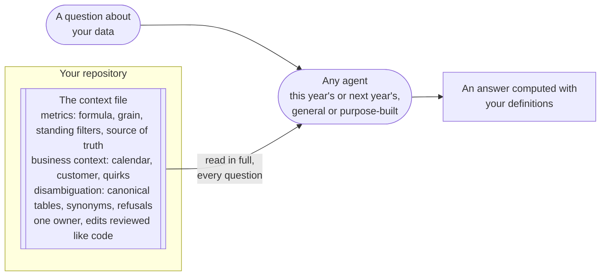

# The one file your AI should read before it answers anything

## Problem

Point an AI agent at your warehouse and it sees table names, column names, and nothing else. The schema does not say which of two similar revenue tables is the one you quote. It does not say that a customer means a paying account rather than a signup, or that the orders table includes test orders unless a status filter is applied. So the agent guesses. The guesses come back as fluent SQL that runs and returns a number, and the number reads exactly like a right answer.

When the wrong numbers surface, the fix everyone reaches for is a better model or a purpose-built analytics tool, because a wrong answer looks like a capability problem. The measured evidence says capability is not the variable. In a paired evaluation, three frontier models from two vendors answered one hundred questions over a retail dataset, once with only the schema and once with the schema plus a small hand-written document describing the dataset's measures and conventions, together with rules for telling similar tables apart. The three models were statistically indistinguishable from each other in both conditions. The document moved every one of them up by seventeen to twenty-three percentage points.[^rumiantsau-2026] The file was the lever, and the model was not.

The ceiling on the other side is just as measured. On an enterprise benchmark where the right answer depends on private business knowledge delivered as long documents, the best evaluated system reached 15.9 percent.[^liao-2026] What your company knows and has not written down is exactly the thing no model upgrade supplies.

<!-- TODO(heqing): a class-level story from your own work of an agent guessing at an ambiguous table: what was ambiguous, what it answered, and who caught it. -->

## When this applies

- You are connecting an AI agent of any category to your company's data, or you are still deciding which one to connect. Write the file first in either case, because it is the input to a fair tool evaluation and the asset that survives the choice.
- You have no analyst. At that size the file is the highest-return work available. It costs one afternoon of the founder's time and no money, and it moves whole if you later switch tools.
- The category of tool does not matter. A general-purpose agent reads the file directly. A purpose-built analytics tool encodes much of the same content in its modeling layer, and the file remains the plain-text source that modeling is built from.
- When it does **not** apply: if your definitions already live in a modeled semantic layer that the agent queries through a defined interface, the file shrinks rather than disappears. It names the layer as the owner of each definition instead of restating it, and carries only what the layer cannot express, such as the synonyms and quirks, and what the agent should refuse. And if a number feeds financial reporting, this file is not the control: it advises the agent and enforces nothing.

## The pattern

Write one plain-text context file, keep it in your own repository, and have every agent read it in full before answering anything about your data. The file holds the metrics you actually quote, each with a one-sentence formula, its grain, the filters that always apply, and the one table or system that is authoritative for it. Around the metrics it holds the business context no schema carries: the fiscal calendar, what counts as a customer, the known quirks in the data, and the disambiguation rules that pick between lookalike tables and ambiguous terms. Keep the whole file short enough to send with every question. Give it one named owner, and review every edit the way you review code, because an edit to this file changes every downstream answer.

Swapping the agent moved answer quality within noise in the paired evaluation. Adding the file moved every agent by seventeen points or more.[^rumiantsau-2026]

## Position

Write the context file before you change tools or models, and before you buy anything, not after. The practitioner this position argues with is competent: wrong answers look like a capability problem, and capability is what vendors sell. A model upgrade also asks nothing of anyone, while writing the file is an afternoon of unglamorous work. But the paired evaluation found the three frontier models statistically indistinguishable within each condition, while the small document moved all three by seventeen to twenty-three points, with every comparison across conditions significant.[^rumiantsau-2026] A transformation-tool vendor's 2026 benchmark re-run points the same way from inside the industry: its two frontier models performed almost identically on both answer paths, and the gains came from modeling and context work, which improved both paths at once.[^ganz-2026] The enterprise benchmark closes the argument from above: when the answer depends on unwritten business knowledge, the best system managed 15.9 percent, a gap that model choice does not touch.[^liao-2026]

The knowledge in the file is not an artifact for the machine. On a large database benchmark that ships a sentence of written business knowledge with each question, people gained almost exactly as much from that knowledge as the strongest model did: 20.6 points for the humans, 20.0 for the model.[^li-2023] The file is onboarding material for anyone who answers questions about your data. The agent is the newest hire who reads it.

The second half of the position is about where the file lives. Author it in plain text in a repository you control, and sync copies into whatever tool you use. Treat everything a tool derives from it as a rebuildable cache, and never let the working copy exist only inside one vendor's platform. No published account prices a migration of business context between AI vendors, so the framework treats portability as something you get by construction rather than a cost you can compare. One dated event shows the exposure: an AI platform vendor retired its hosted assistant objects and stated it would not provide an automated tool for migrating the conversation threads that lived inside them.[^openai-2026] A plain-text file in your own repository moves anywhere in an afternoon.

## Implementation

Copyable artifact: [business context file template](../../../templates/03-ai-agent-integration/context-file.md), which carries the section-by-section skeleton and the machine-readable core, with prompt guidance for handing the file to an agent. The whole sequence below is one afternoon for one person, and it is written for a team of ten with nobody spare.

1. **List the numbers you actually quote.** Take the three to ten metrics that already leave the room in a board update or a weekly email. For each one write a one-sentence formula, the grain ("one row per subscription per day"), the filters that always apply ("test accounts and internal users are excluded"), and the one table or system that is authoritative for it.
2. **Write the business-context block.** Say when the fiscal year starts and what "last quarter" resolves to today. Say what counts as a customer, against the nearby thing it is not, such as a paying account rather than a signup. Name the timezone and the currency every number is reported in.
3. **Write the disambiguation rules.** Name the canonical table for each entity and the lookalike tables the agent must never use, with the reason. List the words your company uses that differ from what the systems call things, and the questions the agent should refuse to answer.
4. **Add the quirks.** Write down what a person learns the hard way in their first month, such as a snapshot table that must not be summed over time or a field that stores yes and no as text. If a needed filter can be built into the table itself, do that instead of documenting it, because a documented filter is a filter the agent may skip.
5. **Put the file where the agent reads it automatically, and send it whole.** Do not index it and do not retrieve pieces of it. Keep it under a few pages; the measured document was about four kilobytes.[^rumiantsau-2026] One open format gives the file a conventional name and location that many agents already look for: AGENTS.md, a plain-markdown instruction file at the repository root.[^agentsmd] That format was built for coding agents, and carrying business context in it is this framework's extension of it.
6. **Name one owner and bind changes.** The file changes in the same commit or pull request as the thing it describes, and every edit gets a review, like code. Keep five questions whose answers you already know, and re-run them after any change. A stale file announces itself as an old answer to a known question.

<!-- TODO(heqing): what did you write first in your own context file, and how long did the first version that visibly helped take? -->

## How you know it is working

- Answers state which metric definition they used and which table they read, and both match the file.
- The five held-back questions keep returning the answers you already know, including after edits to the warehouse or to the file.
- Swapping the model or the agent barely moves your hit rate. That is the paired evaluation's signature, and it means the lever is the file rather than the tool.[^rumiantsau-2026]
- **Anti-signal:** the file exists but answers contradict it. The agent is not actually reading it, and the file is decoration.

## Failure modes

- **Connecting first, writing later.** The team's first week with the agent is spent on confident wrong numbers, and in the framework's judgment the trust that burns does not come back with later accuracy gains. This ordering mistake is the cheapest one to avoid on this page. <!-- TODO(heqing): have you watched a team lose trust in an assistant's numbers in its first week, and did the trust return once accuracy improved? -->
- **The file becomes an index.** The file grows, so someone connects the wiki and adds retrieval over it. A large engineering organization reported declining accuracy as more tables and query samples were onboarded under similarity search, and replaced retrieval with small curated collections per business domain.[^khune-2024] When the file outgrows a few pages, split it by domain and route the question to the right part. Do not index it.
- **Restating a formula a system already owns.** The definition then lives in the warehouse model and in the file, and the two drift apart. The file names the owner of a definition, and restates a formula only when nothing else holds it.
- **The file becomes a wiki page.** Once anyone can edit it, an edit silently changes every answer the agent gives, because the SQL still runs and still returns rows. This file is privileged configuration, not documentation. Keep it somewhere with review on write.
- **Customer names in the payload.** The file travels to the model vendor with every question. Keep named customers and contract values out of it, along with any personal detail, and write "our largest account" rather than the name.
- **Reading the gain as a guarantee.** Roughly a third of the questions still failed with the document present, and the residual failures cluster on things the document did not name.[^rumiantsau-2026] The file is necessary and it is not sufficient, so an answer that matters still gets its own check.
- **Written once.** A definition changes and the file does not. The agent keeps answering from the old definition with unchanged confidence. Bind edits to the commit that changes the thing described, and let the five held-back questions be the alarm.

## Sources & Stories

The accuracy claim rests on a paired benchmark by Michael Rumiantsau and Ivan Fokeev, verified here at abstract level; the arXiv listing names no affiliation, and an earlier verification pass of the full paper places the authors at a semantic-layer company, so the source is treated as commercially interested rather than independent [^rumiantsau-2026]. Its finding cuts partly against that interest, since the measured artifact is a plain markdown file rather than an engine. The corroborating benchmark re-run is by Jason Ganz and Benoit Perigaud, both employed by the vendor of the transformation tool whose semantic layer the benchmark scores; the conflict is disclosed in the post, and the suite is eleven questions on one insurance schema, so the numbers are used here for direction rather than as portable figures [^ganz-2026]. The enterprise ceiling comes from the EntSQL benchmark, cited at abstract level [^liao-2026]. The matched human and model gains come from Table 2 of the BIRD benchmark paper, checked against the paper's own text [^li-2023]. The retrieval-degradation story is a first-party engineering account from a large ride-hailing company; the hour and dollar savings that circulate alongside it do not appear in the company's own post and are not repeated here [^khune-2024]. The platform-retirement event is documented in the vendor's own migration guide, fetched on the shutdown date it names [^openai-2026]. The open instruction-file format is documented by its own project page, whose adoption counts are self-reported [^agentsmd].

The ordering of the position, writing the file before any tool decision, follows the research synthesis behind this module; the review-like-code rule, the named owner, the held-back questions, and the same-commit binding are the framework's own operating rules for the artifact. The prior-art coverage row for this pattern is pending in [prior-art.md](../../prior-art.md).

<!-- Footnote targets; full entries with links and caveats live in REFERENCES.md -->

[^agentsmd]: [[AGENTSMD]](../../../REFERENCES.md)
[^ganz-2026]: [[GANZ-2026]](../../../REFERENCES.md)
[^khune-2024]: [[KHUNE-2024]](../../../REFERENCES.md)
[^li-2023]: [[LI-2023]](../../../REFERENCES.md)
[^liao-2026]: [[LIAO-2026]](../../../REFERENCES.md)
[^openai-2026]: [[OPENAI-2026]](../../../REFERENCES.md)
[^rumiantsau-2026]: [[RUMIANTSAU-2026]](../../../REFERENCES.md)
